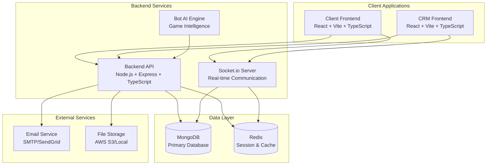
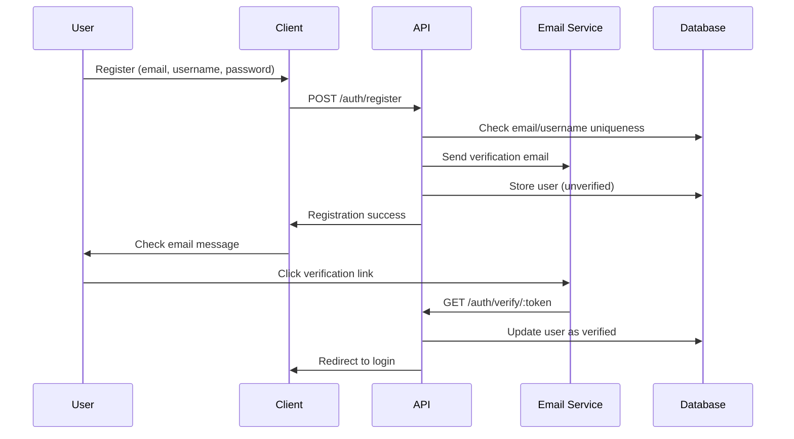
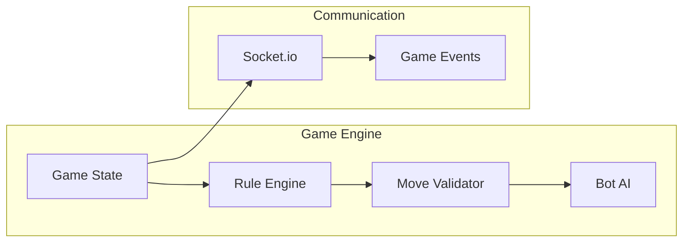
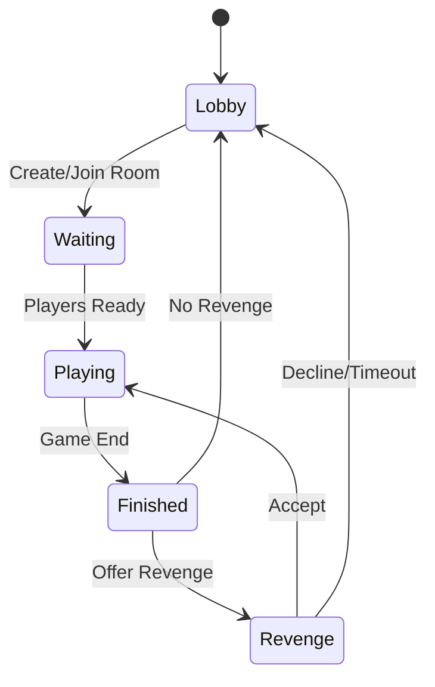
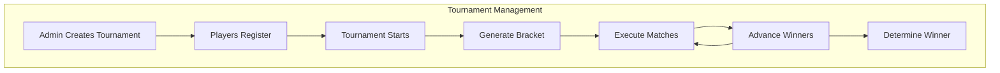
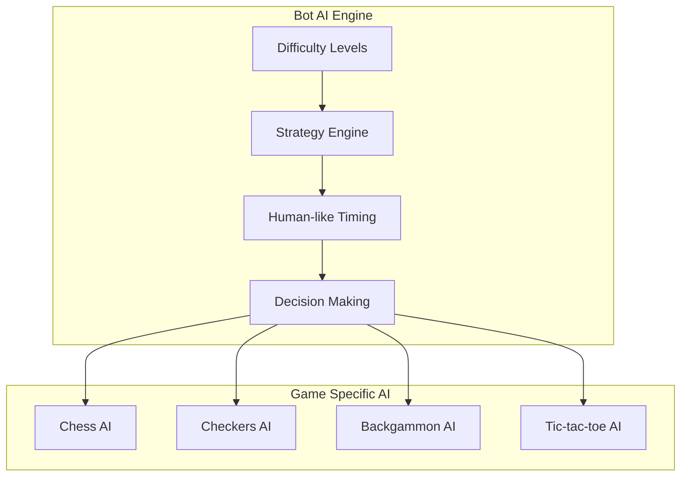
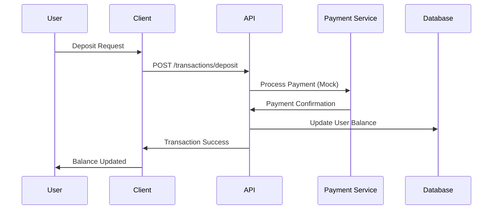
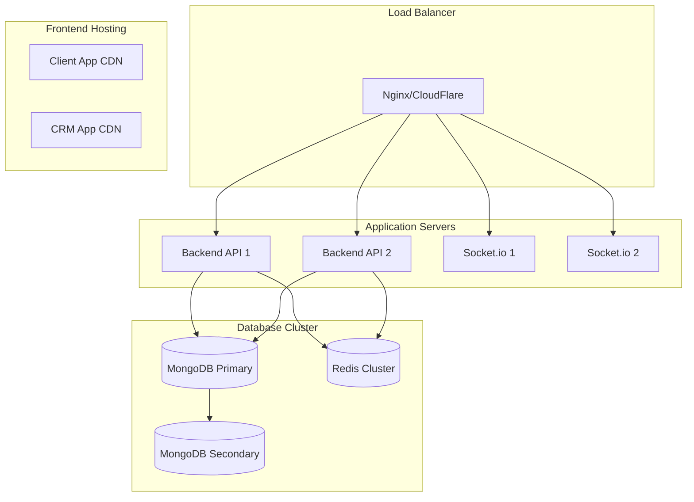

# Gaming Platform Architecture Overview

## Project Overview

A comprehensive, production-ready online gaming platform supporting checkers, chess, backgammon, and tic-tac-toe with real-time multiplayer functionality, intelligent bot opponents, tournament system, and complete user management.

## System Architecture

### High-Level Architecture



### Repository Structure

Three separate repositories for independent deployment and scaling:

1. **gaming-platform-backend** - Backend API and Socket.io server
2. **gaming-platform-client** - User-facing React application
3. **gaming-platform-crm** - Administrative React application

## Technology Stack

### Backend
- **Runtime**: Node.js 18+
- **Framework**: Express.js with TypeScript
- **Database**: MongoDB with Mongoose ODM
- **Cache**: Redis for sessions and real-time data
- **Real-time**: Socket.io for live communication
- **Authentication**: JWT with refresh tokens
- **Validation**: Joi or Zod for input validation
- **Email**: Nodemailer with SMTP/SendGrid
- **File Upload**: Multer with cloud storage

### Frontend (Client & CRM)
- **Framework**: React 18 with TypeScript
- **Build Tool**: Vite
- **State Management**: Redux Toolkit + RTK Query
- **UI Framework**: Material-UI or Ant Design
- **Routing**: React Router v6
- **Forms**: React Hook Form with validation
- **Real-time**: Socket.io-client
- **Internationalization**: react-i18next

### Development Tools
- **Package Manager**: npm or yarn
- **Code Quality**: ESLint + Prettier
- **Testing**: Jest + React Testing Library
- **Type Checking**: TypeScript strict mode
- **API Documentation**: Swagger/OpenAPI
- **Version Control**: Git with conventional commits

## Core System Components

### 1. Authentication & User Management

#### User Registration Flow


#### Authentication Features
- Email/password login with JWT tokens
- Secure password reset with email verification
- Session management with refresh tokens
- Account verification via email
- Password strength validation
- Rate limiting for security

### 2. User Profile System

#### Profile Data Structure
```typescript
interface UserProfile {
  id: string;
  username: string;
  email: string;
  avatar?: string;
  balances: {
    main: number;        // Real money balance
    internal: number;    // Platform currency
  };
  statistics: {
    totalGames: number;
    gamesWon: number;
    gamesLost: number;
    hoursPlayed: number;
    moneyEarned: number;
    gameStats: {
      [gameType: string]: {
        played: number;
        won: number;
        lost: number;
        draws: number;
      };
    };
  };
  kyc: {
    status: 'pending' | 'approved' | 'rejected';
    documents: KYCDocument[];
    submittedAt?: Date;
    reviewedAt?: Date;
  };
  preferences: {
    language: 'en' | 'ru';
    notifications: boolean;
  };
  createdAt: Date;
  updatedAt: Date;
}
```

### 3. Game Engine Architecture

#### Game State Management


#### Supported Games
1. **Checkers** - White moves first, standard rules
2. **Chess** - White moves first, full rule implementation
3. **Backgammon** - Random first player via dice
4. **Tic-tac-toe** - Random first player

#### Game Flow


### 4. Real-time Communication

#### Socket.io Events Architecture
```typescript
// Client to Server Events
interface ClientToServerEvents {
  // Game Events
  'game:join': (roomId: string) => void;
  'game:move': (move: GameMove) => void;
  'game:offer-revenge': () => void;
  'game:accept-revenge': () => void;
  'game:decline-revenge': () => void;
  
  // Lobby Events
  'lobby:join': (gameType: GameType) => void;
  'lobby:create-room': (roomConfig: RoomConfig) => void;
  'lobby:leave': () => void;
  
  // Tournament Events
  'tournament:join': (tournamentId: string) => void;
  'tournament:spectate': (tournamentId: string) => void;
}

// Server to Client Events
interface ServerToClientEvents {
  // Game Events
  'game:state-update': (gameState: GameState) => void;
  'game:move-made': (move: GameMove) => void;
  'game:game-ended': (result: GameResult) => void;
  'game:revenge-offered': (timeLeft: number) => void;
  
  // Lobby Events
  'lobby:room-list': (rooms: Room[]) => void;
  'lobby:joined-room': (room: Room) => void;
  'lobby:player-joined': (player: Player) => void;
  
  // Tournament Events
  'tournament:bracket-update': (bracket: TournamentBracket) => void;
  'tournament:match-started': (match: TournamentMatch) => void;
  
  // System Events
  'notification': (notification: Notification) => void;
  'error': (error: ErrorMessage) => void;
}
```

### 5. Tournament System

#### Tournament Architecture


#### Tournament Features
- Admin-created tournaments via CRM
- Support for all four game types
- Dynamic bracket generation
- Minimum one real player requirement
- Automatic bot filling
- 15-second start countdown
- Real-time bracket visualization
- Prize distribution system

### 6. Bot AI System

#### AI Architecture


#### Bot Features
- Multiple difficulty levels per game
- Human-like play patterns and timing
- Strategic decision-making algorithms
- Realistic usernames and behavior
- Seamless integration (players can't distinguish)

### 7. Financial System

#### Transaction Flow


#### Commission System
- 10% platform commission on all games
- Commission calculated from total pot
- Commission taken even on draws
- Automatic revenue tracking
- CRM dashboard for analytics

### 8. Database Schema Design

#### Core Collections

```typescript
// Users Collection
interface User {
  _id: ObjectId;
  username: string;
  email: string;
  passwordHash: string;
  avatar?: string;
  balances: {
    main: number;
    internal: number;
  };
  statistics: UserStatistics;
  kyc: KYCData;
  preferences: UserPreferences;
  isVerified: boolean;
  isActive: boolean;
  createdAt: Date;
  updatedAt: Date;
}

// Games Collection
interface Game {
  _id: ObjectId;
  type: 'chess' | 'checkers' | 'backgammon' | 'tictactoe';
  players: {
    player1: ObjectId;
    player2: ObjectId;
  };
  gameState: any; // Game-specific state
  moves: GameMove[];
  status: 'waiting' | 'playing' | 'finished';
  result?: GameResult;
  stake: number;
  commission: number;
  startedAt?: Date;
  finishedAt?: Date;
  createdAt: Date;
}

// Tournaments Collection
interface Tournament {
  _id: ObjectId;
  name: string;
  gameType: GameType;
  maxPlayers: number;
  entryFee: number;
  prizePool: number;
  status: 'upcoming' | 'active' | 'finished';
  participants: ObjectId[];
  bracket: TournamentBracket;
  winner?: ObjectId;
  createdBy: ObjectId; // Admin
  startTime: Date;
  createdAt: Date;
}

// Transactions Collection
interface Transaction {
  _id: ObjectId;
  userId: ObjectId;
  type: 'deposit' | 'withdrawal' | 'game_win' | 'game_loss' | 'commission';
  amount: number;
  status: 'pending' | 'completed' | 'failed' | 'cancelled';
  reference?: string; // Game ID, Tournament ID, etc.
  metadata?: any;
  createdAt: Date;
  processedAt?: Date;
}
```

### 9. Security Architecture

#### Security Measures
- JWT authentication with refresh tokens
- Password hashing with bcrypt
- Input validation and sanitization
- Rate limiting for API endpoints
- CORS configuration
- Helmet.js for security headers
- File upload validation
- SQL injection prevention (NoSQL injection)
- XSS protection

#### Data Protection
- Sensitive data encryption
- Secure password reset tokens
- Email verification tokens
- Session management
- Audit logging

### 10. Internationalization

#### i18n Architecture
```typescript
// Language Resources Structure
interface LanguageResources {
  common: {
    buttons: Record<string, string>;
    messages: Record<string, string>;
    errors: Record<string, string>;
  };
  auth: {
    login: Record<string, string>;
    register: Record<string, string>;
    reset: Record<string, string>;
  };
  games: {
    chess: Record<string, string>;
    checkers: Record<string, string>;
    backgammon: Record<string, string>;
    tictactoe: Record<string, string>;
  };
  dashboard: Record<string, string>;
  tournaments: Record<string, string>;
  profile: Record<string, string>;
}
```

#### Supported Languages
- English (en) - Default
- Russian (ru)
- Dynamic language switching
- Persistent language preference

## Deployment Architecture

### Production Environment


### Scaling Strategy
- Horizontal scaling for API servers
- Socket.io clustering with Redis adapter
- MongoDB replica sets
- CDN for static assets
- Microservices architecture potential
- Container orchestration (Docker + Kubernetes)

## Development Workflow

### Repository Management
1. **Backend Repository**: Core API and Socket.io server
2. **Client Repository**: User-facing React application
3. **CRM Repository**: Administrative React application

### Development Process
1. Feature branch workflow
2. Code review requirements
3. Automated testing pipeline
4. Staging environment testing
5. Production deployment

### Quality Assurance
- Unit testing (Jest)
- Integration testing
- End-to-end testing (Cypress)
- Performance testing
- Security testing
- Code coverage requirements

## Performance Optimization

### Backend Optimization
- Database indexing strategy
- Query optimization
- Caching layers (Redis)
- Connection pooling
- Compression middleware
- Rate limiting

### Frontend Optimization
- Code splitting
- Lazy loading
- Bundle optimization
- Image optimization
- Service workers
- Progressive Web App features

### Real-time Optimization
- Socket.io clustering
- Event batching
- Connection management
- Memory leak prevention
- Graceful degradation

## Monitoring & Analytics

### System Monitoring
- Application performance monitoring
- Error tracking and logging
- Database performance monitoring
- Real-time user analytics
- Revenue tracking
- Bot performance metrics

### Business Analytics
- User engagement metrics
- Game popularity statistics
- Revenue analytics
- Tournament participation
- KYC approval rates
- Platform commission tracking

## Next Steps

This architectural overview provides the foundation for implementing the gaming platform. The next phase involves:

1. Setting up the development environment
2. Implementing the backend API structure
3. Creating the database schemas
4. Building the authentication system
5. Developing the game engines
6. Implementing real-time communication
7. Creating the frontend applications
8. Integrating the bot AI system
9. Building the tournament system
10. Implementing the financial system
11. Adding internationalization
12. Testing and optimization
13. Deployment and monitoring

Each component should be developed iteratively with proper testing and documentation to ensure a robust, scalable, and maintainable gaming platform.