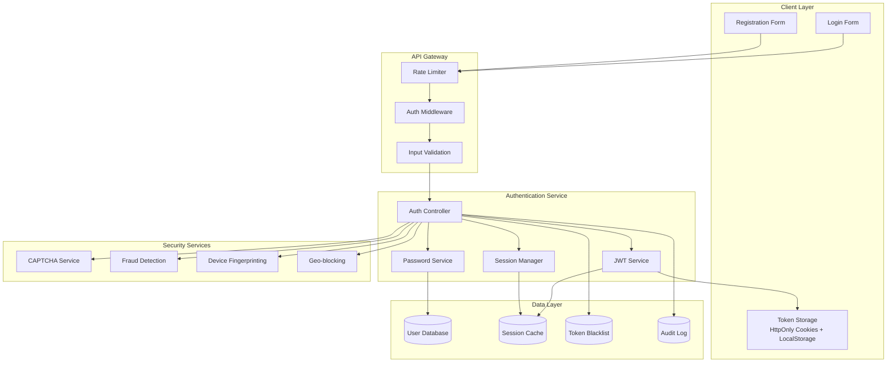

# Authentication & Security Architecture

## Overview

This document outlines the comprehensive authentication and security architecture for the gaming platform, ensuring robust protection against threats while maintaining excellent user experience.

## 1. Authentication Architecture

### Authentication Flow Overview



### JWT Token Strategy

#### Access Token Structure
```typescript
interface AccessTokenPayload {
  sub: string;           // User ID
  username: string;      // Username
  email: string;         // Email address
  role: 'user' | 'admin' | 'moderator';
  isVerified: boolean;   // Email verification status
  permissions: string[]; // Granular permissions
  sessionId: string;     // Session identifier
  deviceId: string;      // Device fingerprint
  iat: number;          // Issued at
  exp: number;          // Expires at (15 minutes)
  iss: string;          // Issuer
  aud: string;          // Audience
}
```

#### Refresh Token Structure
```typescript
interface RefreshTokenPayload {
  sub: string;           // User ID
  sessionId: string;     // Session identifier
  deviceId: string;      // Device fingerprint
  tokenFamily: string;   // Token rotation family
  iat: number;          // Issued at
  exp: number;          // Expires at (7-30 days)
  iss: string;          // Issuer
  aud: string;          // Audience
}
```

### Token Security Features

#### 1. Token Rotation
```typescript
class TokenRotationService {
  async rotateRefreshToken(oldToken: string): Promise<TokenPair> {
    // Validate old token
    const payload = await this.validateRefreshToken(oldToken);
    
    // Invalidate old token family if suspicious activity
    if (await this.detectTokenReuse(oldToken)) {
      await this.invalidateTokenFamily(payload.tokenFamily);
      throw new SecurityError('Token reuse detected');
    }
    
    // Generate new token pair
    const newTokenFamily = this.generateTokenFamily();
    const accessToken = await this.generateAccessToken(payload.sub);
    const refreshToken = await this.generateRefreshToken(payload.sub, newTokenFamily);
    
    // Store new session
    await this.storeSession(payload.sub, newTokenFamily, payload.deviceId);
    
    return { accessToken, refreshToken };
  }
}
```

#### 2. Token Blacklisting
```typescript
class TokenBlacklistService {
  async blacklistToken(token: string, reason: string): Promise<void> {
    const payload = jwt.decode(token) as JWTPayload;
    const key = `blacklist:${payload.jti}`;
    const ttl = payload.exp - Math.floor(Date.now() / 1000);
    
    await this.redis.setex(key, ttl, JSON.stringify({
      reason,
      blacklistedAt: new Date(),
      userId: payload.sub
    }));
  }
  
  async isTokenBlacklisted(token: string): Promise<boolean> {
    const payload = jwt.decode(token) as JWTPayload;
    const key = `blacklist:${payload.jti}`;
    return await this.redis.exists(key) === 1;
  }
}
```

### Multi-Factor Authentication (MFA)

#### TOTP Implementation
```typescript
class TOTPService {
  generateSecret(userId: string): string {
    return speakeasy.generateSecret({
      name: `Gaming Platform (${userId})`,
      issuer: 'Gaming Platform',
      length: 32
    }).base32;
  }
  
  async enableTOTP(userId: string, token: string): Promise<string[]> {
    const user = await this.userService.findById(userId);
    const secret = user.security.twoFactorSecret;
    
    const verified = speakeasy.totp.verify({
      secret,
      encoding: 'base32',
      token,
      window: 2
    });
    
    if (!verified) {
      throw new ValidationError('Invalid TOTP token');
    }
    
    // Generate backup codes
    const backupCodes = this.generateBackupCodes();
    
    await this.userService.updateSecurity(userId, {
      twoFactorEnabled: true,
      backupCodes: await this.hashBackupCodes(backupCodes)
    });
    
    return backupCodes;
  }
}
```

## 2. Password Security

### Password Policy
```typescript
interface PasswordPolicy {
  minLength: 8;
  maxLength: 128;
  requireUppercase: true;
  requireLowercase: true;
  requireNumbers: true;
  requireSpecialChars: true;
  preventCommonPasswords: true;
  preventUserInfoInPassword: true;
  passwordHistory: 5; // Remember last 5 passwords
  maxAge: 90; // Days before password expires
}
```

### Password Hashing Strategy
```typescript
class PasswordService {
  private readonly SALT_ROUNDS = 12;
  private readonly PEPPER = process.env.PASSWORD_PEPPER;
  
  async hashPassword(password: string): Promise<string> {
    // Add pepper for additional security
    const pepperedPassword = password + this.PEPPER;
    
    // Use bcrypt with high cost factor
    return await bcrypt.hash(pepperedPassword, this.SALT_ROUNDS);
  }
  
  async verifyPassword(password: string, hash: string): Promise<boolean> {
    const pepperedPassword = password + this.PEPPER;
    return await bcrypt.compare(pepperedPassword, hash);
  }
  
  async isPasswordCompromised(password: string): Promise<boolean> {
    // Check against HaveIBeenPwned API
    const sha1Hash = crypto.createHash('sha1').update(password).digest('hex');
    const prefix = sha1Hash.substring(0, 5);
    const suffix = sha1Hash.substring(5).toUpperCase();
    
    try {
      const response = await axios.get(`https://api.pwnedpasswords.com/range/${prefix}`);
      return response.data.includes(suffix);
    } catch {
      return false; // Fail open for availability
    }
  }
}
```

## 3. Session Management

### Session Architecture
```typescript
interface UserSession {
  sessionId: string;
  userId: string;
  deviceId: string;
  ipAddress: string;
  userAgent: string;
  location?: {
    country: string;
    city: string;
    coordinates: [number, number];
  };
  createdAt: Date;
  lastActivity: Date;
  expiresAt: Date;
  isActive: boolean;
  tokenFamily: string;
  securityFlags: {
    isSuspicious: boolean;
    riskScore: number;
    verificationLevel: 'basic' | 'enhanced' | 'high';
  };
}
```

### Session Security Features
```typescript
class SessionSecurityService {
  async detectAnomalousSession(session: UserSession): Promise<boolean> {
    const user = await this.userService.findById(session.userId);
    const recentSessions = await this.getRecentSessions(session.userId, 30);
    
    // Check for unusual location
    if (await this.isUnusualLocation(session, recentSessions)) {
      return true;
    }
    
    // Check for unusual device
    if (await this.isUnusualDevice(session, recentSessions)) {
      return true;
    }
    
    // Check for concurrent sessions from different locations
    if (await this.hasConcurrentSuspiciousSessions(session, recentSessions)) {
      return true;
    }
    
    return false;
  }
  
  async handleSuspiciousSession(session: UserSession): Promise<void> {
    // Require additional verification
    session.securityFlags.verificationLevel = 'enhanced';
    
    // Send security alert
    await this.notificationService.sendSecurityAlert(session.userId, {
      type: 'suspicious_login',
      location: session.location,
      device: session.userAgent,
      timestamp: session.createdAt
    });
    
    // Log security event
    await this.auditService.logSecurityEvent({
      type: 'SUSPICIOUS_SESSION',
      userId: session.userId,
      sessionId: session.sessionId,
      details: session
    });
  }
}
```

## 4. Input Validation & Sanitization

### Validation Middleware
```typescript
class ValidationMiddleware {
  static validateRegistration = [
    body('username')
      .isLength({ min: 3, max: 20 })
      .matches(/^[a-zA-Z0-9_]+$/)
      .custom(async (value) => {
        const exists = await User.findOne({ username: value });
        if (exists) throw new Error('Username already exists');
      }),
    
    body('email')
      .isEmail()
      .normalizeEmail()
      .custom(async (value) => {
        const exists = await User.findOne({ email: value });
        if (exists) throw new Error('Email already exists');
      }),
    
    body('password')
      .isLength({ min: 8, max: 128 })
      .matches(/^(?=.*[a-z])(?=.*[A-Z])(?=.*\d)(?=.*[@$!%*?&])[A-Za-z\d@$!%*?&]/)
      .custom(async (value) => {
        const isCompromised = await passwordService.isPasswordCompromised(value);
        if (isCompromised) throw new Error('Password has been compromised');
      }),
    
    this.handleValidationErrors
  ];
  
  static sanitizeInput(req: Request, res: Response, next: NextFunction) {
    // Sanitize all string inputs
    for (const key in req.body) {
      if (typeof req.body[key] === 'string') {
        req.body[key] = validator.escape(req.body[key]);
      }
    }
    next();
  }
}
```

### SQL/NoSQL Injection Prevention
```typescript
class DatabaseSecurity {
  // Use parameterized queries with Mongoose
  static async findUserSafely(criteria: any): Promise<User | null> {
    // Whitelist allowed fields
    const allowedFields = ['username', 'email', '_id'];
    const sanitizedCriteria = Object.keys(criteria)
      .filter(key => allowedFields.includes(key))
      .reduce((obj, key) => {
        obj[key] = criteria[key];
        return obj;
      }, {});
    
    return await User.findOne(sanitizedCriteria);
  }
  
  // Prevent NoSQL injection in aggregation pipelines
  static sanitizeAggregationPipeline(pipeline: any[]): any[] {
    return pipeline.map(stage => {
      // Remove dangerous operators
      const dangerousOps = ['$where', '$function', '$accumulator'];
      return this.removeDangerousOperators(stage, dangerousOps);
    });
  }
}
```

## 5. Rate Limiting & DDoS Protection

### Rate Limiting Strategy
```typescript
class RateLimitingService {
  // Different limits for different endpoints
  static readonly LIMITS = {
    login: { windowMs: 15 * 60 * 1000, max: 5 }, // 5 attempts per 15 minutes
    register: { windowMs: 60 * 60 * 1000, max: 3 }, // 3 registrations per hour
    passwordReset: { windowMs: 60 * 60 * 1000, max: 3 }, // 3 resets per hour
    gameMove: { windowMs: 1000, max: 1 }, // 1 move per second
    apiGeneral: { windowMs: 15 * 60 * 1000, max: 100 }, // 100 requests per 15 minutes
    fileUpload: { windowMs: 60 * 60 * 1000, max: 10 } // 10 uploads per hour
  };
  
  static createRateLimit(type: keyof typeof RateLimitingService.LIMITS) {
    const config = this.LIMITS[type];
    
    return rateLimit({
      windowMs: config.windowMs,
      max: config.max,
      message: {
        error: 'Too many requests',
        retryAfter: Math.ceil(config.windowMs / 1000)
      },
      standardHeaders: true,
      legacyHeaders: false,
      store: new RedisStore({
        client: redisClient,
        prefix: `rl:${type}:`
      }),
      keyGenerator: (req) => {
        // Use IP + User ID for authenticated requests
        return req.user ? `${req.ip}:${req.user.id}` : req.ip;
      }
    });
  }
}
```

### DDoS Protection
```typescript
class DDoSProtectionService {
  async detectDDoSAttack(req: Request): Promise<boolean> {
    const clientIP = this.getClientIP(req);
    const timeWindow = 60; // 1 minute
    const threshold = 1000; // requests per minute
    
    // Count requests from this IP
    const requestCount = await this.redis.incr(`ddos:${clientIP}`);
    
    if (requestCount === 1) {
      await this.redis.expire(`ddos:${clientIP}`, timeWindow);
    }
    
    if (requestCount > threshold) {
      // Temporarily block this IP
      await this.redis.setex(`blocked:${clientIP}`, 3600, 'DDoS detected');
      
      // Log attack
      await this.auditService.logSecurityEvent({
        type: 'DDOS_ATTACK',
        sourceIP: clientIP,
        requestCount,
        timestamp: new Date()
      });
      
      return true;
    }
    
    return false;
  }
}
```

## 6. Data Encryption

### Encryption at Rest
```typescript
class EncryptionService {
  private readonly algorithm = 'aes-256-gcm';
  private readonly keyDerivationIterations = 100000;
  
  async encryptSensitiveData(data: string, userKey?: string): Promise<EncryptedData> {
    const key = userKey || process.env.ENCRYPTION_KEY;
    const iv = crypto.randomBytes(16);
    const salt = crypto.randomBytes(32);
    
    // Derive key using PBKDF2
    const derivedKey = crypto.pbkdf2Sync(key, salt, this.keyDerivationIterations, 32, 'sha256');
    
    const cipher = crypto.createCipher(this.algorithm, derivedKey);
    cipher.setAAD(Buffer.from('gaming-platform'));
    
    let encrypted = cipher.update(data, 'utf8', 'hex');
    encrypted += cipher.final('hex');
    
    const authTag = cipher.getAuthTag();
    
    return {
      encrypted,
      iv: iv.toString('hex'),
      salt: salt.toString('hex'),
      authTag: authTag.toString('hex')
    };
  }
  
  async decryptSensitiveData(encryptedData: EncryptedData, userKey?: string): Promise<string> {
    const key = userKey || process.env.ENCRYPTION_KEY;
    const derivedKey = crypto.pbkdf2Sync(
      key,
      Buffer.from(encryptedData.salt, 'hex'),
      this.keyDerivationIterations,
      32,
      'sha256'
    );
    
    const decipher = crypto.createDecipher(this.algorithm, derivedKey);
    decipher.setAAD(Buffer.from('gaming-platform'));
    decipher.setAuthTag(Buffer.from(encryptedData.authTag, 'hex'));
    
    let decrypted = decipher.update(encryptedData.encrypted, 'hex', 'utf8');
    decrypted += decipher.final('utf8');
    
    return decrypted;
  }
}
```

### Encryption in Transit
```typescript
// TLS Configuration
const tlsOptions = {
  key: fs.readFileSync('path/to/private-key.pem'),
  cert: fs.readFileSync('path/to/certificate.pem'),
  ca: fs.readFileSync('path/to/ca-certificate.pem'),
  
  // Security settings
  secureProtocol: 'TLSv1_2_method',
  ciphers: [
    'ECDHE-RSA-AES128-GCM-SHA256',
    'ECDHE-RSA-AES256-GCM-SHA384',
    'ECDHE-RSA-AES128-SHA256',
    'ECDHE-RSA-AES256-SHA384'
  ].join(':'),
  
  honorCipherOrder: true,
  secureOptions: crypto.constants.SSL_OP_NO_SSLv2 | crypto.constants.SSL_OP_NO_SSLv3
};
```

## 7. Security Headers & CORS

### Security Headers Configuration
```typescript
class SecurityHeadersMiddleware {
  static configure() {
    return helmet({
      contentSecurityPolicy: {
        directives: {
          defaultSrc: ["'self'"],
          styleSrc: ["'self'", "'unsafe-inline'", "https://fonts.googleapis.com"],
          fontSrc: ["'self'", "https://fonts.gstatic.com"],
          imgSrc: ["'self'", "data:", "https:"],
          scriptSrc: ["'self'"],
          connectSrc: ["'self'", "wss:", "https:"],
          frameSrc: ["'none'"],
          objectSrc: ["'none'"],
          baseUri: ["'self'"],
          formAction: ["'self'"],
          upgradeInsecureRequests: []
        }
      },
      
      hsts: {
        maxAge: 31536000,
        includeSubDomains: true,
        preload: true
      },
      
      noSniff: true,
      frameguard: { action: 'deny' },
      xssFilter: true,
      referrerPolicy: { policy: 'strict-origin-when-cross-origin' }
    });
  }
}
```

### CORS Configuration
```typescript
const corsOptions = {
  origin: (origin, callback) => {
    const allowedOrigins = [
      'https://gaming-platform.com',
      'https://admin.gaming-platform.com',
      'https://api.gaming-platform.com'
    ];
    
    if (!origin || allowedOrigins.includes(origin)) {
      callback(null, true);
    } else {
      callback(new Error('Not allowed by CORS'));
    }
  },
  
  credentials: true,
  optionsSuccessStatus: 200,
  
  methods: ['GET', 'POST', 'PUT', 'DELETE', 'PATCH'],
  allowedHeaders: [
    'Origin',
    'X-Requested-With',
    'Content-Type',
    'Accept',
    'Authorization',
    'X-CSRF-Token'
  ]
};
```

## 8. Audit Logging & Monitoring

### Security Event Logging
```typescript
interface SecurityEvent {
  eventType: 'LOGIN' | 'LOGOUT' | 'FAILED_LOGIN' | 'PASSWORD_CHANGE' | 'SUSPICIOUS_ACTIVITY' | 'DATA_ACCESS' | 'PRIVILEGE_ESCALATION';
  userId?: string;
  sessionId?: string;
  ipAddress: string;
  userAgent: string;
  timestamp: Date;
  details: Record<string, any>;
  riskLevel: 'LOW' | 'MEDIUM' | 'HIGH' | 'CRITICAL';
}

class SecurityAuditService {
  async logSecurityEvent(event: SecurityEvent): Promise<void> {
    // Store in database
    await SecurityLog.create(event);
    
    // Send to monitoring system
    await this.monitoringService.sendEvent(event);
    
    // Alert on high-risk events
    if (event.riskLevel === 'HIGH' || event.riskLevel === 'CRITICAL') {
      await this.alertService.sendSecurityAlert(event);
    }
  }
  
  async detectSecurityPatterns(): Promise<void> {
    // Detect brute force attacks
    await this.detectBruteForceAttacks();
    
    // Detect credential stuffing
    await this.detectCredentialStuffing();
    
    // Detect account takeover attempts
    await this.detectAccountTakeoverAttempts();
  }
}
```

## 9. Compliance & Privacy

### GDPR Compliance
```typescript
class GDPRComplianceService {
  async handleDataSubjectRequest(userId: string, requestType: 'access' | 'rectification' | 'erasure' | 'portability'): Promise<void> {
    switch (requestType) {
      case 'access':
        return await this.generateDataExport(userId);
      case 'rectification':
        return await this.enableDataCorrection(userId);
      case 'erasure':
        return await this.anonymizeUserData(userId);
      case 'portability':
        return await this.generatePortableData(userId);
    }
  }
  
  async anonymizeUserData(userId: string): Promise<void> {
    // Replace personal data with anonymized values
    await User.updateOne(
      { _id: userId },
      {
        $set: {
          username: `anonymous_${crypto.randomBytes(8).toString('hex')}`,
          email: `deleted_${crypto.randomBytes(8).toString('hex')}@deleted.com`,
          'profile.firstName': '[DELETED]',
          'profile.lastName': '[DELETED]',
          'profile.phone': '[DELETED]',
          isAnonymized: true
        }
      }
    );
    
    // Keep game statistics but remove personal identifiers
    await Game.updateMany(
      { $or: [{ 'players.player1.userId': userId }, { 'players.player2.userId': userId }] },
      { $set: { 'players.$[elem].username': '[DELETED]' } },
      { arrayFilters: [{ 'elem.userId': userId }] }
    );
  }
}
```

This comprehensive authentication and security architecture ensures robust protection while maintaining usability and compliance with modern security standards.