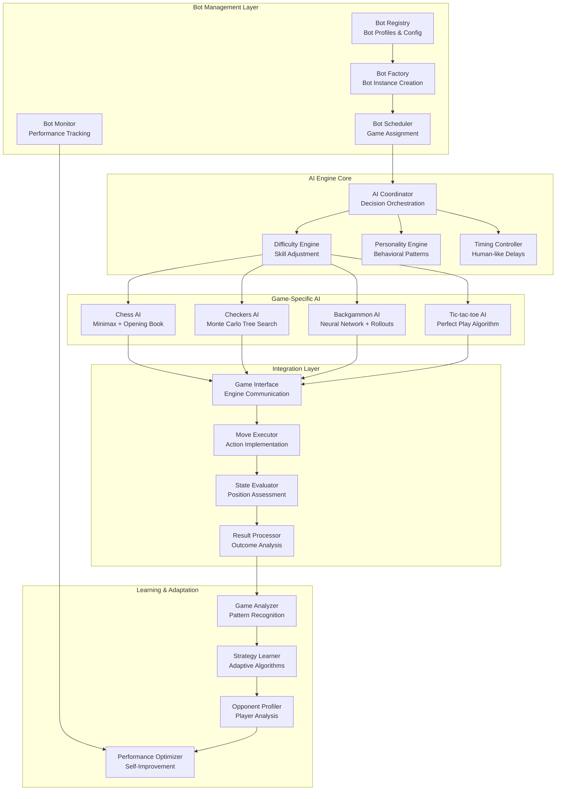

# Bot AI System Architecture

## Overview

This document outlines the comprehensive bot AI system architecture for the gaming platform, providing intelligent opponents across all four game types with varying difficulty levels, human-like behavior patterns, and seamless integration with the game engines.

## 1. Bot AI System Overview



## 2. Core Bot Architecture

### Bot Entity Structure
```typescript
interface BotProfile {
  id: string;
  username: string;
  avatar?: string;
  difficulty: BotDifficulty;
  gameTypes: GameType[];
  personality: BotPersonality;
  aiConfig: AIConfiguration;
  statistics: BotStatistics;
  settings: BotSettings;
  createdAt: Date;
  updatedAt: Date;
}

enum BotDifficulty {
  BEGINNER = 'beginner',
  EASY = 'easy',
  MEDIUM = 'medium',
  HARD = 'hard',
  EXPERT = 'expert',
  MASTER = 'master'
}

interface BotPersonality {
  playStyle: 'aggressive' | 'defensive' | 'balanced' | 'unpredictable' | 'positional';
  riskTolerance: number; // 0-1, higher = more risky
  patience: number; // 0-1, affects thinking time
  consistency: number; // 0-1, higher = fewer mistakes
  adaptability: number; // 0-1, ability to change strategy
  bluffing: number; // 0-1, tendency to make deceptive moves
}

interface AIConfiguration {
  engine: string;
  searchDepth: number;
  evaluationWeights: Record<string, number>;
  openingBookEnabled: boolean;
  endgameTablebaseEnabled: boolean;
  learningEnabled: boolean;
  errorRate: number; // Intentional mistake probability
  thinkingTime: {
    min: number;
    max: number;
    variance: number;
  };
}
```

### Bot Factory and Management
```typescript
class BotFactory {
  private botTemplates: Map<string, BotTemplate> = new Map();
  private activeBots: Map<string, BotInstance> = new Map();

  constructor(
    private aiEngineFactory: AIEngineFactory,
    private personalityEngine: PersonalityEngine,
    private difficultyEngine: DifficultyEngine
  ) {
    this.initializeBotTemplates();
  }

  async createBot(template: BotTemplate, gameType: GameType): Promise<BotInstance> {
    const botProfile = await this.generateBotProfile(template, gameType);
    const aiEngine = await this.aiEngineFactory.createEngine(gameType, botProfile.difficulty);
    const personality = this.personalityEngine.createPersonality(botProfile.personality);
    
    const botInstance: BotInstance = {
      id: botProfile.id,
      profile: botProfile,
      aiEngine,
      personality,
      currentGames: new Set(),
      isActive: true,
      createdAt: new Date()
    };

    this.activeBots.set(botInstance.id, botInstance);
    return botInstance;
  }

  async getBotForGame(gameType: GameType, difficulty: BotDifficulty, excludeIds: string[] = []): Promise<BotInstance> {
    // Try to find existing suitable bot
    const availableBot = this.findAvailableBot(gameType, difficulty, excludeIds);
    
    if (availableBot) {
      return availableBot;
    }

    // Create new bot if none available
    const template = this.selectBotTemplate(gameType, difficulty);
    return await this.createBot(template, gameType);
  }

  private async generateBotProfile(template: BotTemplate, gameType: GameType): Promise<BotProfile> {
    const username = this.generateBotUsername(template);
    const personality = this.generatePersonality(template.personalityType);
    const aiConfig = this.generateAIConfig(template.difficulty, gameType);

    return {
      id: generateId(),
      username,
      avatar: template.avatar,
      difficulty: template.difficulty,
      gameTypes: [gameType],
      personality,
      aiConfig,
      statistics: this.initializeBotStatistics(),
      settings: this.generateBotSettings(template),
      createdAt: new Date(),
      updatedAt: new Date()
    };
  }

  private generateBotUsername(template: BotTemplate): string {
    const prefixes = {
      aggressive: ['Blitz', 'Storm', 'Thunder', 'Lightning', 'Fury'],
      defensive: ['Shield', 'Guard', 'Fortress', 'Bastion', 'Wall'],
      balanced: ['Sage', 'Master', 'Scholar', 'Tactician', 'Strategist'],
      unpredictable: ['Chaos', 'Wild', 'Rogue', 'Maverick', 'Rebel'],
      positional: ['Deep', 'Profound', 'Wise', 'Calculated', 'Methodical']
    };

    const suffixes = ['Bot', 'AI', 'Engine', 'Mind', 'Brain', 'Logic'];
    const numbers = Math.floor(Math.random() * 9999) + 1;

    const prefix = prefixes[template.personalityType][Math.floor(Math.random() * prefixes[template.personalityType].length)];
    const suffix = suffixes[Math.floor(Math.random() * suffixes.length)];

    return `${prefix}${suffix}${numbers}`;
  }
}
```

## 3. Game-Specific AI Implementations

### Chess AI Engine
```typescript
class ChessAIEngine extends BaseAIEngine {
  private openingBook: OpeningBook;
  private endgameTablebase: EndgameTablebase;
  private evaluator: ChessPositionEvaluator;

  constructor(difficulty: BotDifficulty, config: AIConfiguration) {
    super(difficulty, config);
    this.openingBook = new OpeningBook();
    this.endgameTablebase = new EndgameTablebase();
    this.evaluator = new ChessPositionEvaluator(config.evaluationWeights);
  }

  async calculateBestMove(position: ChessPosition, timeLimit: number): Promise<ChessMove> {
    // Check opening book first
    if (this.config.openingBookEnabled && position.fullmoveNumber <= 15) {
      const bookMove = this.openingBook.getMove(position);
      if (bookMove && this.shouldUseBookMove()) {
        return this.addPersonalityVariation(bookMove);
      }
    }

    // Check endgame tablebase
    if (this.config.endgameTablebaseEnabled && this.isEndgame(position)) {
      const tablebaseMove = await this.endgameTablebase.getMove(position);
      if (tablebaseMove) {
        return this.addPersonalityVariation(tablebaseMove);
      }
    }

    // Use search algorithm
    const searchResult = await this.searchBestMove(position, timeLimit);
    return this.applyDifficultyAdjustment(searchResult);
  }

  private async searchBestMove(position: ChessPosition, timeLimit: number): Promise<ChessMove> {
    const startTime = Date.now();
    let bestMove: ChessMove | null = null;
    let bestScore = -Infinity;

    // Iterative deepening
    for (let depth = 1; depth <= this.config.searchDepth; depth++) {
      if (Date.now() - startTime > timeLimit * 0.8) break;

      const result = await this.alphaBetaSearch(position, depth, -Infinity, Infinity, true);
      
      if (result.move) {
        bestMove = result.move;
        bestScore = result.score;
      }

      // Stop if mate found
      if (Math.abs(result.score) > 9000) break;
    }

    return bestMove || this.getRandomLegalMove(position);
  }

  private async alphaBetaSearch(
    position: ChessPosition,
    depth: number,
    alpha: number,
    beta: number,
    isMaximizing: boolean
  ): Promise<SearchResult> {
    if (depth === 0 || this.isGameOver(position)) {
      return {
        score: this.evaluator.evaluate(position),
        move: null
      };
    }

    const moves = this.generateMoves(position);
    this.orderMoves(moves, position);

    let bestMove: ChessMove | null = null;

    if (isMaximizing) {
      let maxScore = -Infinity;
      
      for (const move of moves) {
        const newPosition = this.makeMove(position, move);
        const result = await this.alphaBetaSearch(newPosition, depth - 1, alpha, beta, false);
        
        if (result.score > maxScore) {
          maxScore = result.score;
          bestMove = move;
        }
        
        alpha = Math.max(alpha, result.score);
        if (beta <= alpha) break; // Alpha-beta pruning
      }
      
      return { score: maxScore, move: bestMove };
    } else {
      let minScore = Infinity;
      
      for (const move of moves) {
        const newPosition = this.makeMove(position, move);
        const result = await this.alphaBetaSearch(newPosition, depth - 1, alpha, beta, true);
        
        if (result.score < minScore) {
          minScore = result.score;
          bestMove = move;
        }
        
        beta = Math.min(beta, result.score);
        if (beta <= alpha) break; // Alpha-beta pruning
      }
      
      return { score: minScore, move: bestMove };
    }
  }

  private applyDifficultyAdjustment(move: ChessMove): ChessMove {
    // Introduce errors based on difficulty
    if (Math.random() < this.config.errorRate) {
      const alternatives = this.getAlternativeMoves(move);
      if (alternatives.length > 0) {
        return alternatives[Math.floor(Math.random() * alternatives.length)];
      }
    }

    return move;
  }
}
```

### Checkers AI Engine
```typescript
class CheckersAIEngine extends BaseAIEngine {
  private mctsTree: MCTSNode | null = null;
  private evaluator: CheckersPositionEvaluator;

  constructor(difficulty: BotDifficulty, config: AIConfiguration) {
    super(difficulty, config);
    this.evaluator = new CheckersPositionEvaluator(config.evaluationWeights);
  }

  async calculateBestMove(position: CheckersPosition, timeLimit: number): Promise<CheckersMove> {
    // Use Monte Carlo Tree Search for checkers
    const rootNode = new MCTSNode(position, null);
    const startTime = Date.now();
    let iterations = 0;

    while (Date.now() - startTime < timeLimit && iterations < this.getMaxIterations()) {
      await this.mctsIteration(rootNode);
      iterations++;
    }

    const bestChild = this.selectBestChild(rootNode);
    return bestChild ? bestChild.move! : this.getRandomLegalMove(position);
  }

  private async mctsIteration(node: MCTSNode): Promise<void> {
    // Selection
    const selectedNode = this.selectNode(node);
    
    // Expansion
    const expandedNode = this.expandNode(selectedNode);
    
    // Simulation
    const result = await this.simulate(expandedNode.position);
    
    // Backpropagation
    this.backpropagate(expandedNode, result);
  }

  private selectNode(node: MCTSNode): MCTSNode {
    while (!node.isLeaf() && !this.isGameOver(node.position)) {
      node = this.selectChildUCB1(node);
    }
    return node;
  }

  private selectChildUCB1(node: MCTSNode): MCTSNode {
    let bestChild: MCTSNode | null = null;
    let bestValue = -Infinity;

    for (const child of node.children) {
      const exploitation = child.wins / child.visits;
      const exploration = Math.sqrt(2 * Math.log(node.visits) / child.visits);
      const ucb1Value = exploitation + exploration;

      if (ucb1Value > bestValue) {
        bestValue = ucb1Value;
        bestChild = child;
      }
    }

    return bestChild!;
  }

  private expandNode(node: MCTSNode): MCTSNode {
    if (this.isGameOver(node.position)) {
      return node;
    }

    const moves = this.generateMoves(node.position);
    
    for (const move of moves) {
      const newPosition = this.makeMove(node.position, move);
      const childNode = new MCTSNode(newPosition, move, node);
      node.children.push(childNode);
    }

    return node.children.length > 0 ? node.children[0] : node;
  }

  private async simulate(position: CheckersPosition): Promise<number> {
    let currentPosition = { ...position };
    let moveCount = 0;
    const maxMoves = 200; // Prevent infinite games

    while (!this.isGameOver(currentPosition) && moveCount < maxMoves) {
      const moves = this.generateMoves(currentPosition);
      if (moves.length === 0) break;

      const randomMove = moves[Math.floor(Math.random() * moves.length)];
      currentPosition = this.makeMove(currentPosition, randomMove);
      moveCount++;
    }

    return this.evaluateGameResult(currentPosition);
  }

  private backpropagate(node: MCTSNode, result: number): void {
    let current: MCTSNode | null = node;
    
    while (current) {
      current.visits++;
      current.wins += result;
      current = current.parent;
    }
  }
}
```

### Backgammon AI Engine
```typescript
class BackgammonAIEngine extends BaseAIEngine {
  private neuralNetwork: BackgammonNeuralNetwork;
  private rolloutEvaluator: RolloutEvaluator;

  constructor(difficulty: BotDifficulty, config: AIConfiguration) {
    super(difficulty, config);
    this.neuralNetwork = new BackgammonNeuralNetwork();
    this.rolloutEvaluator = new RolloutEvaluator();
  }

  async calculateBestMove(position: BackgammonPosition, availableMoves: number[]): Promise<BackgammonMove[]> {
    const possibleMoveSequences = this.generateMoveSequences(position, availableMoves);
    let bestSequence: BackgammonMove[] = [];
    let bestScore = -Infinity;

    for (const sequence of possibleMoveSequences) {
      const resultingPosition = this.applyMoveSequence(position, sequence);
      const score = await this.evaluatePosition(resultingPosition);
      
      if (score > bestScore) {
        bestScore = score;
        bestSequence = sequence;
      }
    }

    return this.applyDifficultyAdjustment(bestSequence, possibleMoveSequences);
  }

  private async evaluatePosition(position: BackgammonPosition): Promise<number> {
    // Use neural network for position evaluation
    const features = this.extractFeatures(position);
    const networkScore = await this.neuralNetwork.evaluate(features);
    
    // Combine with rollout evaluation for better accuracy
    const rolloutScore = await this.rolloutEvaluator.evaluate(position, 100);
    
    // Weight combination based on game phase
    const gamePhase = this.determineGamePhase(position);
    const networkWeight = gamePhase === 'endgame' ? 0.8 : 0.6;
    
    return networkScore * networkWeight + rolloutScore * (1 - networkWeight);
  }

  private extractFeatures(position: BackgammonPosition): number[] {
    const features: number[] = [];
    
    // Board representation (24 points)
    for (let i = 1; i <= 24; i++) {
      features.push(position.board[i] || 0);
    }
    
    // Bar pieces
    features.push(position.bar.white, position.bar.black);
    
    // Borne off pieces
    features.push(position.off.white, position.off.black);
    
    // Pip count
    features.push(this.calculatePipCount(position, 'white'));
    features.push(this.calculatePipCount(position, 'black'));
    
    // Advanced features
    features.push(this.countBlots(position, 'white'));
    features.push(this.countBlots(position, 'black'));
    features.push(this.countMadePoints(position, 'white'));
    features.push(this.countMadePoints(position, 'black'));
    
    return features;
  }

  private generateMoveSequences(position: BackgammonPosition, dice: number[]): BackgammonMove[][] {
    const sequences: BackgammonMove[][] = [];
    
    if (dice[0] === dice[1]) {
      // Doubles: can use up to 4 moves
      this.generateDoublesSequences(position, dice[0], 4, [], sequences);
    } else {
      // Regular roll: use both dice
      this.generateRegularSequences(position, dice, [], sequences);
    }
    
    return sequences;
  }

  private applyDifficultyAdjustment(bestSequence: BackgammonMove[], allSequences: BackgammonMove[][]): BackgammonMove[] {
    // Introduce suboptimal play based on difficulty
    if (Math.random() < this.config.errorRate && allSequences.length > 1) {
      // Choose a slightly worse move
      const alternatives = allSequences.filter(seq => seq !== bestSequence);
      if (alternatives.length > 0) {
        return alternatives[Math.floor(Math.random() * Math.min(3, alternatives.length))];
      }
    }
    
    return bestSequence;
  }
}
```

### Tic-tac-toe AI Engine
```typescript
class TicTacToeAIEngine extends BaseAIEngine {
  constructor(difficulty: BotDifficulty, config: AIConfiguration) {
    super(difficulty, config);
  }

  async calculateBestMove(position: TicTacToePosition): Promise<TicTacToeMove> {
    // Perfect play using minimax for higher difficulties
    if (this.difficulty === BotDifficulty.EXPERT || this.difficulty === BotDifficulty.MASTER) {
      return this.minimaxMove(position);
    }
    
    // Imperfect play for lower difficulties
    return this.imperfectMove(position);
  }

  private minimaxMove(position: TicTacToePosition): TicTacToeMove {
    const availableMoves = this.getAvailableMoves(position);
    let bestMove: TicTacToeMove = availableMoves[0];
    let bestScore = -Infinity;

    for (const move of availableMoves) {
      const newPosition = this.makeMove(position, move);
      const score = this.minimax(newPosition, false);
      
      if (score > bestScore) {
        bestScore = score;
        bestMove = move;
      }
    }

    return bestMove;
  }

  private minimax(position: TicTacToePosition, isMaximizing: boolean): number {
    const winner = this.checkWinner(position);
    
    if (winner === 'X') return isMaximizing ? -1 : 1;
    if (winner === 'O') return isMaximizing ? 1 : -1;
    if (this.isBoardFull(position)) return 0;

    const availableMoves = this.getAvailableMoves(position);
    
    if (isMaximizing) {
      let maxScore = -Infinity;
      for (const move of availableMoves) {
        const newPosition = this.makeMove(position, move);
        const score = this.minimax(newPosition, false);
        maxScore = Math.max(score, maxScore);
      }
      return maxScore;
    } else {
      let minScore = Infinity;
      for (const move of availableMoves) {
        const newPosition = this.makeMove(position, move);
        const score = this.minimax(newPosition, true);
        minScore = Math.min(score, minScore);
      }
      return minScore;
    }
  }

  private imperfectMove(position: TicTacToePosition): TicTacToeMove {
    const availableMoves = this.getAvailableMoves(position);
    
    // Check for winning move
    for (const move of availableMoves) {
      const testPosition = this.makeMove(position, move);
      if (this.checkWinner(testPosition) === position.activePlayer) {
        return move;
      }
    }
    
    // Check for blocking move (based on difficulty)
    if (this.difficulty !== BotDifficulty.BEGINNER && Math.random() > this.config.errorRate) {
      const opponent = position.activePlayer === 'X' ? 'O' : 'X';
      for (const move of availableMoves) {
        const testPosition = { ...position, activePlayer: opponent };
        const testMove = this.makeMove(testPosition, move);
        if (this.checkWinner(testMove) === opponent) {
          return move;
        }
      }
    }
    
    // Strategic moves based on difficulty
    if (this.difficulty >= BotDifficulty.MEDIUM) {
      // Prefer center, then corners, then edges
      const center = { row: 1, col: 1 };
      if (this.isMoveAvailable(position, center)) {
        return center;
      }
      
      const corners = [
        { row: 0, col: 0 }, { row: 0, col: 2 },
        { row: 2, col: 0 }, { row: 2, col: 2 }
      ];
      
      for (const corner of corners) {
        if (this.isMoveAvailable(position, corner)) {
          return corner;
        }
      }
    }
    
    // Random move
    return availableMoves[Math.floor(Math.random() * availableMoves.length)];
  }
}
```

## 4. Personality and Behavior Engine

### Personality Engine
```typescript
class PersonalityEngine {
  createPersonality(config: BotPersonality): BotBehavior {
    return {
      makeDecision: (options: DecisionOptions) => this.makePersonalizedDecision(config, options),
      calculateThinkingTime: (complexity: number) => this.calculateThinkingTime(config, complexity),
      shouldBluff: (situation: GameSituation) => this.shouldBluff(config, situation),
      adaptStrategy: (gameHistory: GameHistory) => this.adaptStrategy(config, gameHistory)
    };
  }

  private makePersonalizedDecision(personality: BotPersonality, options: DecisionOptions): Decision {
    const baseDecision = options.bestMove;
    
    // Apply personality modifications
    if (personality.playStyle === 'aggressive' && options.aggressiveAlternatives.length > 0) {
      if (Math.random() < personality.riskTolerance) {
        return this.selectAggressiveMove(options.aggressiveAlternatives);
      }
    }
    
    if (personality.playStyle === 'defensive' && options.defensiveAlternatives.length > 0) {
      if (Math.random() < (1 - personality.riskTolerance)) {
        return this.selectDefensiveMove(options.defensiveAlternatives);
      }
    }
    
    if (personality.playStyle === 'unpredictable') {
      if (Math.random() < 0.3) { // 30% chance of unpredictable move
        return this.selectRandomMove(options.allMoves);
      }
    }
    
    // Apply consistency factor
    if (Math.random() > personality.consistency) {
      return this.introduceError(baseDecision, options.allMoves);
    }
    
    return baseDecision;
  }

  private calculateThinkingTime(personality: BotPersonality, complexity: number): number {
    const baseTime = complexity * 1000; // Base thinking time in ms
    const patienceMultiplier = 0.5 + (personality.patience * 1.5);
    const variance = personality.patience * 0.3; // More patient bots have more variance
    
    const thinkingTime = baseTime * patienceMultiplier;
    const randomVariance = (Math.random() - 0.5) * variance * thinkingTime;
    
    return Math.max(500, thinkingTime + randomVariance); // Minimum 500ms
  }

  private shouldBluff(personality: BotPersonality, situation: GameSituation): boolean {
    if (!situation.bluffingPossible) return false;
    
    const bluffProbability = personality.bluffing * situation.bluffingOpportunity;
    return Math.random() < bluffProbability;
  }

  private adaptStrategy(personality: BotPersonality, gameHistory: GameHistory): StrategyAdjustment {
    if (personality.adaptability < 0.3) {
      return { shouldAdapt: false }; // Low adaptability bots don't change
    }
    
    const recentPerformance = this.analyzeRecentPerformance(gameHistory);
    
    if (recentPerformance.winRate < 0.3 && personality.adaptability > 0.7) {
      return {
        shouldAdapt: true,
        newStrategy: this.selectCounterStrategy(recentPerformance.opponentStyle),
        adaptationStrength: personality.adaptability
      };
    }
    
    return { shouldAdapt: false };
  }
}
```

## 5. Difficulty Scaling System

### Difficulty Engine
```typescript
class DifficultyEngine {
  private difficultyProfiles: Map<BotDifficulty, DifficultyProfile> = new Map();

  constructor() {
    this.initializeDifficultyProfiles();
  }

  private initializeDifficultyProfiles(): void {
    this.difficultyProfiles.set(BotDifficulty.BEGINNER, {
      searchDepth: 1,
      errorRate: 0.4,
      thinkingTimeMultiplier: 0.5,
      openingBookUsage: 0.1,
      tacticalAwareness: 0.2,
      strategicUnderstanding: 0.1,
      endgameSkill: 0.1
    });

    this.difficultyProfiles.set(BotDifficulty.EASY, {
      searchDepth: 2,
      errorRate: 0.25,
      thinkingTimeMultiplier: 0.7,
      openingBookUsage: 0.3,
      tacticalAwareness: 0.4,
      strategicUnderstanding: 0.3,
      endgameSkill: 0.3
    });

    this.difficultyProfiles.set(BotDifficulty.MEDIUM, {
      searchDepth: 3,
      errorRate: 0.15,
      thinkingTimeMultiplier: 1.0,
      openingBookUsage: 0.5,
      tacticalAwareness: 0.6,
      strategicUnderstanding: 0.5,
      endgameSkill: 0.5
    });

    this.difficultyProfiles.set(BotDifficulty.HARD, {
      searchDepth: 4,
      errorRate: 0.08,
      thinkingTimeMultiplier: 1.3,
      openingBookUsage: 0.7,
      tacticalAwareness: 0.8,
      strategicUnderstanding: 0.7,
      endgameSkill: 0.7
    });

    this.difficultyProfiles.set(BotDifficulty.EXPERT, {
      searchDepth: 5,
      errorRate: 0.03,
      thinkingTimeMultiplier: 1.5,
      openingBookUsage: 0.9,
      tacticalAwareness: 0.95,
      strategicUnderstanding: 0.9,
      endgameSkill: 0.9
    });

    this.difficultyProfiles.set(BotDifficulty.MASTER, {
      searchDepth: 6,
      errorRate: 0.01,
      thinkingTimeMultiplier: 2.0,
      openingBookUsage: 1.

      openingBookUsage: 1.0,
      tacticalAwareness: 0.99,
      strategicUnderstanding: 0.95,
      endgameSkill: 0.95
    });
  }

  adjustBotForDifficulty(bot: BotInstance, targetDifficulty: BotDifficulty): void {
    const profile = this.difficultyProfiles.get(targetDifficulty);
    if (!profile) return;

    // Adjust AI configuration
    bot.profile.aiConfig.searchDepth = profile.searchDepth;
    bot.profile.aiConfig.errorRate = profile.errorRate;
    bot.profile.aiConfig.thinkingTime.min *= profile.thinkingTimeMultiplier;
    bot.profile.aiConfig.thinkingTime.max *= profile.thinkingTimeMultiplier;

    // Adjust evaluation weights based on skill levels
    this.adjustEvaluationWeights(bot.profile.aiConfig.evaluationWeights, profile);
  }

  private adjustEvaluationWeights(weights: Record<string, number>, profile: DifficultyProfile): void {
    // Tactical awareness affects tactical pattern recognition
    weights.tactics = profile.tacticalAwareness;
    weights.pins = profile.tacticalAwareness * 0.8;
    weights.forks = profile.tacticalAwareness * 0.9;
    weights.skewers = profile.tacticalAwareness * 0.7;

    // Strategic understanding affects positional evaluation
    weights.pawnStructure = profile.strategicUnderstanding * 0.8;
    weights.kingSafety = profile.strategicUnderstanding * 0.9;
    weights.pieceActivity = profile.strategicUnderstanding * 0.7;
    weights.centerControl = profile.strategicUnderstanding * 0.6;

    // Endgame skill affects endgame evaluation
    weights.endgameKnowledge = profile.endgameSkill;
    weights.pawnEndgames = profile.endgameSkill * 0.9;
    weights.pieceEndgames = profile.endgameSkill * 0.8;
  }

  calculateDynamicDifficulty(opponentRating: number, botRating: number): BotDifficulty {
    const ratingDifference = opponentRating - botRating;
    
    if (ratingDifference > 400) return BotDifficulty.EXPERT;
    if (ratingDifference > 200) return BotDifficulty.HARD;
    if (ratingDifference > 0) return BotDifficulty.MEDIUM;
    if (ratingDifference > -200) return BotDifficulty.EASY;
    return BotDifficulty.BEGINNER;
  }
}
```

## 6. Bot Performance Monitoring

### Performance Monitor
```typescript
class BotPerformanceMonitor {
  private performanceMetrics: Map<string, BotMetrics> = new Map();
  private gameAnalyzer: GameAnalyzer;

  constructor() {
    this.gameAnalyzer = new GameAnalyzer();
  }

  async recordGameResult(botId: string, gameResult: GameResult): Promise<void> {
    const metrics = this.getOrCreateMetrics(botId);
    
    // Update basic statistics
    metrics.gamesPlayed++;
    if (gameResult.winner === 'bot') {
      metrics.wins++;
    } else if (gameResult.winner === 'draw') {
      metrics.draws++;
    } else {
      metrics.losses++;
    }

    // Calculate performance metrics
    metrics.winRate = metrics.wins / metrics.gamesPlayed;
    metrics.averageGameDuration = this.updateAverageGameDuration(metrics, gameResult.duration);
    
    // Analyze game quality
    const gameAnalysis = await this.gameAnalyzer.analyzeGame(gameResult.gameData);
    metrics.averageAccuracy = this.updateAverageAccuracy(metrics, gameAnalysis.accuracy);
    metrics.blunderRate = this.updateBlunderRate(metrics, gameAnalysis.blunders);

    // Update opponent strength tracking
    this.updateOpponentStrengthMetrics(metrics, gameResult.opponentRating);

    // Store updated metrics
    this.performanceMetrics.set(botId, metrics);
    
    // Persist to database
    await this.saveBotMetrics(botId, metrics);
  }

  async analyzeBotPerformance(botId: string, period: TimePeriod): Promise<PerformanceAnalysis> {
    const metrics = this.performanceMetrics.get(botId);
    if (!metrics) {
      throw new Error(`No metrics found for bot ${botId}`);
    }

    const recentGames = await this.getRecentGames(botId, period);
    const analysis: PerformanceAnalysis = {
      overallRating: this.calculateBotRating(metrics),
      strengthAreas: this.identifyStrengths(metrics, recentGames),
      weaknessAreas: this.identifyWeaknesses(metrics, recentGames),
      improvementSuggestions: this.generateImprovementSuggestions(metrics),
      difficultyRecommendation: this.recommendDifficultyAdjustment(metrics),
      consistencyScore: this.calculateConsistencyScore(recentGames),
      adaptabilityScore: this.calculateAdaptabilityScore(recentGames)
    };

    return analysis;
  }

  private calculateBotRating(metrics: BotMetrics): number {
    // Base rating calculation
    let rating = 1200; // Starting rating
    
    // Adjust based on win rate
    const winRateAdjustment = (metrics.winRate - 0.5) * 400;
    rating += winRateAdjustment;
    
    // Adjust based on opponent strength
    const opponentStrengthAdjustment = (metrics.averageOpponentRating - 1200) * 0.1;
    rating += opponentStrengthAdjustment;
    
    // Adjust based on game quality
    const accuracyAdjustment = (metrics.averageAccuracy - 0.8) * 200;
    rating += accuracyAdjustment;
    
    return Math.max(800, Math.min(2400, rating));
  }

  private identifyStrengths(metrics: BotMetrics, recentGames: GameData[]): string[] {
    const strengths: string[] = [];
    
    if (metrics.winRate > 0.6) strengths.push('High win rate');
    if (metrics.averageAccuracy > 0.85) strengths.push('Accurate play');
    if (metrics.blunderRate < 0.1) strengths.push('Low blunder rate');
    
    // Analyze game phases
    const phaseAnalysis = this.analyzeGamePhases(recentGames);
    if (phaseAnalysis.openingScore > 0.8) strengths.push('Strong opening play');
    if (phaseAnalysis.middlegameScore > 0.8) strengths.push('Excellent middlegame');
    if (phaseAnalysis.endgameScore > 0.8) strengths.push('Superior endgame technique');
    
    return strengths;
  }

  private generateImprovementSuggestions(metrics: BotMetrics): ImprovementSuggestion[] {
    const suggestions: ImprovementSuggestion[] = [];
    
    if (metrics.blunderRate > 0.15) {
      suggestions.push({
        area: 'Tactical Awareness',
        priority: 'High',
        description: 'Increase search depth and improve tactical pattern recognition',
        implementation: 'Adjust evaluation weights for tactical motifs'
      });
    }
    
    if (metrics.averageAccuracy < 0.75) {
      suggestions.push({
        area: 'Position Evaluation',
        priority: 'Medium',
        description: 'Improve position evaluation function',
        implementation: 'Retrain evaluation weights based on recent games'
      });
    }
    
    if (metrics.winRate < 0.4) {
      suggestions.push({
        area: 'Overall Strategy',
        priority: 'High',
        description: 'Review and adjust overall playing strategy',
        implementation: 'Analyze losing games and adjust personality parameters'
      });
    }
    
    return suggestions;
  }
}
```

## 7. Bot Learning and Adaptation

### Learning Engine
```typescript
class BotLearningEngine {
  private neuralNetworks: Map<string, NeuralNetwork> = new Map();
  private experienceBuffer: ExperienceBuffer;
  private trainingScheduler: TrainingScheduler;

  constructor() {
    this.experienceBuffer = new ExperienceBuffer(10000); // Store last 10k games
    this.trainingScheduler = new TrainingScheduler();
  }

  async learnFromGame(botId: string, gameData: GameData): Promise<void> {
    // Extract learning examples from the game
    const examples = this.extractLearningExamples(gameData);
    
    // Add to experience buffer
    for (const example of examples) {
      this.experienceBuffer.add(botId, example);
    }

    // Schedule training if enough new data
    if (this.experienceBuffer.getSize(botId) >= 100) {
      await this.trainingScheduler.scheduleTraining(botId);
    }
  }

  private extractLearningExamples(gameData: GameData): LearningExample[] {
    const examples: LearningExample[] = [];
    
    for (let i = 0; i < gameData.moves.length; i++) {
      const position = gameData.positions[i];
      const move = gameData.moves[i];
      const evaluation = gameData.evaluations[i];
      
      examples.push({
        position: this.encodePosition(position),
        move: this.encodeMove(move),
        evaluation: evaluation,
        gameOutcome: gameData.result,
        moveQuality: this.calculateMoveQuality(move, evaluation, gameData.bestMoves[i])
      });
    }
    
    return examples;
  }

  async trainBot(botId: string): Promise<void> {
    const examples = this.experienceBuffer.getExamples(botId);
    if (examples.length < 50) return; // Need minimum data for training
    
    const network = this.getOrCreateNetwork(botId);
    
    // Prepare training data
    const trainingData = this.prepareTrainingData(examples);
    
    // Train the network
    await network.train(trainingData, {
      epochs: 10,
      batchSize: 32,
      learningRate: 0.001,
      validationSplit: 0.2
    });
    
    // Update bot's evaluation function
    await this.updateBotEvaluation(botId, network);
    
    // Clear old examples to prevent overfitting
    this.experienceBuffer.clearOldExamples(botId, 5000);
  }

  private async updateBotEvaluation(botId: string, network: NeuralNetwork): Promise<void> {
    const bot = await this.botService.getBot(botId);
    if (!bot) return;
    
    // Create new evaluation function using the trained network
    const newEvaluationFunction = (position: any) => {
      const features = this.extractFeatures(position);
      return network.predict(features);
    };
    
    // Update bot's AI engine
    bot.aiEngine.setEvaluationFunction(newEvaluationFunction);
    
    // Save updated bot configuration
    await this.botService.updateBot(botId, {
      aiConfig: bot.profile.aiConfig,
      lastTrainingDate: new Date()
    });
  }

  async adaptToOpponent(botId: string, opponentId: string, gameHistory: GameData[]): Promise<void> {
    if (gameHistory.length < 3) return; // Need sufficient history
    
    // Analyze opponent's playing style
    const opponentProfile = this.analyzeOpponentStyle(gameHistory);
    
    // Adjust bot's strategy accordingly
    const adaptations = this.calculateAdaptations(opponentProfile);
    
    // Apply temporary adaptations
    await this.applyTemporaryAdaptations(botId, adaptations);
  }

  private analyzeOpponentStyle(gameHistory: GameData[]): OpponentProfile {
    const profile: OpponentProfile = {
      playingStyle: 'balanced',
      aggression: 0.5,
      riskTolerance: 0.5,
      tacticalStrength: 0.5,
      positionalStrength: 0.5,
      endgameStrength: 0.5,
      timeManagement: 0.5,
      commonMistakes: [],
      preferredOpenings: [],
      weaknesses: []
    };

    // Analyze aggression level
    profile.aggression = this.calculateAggression(gameHistory);
    
    // Analyze tactical vs positional preference
    profile.tacticalStrength = this.calculateTacticalStrength(gameHistory);
    profile.positionalStrength = this.calculatePositionalStrength(gameHistory);
    
    // Identify common mistakes
    profile.commonMistakes = this.identifyCommonMistakes(gameHistory);
    
    // Identify weaknesses to exploit
    profile.weaknesses = this.identifyWeaknesses(gameHistory);
    
    return profile;
  }

  private calculateAdaptations(opponentProfile: OpponentProfile): BotAdaptation {
    const adaptations: BotAdaptation = {
      strategyAdjustments: {},
      evaluationWeightChanges: {},
      personalityModifications: {}
    };

    // Adapt to opponent's aggression
    if (opponentProfile.aggression > 0.7) {
      adaptations.strategyAdjustments.counterAggression = true;
      adaptations.personalityModifications.playStyle = 'defensive';
    } else if (opponentProfile.aggression < 0.3) {
      adaptations.strategyAdjustments.increaseAggression = true;
      adaptations.personalityModifications.playStyle = 'aggressive';
    }

    // Exploit identified weaknesses
    for (const weakness of opponentProfile.weaknesses) {
      switch (weakness) {
        case 'tactical_blindness':
          adaptations.evaluationWeightChanges.tactics = 1.5;
          break;
        case 'poor_endgame':
          adaptations.strategyAdjustments.simplifyToEndgame = true;
          break;
        case 'time_pressure':
          adaptations.strategyAdjustments.playSlowly = true;
          break;
      }
    }

    return adaptations;
  }
}
```

## 8. Bot Integration with Game Systems

### Game Integration Manager
```typescript
class BotGameIntegrationManager {
  private activeBotGames: Map<string, BotGameSession> = new Map();
  private moveQueue: PriorityQueue<BotMoveTask> = new PriorityQueue();

  async assignBotToGame(gameId: string, botId: string, playerSlot: 'player1' | 'player2'): Promise<void> {
    const bot = await this.botService.getBot(botId);
    const game = await this.gameService.getGame(gameId);
    
    if (!bot || !game) {
      throw new Error('Bot or game not found');
    }

    // Create bot game session
    const session: BotGameSession = {
      gameId,
      botId,
      playerSlot,
      bot,
      startTime: new Date(),
      moveCount: 0,
      isActive: true,
      lastMoveTime: new Date()
    };

    this.activeBotGames.set(gameId, session);

    // Join the game
    await this.gameService.joinGame(gameId, botId);

    // Start monitoring the game
    this.monitorGame(session);
  }

  private async monitorGame(session: BotGameSession): Promise<void> {
    const gameStateSubscription = this.gameService.subscribeToGameState(session.gameId);
    
    gameStateSubscription.on('stateUpdate', async (gameState) => {
      if (this.isBotTurn(gameState, session.playerSlot)) {
        await this.scheduleBotMove(session, gameState);
      }
    });

    gameStateSubscription.on('gameEnded', async (result) => {
      await this.handleGameEnd(session, result);
    });
  }

  private async scheduleBotMove(session: BotGameSession, gameState: any): Promise<void> {
    const moveTask: BotMoveTask = {
      sessionId: session.gameId,
      botId: session.botId,
      gameState,
      priority: this.calculateMovePriority(session, gameState),
      scheduledTime: Date.now() + this.calculateThinkingTime(session.bot, gameState)
    };

    this.moveQueue.enqueue(moveTask);
    this.processMoveQueue();
  }

  private async processMoveQueue(): Promise<void> {
    while (!this.moveQueue.isEmpty()) {
      const task = this.moveQueue.peek();
      
      if (task.scheduledTime > Date.now()) {
        // Wait for the scheduled time
        setTimeout(() => this.processMoveQueue(), task.scheduledTime - Date.now());
        break;
      }

      const moveTask = this.moveQueue.dequeue();
      await this.executeBotMove(moveTask);
    }
  }

  private async executeBotMove(task: BotMoveTask): Promise<void> {
    try {
      const session = this.activeBotGames.get(task.sessionId);
      if (!session || !session.isActive) return;

      // Calculate the best move
      const move = await session.bot.aiEngine.calculateBestMove(
        task.gameState,
        this.getTimeLimit(session.bot, task.gameState)
      );

      // Execute the move
      await this.gameService.makeMove(task.sessionId, task.botId, move);

      // Update session statistics
      session.moveCount++;
      session.lastMoveTime = new Date();

      // Learn from the move
      if (session.bot.profile.aiConfig.learningEnabled) {
        await this.learningEngine.recordMove(task.botId, {
          position: task.gameState,
          move,
          evaluation: await session.bot.aiEngine.evaluatePosition(task.gameState)
        });
      }

    } catch (error) {
      console.error(`Error executing bot move for ${task.botId}:`, error);
      
      // Handle error gracefully - maybe resign or make random move
      await this.handleMoveError(task);
    }
  }

  private calculateThinkingTime(bot: BotInstance, gameState: any): number {
    const complexity = this.calculatePositionComplexity(gameState);
    const baseTime = bot.profile.aiConfig.thinkingTime.min;
    const maxTime = bot.profile.aiConfig.thinkingTime.max;
    const variance = bot.profile.aiConfig.thinkingTime.variance;

    // Calculate thinking time based on complexity and personality
    let thinkingTime = baseTime + (complexity * (maxTime - baseTime));
    
    // Add personality-based variance
    const personalityVariance = (Math.random() - 0.5) * variance * thinkingTime;
    thinkingTime += personalityVariance;

    // Ensure minimum and maximum bounds
    return Math.max(500, Math.min(30000, thinkingTime));
  }

  private async handleGameEnd(session: BotGameSession, result: GameResult): Promise<void> {
    // Record game result for learning
    if (session.bot.profile.aiConfig.learningEnabled) {
      await this.learningEngine.learnFromGame(session.botId, {
        gameId: session.gameId,
        result,
        moves: await this.gameService.getGameMoves(session.gameId),
        duration: Date.now() - session.startTime.getTime()
      });
    }

    // Update bot statistics
    await this.botPerformanceMonitor.recordGameResult(session.botId, result);

    // Clean up session
    session.isActive = false;
    this.activeBotGames.delete(session.gameId);
  }

  async pauseBotInGame(gameId: string): Promise<void> {
    const session = this.activeBotGames.get(gameId);
    if (session) {
      session.isActive = false;
    }
  }

  async resumeBotInGame(gameId: string): Promise<void> {
    const session = this.activeBotGames.get(gameId);
    if (session) {
      session.isActive = true;
      
      // Check if it's bot's turn and schedule move if needed
      const gameState = await this.gameService.getGameState(gameId);
      if (this.isBotTurn(gameState, session.playerSlot)) {
        await this.scheduleBotMove(session, gameState);
      }
    }
  }
}
```

## 9. Bot Analytics and Reporting

### Bot Analytics Engine
```typescript
class BotAnalyticsEngine {
  async generateBotReport(botId: string, period: AnalyticsPeriod): Promise<BotAnalyticsReport> {
    const bot = await this.botService.getBot(botId);
    const games = await this.getGamesInPeriod(botId, period);
    const performance = await this.botPerformanceMonitor.analyzeBotPerformance(botId, period);

    return {
      botInfo: {
        id: bot.id,
        username: bot.username,
        difficulty: bot.difficulty,
        gameTypes: bot.gameTypes
      },
      periodSummary: {
        gamesPlayed: games.length,
        winRate: this.calculateWinRate(games),
        averageGameDuration: this.calculateAverageGameDuration(games),
        opponentTypes: this.analyzeOpponentTypes(games)
      },
      performanceMetrics: {
        rating: performance.overallRating,
        accuracy: performance.averageAccuracy,
        consistency: performance.consistencyScore,
        adaptability: performance.adaptabilityScore
      },
      gameAnalysis: {
        strongestGamePhase: this.identifyStrongestPhase(games),
        weakestGamePhase: this.identifyWeakestPhase(games),
        commonMistakes: this.identifyCommonMistakes(games),
        improvementAreas: performance.improvementSuggestions
      },
      learningProgress: await this.analyzeLearningProgress(botId, period),
      recommendations: this.generateRecommendations(performance, games)
    };
  }

  async generatePlatformBotAnalytics(): Promise<PlatformBotAnalytics> {
    const allBots = await this.botService.getAllBots();
    const activeGames = await this.getActiveBotGames();

    return {
      totalBots: allBots.length,
      activeBots: allBots.filter(bot => bot.settings.isActive).length,
      botsByDifficulty: this.groupBotsByDifficulty(allBots),
      botsByGameType: this.groupBotsByGameType(allBots),
      averagePerformance: await this.calculateAveragePerformance(allBots),
      topPerformingBots: await this.getTopPerformingBots(10),
      botUtilization: this.calculateBotUtilization(allBots, activeGames),
      learningStatistics: await this.calculateLearningStatistics(allBots)
    };
  }

  private async analyzeLearningProgress(botId: string, period: AnalyticsPeriod): Promise<LearningProgress> {
    const learningData = await this.learningEngine.getLearningData(botId, period);
    
    return {
      gamesLearned: learningData.totalGames,
      trainingCycles: learningData.trainingCycles,
      accuracyImprovement: learningData.accuracyTrend,
      ratingProgress: learningData.ratingTrend,
      adaptationSuccess: learningData.adaptationSuccessRate,
      knowledgeAreas: learningData.improvedAreas
    };
  }

  private generateRecommendations(performance: PerformanceAnalysis, games: GameData[]): BotRecommendation[] {
    const recommendations: BotRecommendation[] = [];

    // Performance-based recommendations
    if (performance.overallRating < 1000) {
      recommendations.push({
        type: 'difficulty_adjustment',
        priority: 'high',
        description: 'Consider reducing difficulty level',
        action: 'Decrease search depth and increase error rate'
      });
    }

    if (performance.consistencyScore < 0.6) {
      recommendations.push({
        type: 'consistency_improvement',
        priority: 'medium',
        description: 'Improve move consistency',
        action: 'Adjust personality parameters to reduce variance'
      });
    }

    // Game-specific recommendations
    const gamePhaseAnalysis = this.analyzeGamePhases(games);
    if (gamePhaseAnalysis.endgameScore < 0.5) {
      recommendations.push({
        type: 'endgame_training',
        priority: 'medium',
        description: 'Improve endgame play',
        action: 'Enable endgame tablebase and increase endgame evaluation weights'
      });
    }

    return recommendations;
  }
}
```

This comprehensive bot AI system architecture provides intelligent, adaptive, and human-like opponents that enhance the gaming experience while maintaining competitive balance across all skill levels.