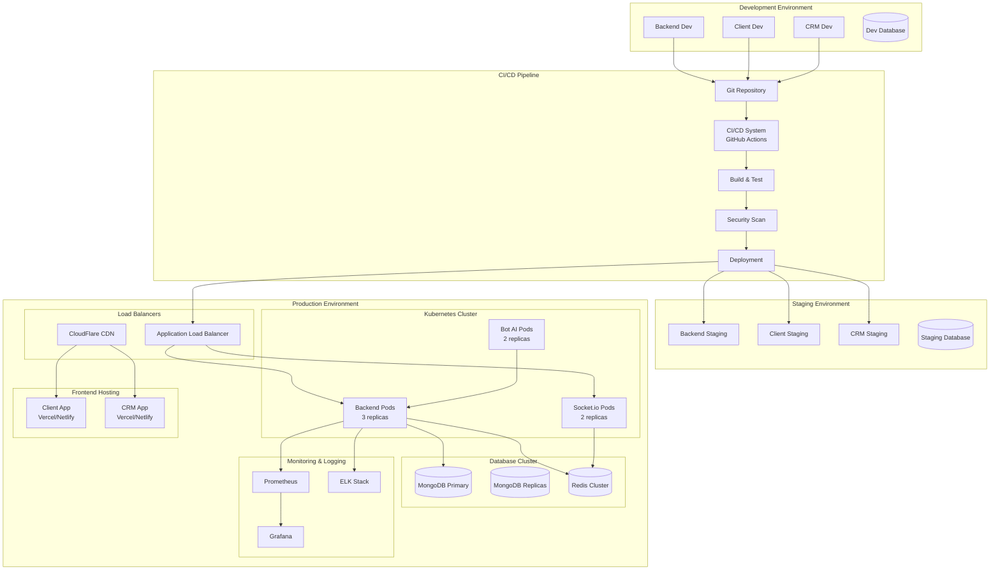

# Deployment and Scaling Strategy

## Overview

This document outlines the comprehensive deployment and scaling strategy for the gaming platform, covering containerization, orchestration, cloud infrastructure, monitoring, and automated scaling across all three applications (backend, client, CRM).

## 1. Deployment Architecture Overview



## 2. Containerization Strategy

### Docker Configuration

#### Backend API Dockerfile
```dockerfile
# Multi-stage build for backend API
FROM node:18-alpine AS builder

WORKDIR /app

# Copy package files
COPY package*.json ./
COPY tsconfig.json ./

# Install dependencies
RUN npm ci --only=production && npm cache clean --force

# Copy source code
COPY src/ ./src/

# Build application
RUN npm run build

# Production stage
FROM node:18-alpine AS production

# Create non-root user
RUN addgroup -g 1001 -S nodejs && \
    adduser -S nodejs -u 1001

WORKDIR /app

# Copy built application
COPY --from=builder --chown=nodejs:nodejs /app/dist ./dist
COPY --from=builder --chown=nodejs:nodejs /app/node_modules ./node_modules
COPY --from=builder --chown=nodejs:nodejs /app/package*.json ./

# Set environment
ENV NODE_ENV=production
ENV PORT=3000

# Health check
HEALTHCHECK --interval=30s --timeout=3s --start-period=5s --retries=3 \
    CMD curl -f http://localhost:3000/health || exit 1

# Switch to non-root user
USER nodejs

# Expose port
EXPOSE 3000

# Start application
CMD ["node", "dist/index.js"]
```

#### Frontend Dockerfile (for SSR/build optimization)
```dockerfile
# Multi-stage build for React frontend
FROM node:18-alpine AS builder

WORKDIR /app

# Copy package files
COPY package*.json ./

# Install dependencies
RUN npm ci && npm cache clean --force

# Copy source code
COPY . .

# Build application
ARG REACT_APP_API_URL
ARG REACT_APP_SOCKET_URL
ENV REACT_APP_API_URL=$REACT_APP_API_URL
ENV REACT_APP_SOCKET_URL=$REACT_APP_SOCKET_URL

RUN npm run build

# Production stage with nginx
FROM nginx:alpine AS production

# Copy built files
COPY --from=builder /app/dist /usr/share/nginx/html

# Copy nginx configuration
COPY nginx.conf /etc/nginx/nginx.conf

# Health check
HEALTHCHECK --interval=30s --timeout=3s --start-period=5s --retries=3 \
    CMD curl -f http://localhost:80/health || exit 1

EXPOSE 80

CMD ["nginx", "-g", "daemon off;"]
```

### Docker Compose for Development
```yaml
version: '3.8'

services:
  backend:
    build:
      context: ./backend
      dockerfile: Dockerfile.dev
    ports:
      - "3000:3000"
    environment:
      - NODE_ENV=development
      - MONGODB_URI=mongodb://mongodb:27017/gaming_platform_dev
      - REDIS_URL=redis://redis:6379
      - JWT_SECRET=dev_secret_key
    volumes:
      - ./backend/src:/app/src
      - /app/node_modules
    depends_on:
      - mongodb
      - redis
    networks:
      - gaming-network

  client:
    build:
      context: ./client
      dockerfile: Dockerfile.dev
    ports:
      - "5173:5173"
    environment:
      - VITE_API_URL=http://localhost:3000
      - VITE_SOCKET_URL=http://localhost:3001
    volumes:
      - ./client/src:/app/src
      - /app/node_modules
    networks:
      - gaming-network

  crm:
    build:
      context: ./crm
      dockerfile: Dockerfile.dev
    ports:
      - "5174:5173"
    environment:
      - VITE_API_URL=http://localhost:3000
      - VITE_SOCKET_URL=http://localhost:3001
    volumes:
      - ./crm/src:/app/src
      - /app/node_modules
    networks:
      - gaming-network

  mongodb:
    image: mongo:6.0
    ports:
      - "27017:27017"
    environment:
      - MONGO_INITDB_ROOT_USERNAME=admin
      - MONGO_INITDB_ROOT_PASSWORD=password
      - MONGO_INITDB_DATABASE=gaming_platform_dev
    volumes:
      - mongodb_data:/data/db
      - ./scripts/mongo-init.js:/docker-entrypoint-initdb.d/mongo-init.js:ro
    networks:
      - gaming-network

  redis:
    image: redis:7-alpine
    ports:
      - "6379:6379"
    command: redis-server --appendonly yes
    volumes:
      - redis_data:/data
    networks:
      - gaming-network

  nginx:
    image: nginx:alpine
    ports:
      - "80:80"
      - "443:443"
    volumes:
      - ./nginx/nginx.conf:/etc/nginx/nginx.conf:ro
      - ./nginx/ssl:/etc/nginx/ssl:ro
    depends_on:
      - backend
      - client
      - crm
    networks:
      - gaming-network

volumes:
  mongodb_data:
  redis_data:

networks:
  gaming-network:
    driver: bridge
```

## 3. Kubernetes Deployment

### Namespace Configuration
```yaml
apiVersion: v1
kind: Namespace
metadata:
  name: gaming-platform
  labels:
    name: gaming-platform
    environment: production
```

### Backend API Deployment
```yaml
apiVersion: apps/v1
kind: Deployment
metadata:
  name: backend-api
  namespace: gaming-platform
  labels:
    app: backend-api
    version: v1
spec:
  replicas: 3
  strategy:
    type: RollingUpdate
    rollingUpdate:
      maxSurge: 1
      maxUnavailable: 0
  selector:
    matchLabels:
      app: backend-api
  template:
    metadata:
      labels:
        app: backend-api
        version: v1
    spec:
      containers:
      - name: backend-api
        image: gaming-platform/backend:latest
        ports:
        - containerPort: 3000
          name: http
        env:
        - name: NODE_ENV
          value: "production"
        - name: MONGODB_URI
          valueFrom:
            secretKeyRef:
              name: database-secrets
              key: mongodb-uri
        - name: REDIS_URL
          valueFrom:
            secretKeyRef:
              name: database-secrets
              key: redis-url
        - name: JWT_SECRET
          valueFrom:
            secretKeyRef:
              name: app-secrets
              key: jwt-secret
        resources:
          requests:
            memory: "256Mi"
            cpu: "250m"
          limits:
            memory: "512Mi"
            cpu: "500m"
        livenessProbe:
          httpGet:
            path: /health
            port: 3000
          initialDelaySeconds: 30
          periodSeconds: 10
          timeoutSeconds: 5
          failureThreshold: 3
        readinessProbe:
          httpGet:
            path: /ready
            port: 3000
          initialDelaySeconds: 5
          periodSeconds: 5
          timeoutSeconds: 3
          failureThreshold: 3
      imagePullSecrets:
      - name: registry-secret
---
apiVersion: v1
kind: Service
metadata:
  name: backend-api-service
  namespace: gaming-platform
spec:
  selector:
    app: backend-api
  ports:
  - name: http
    port: 80
    targetPort: 3000
  type: ClusterIP
```

### Socket.io Deployment
```yaml
apiVersion: apps/v1
kind: Deployment
metadata:
  name: socketio-server
  namespace: gaming-platform
  labels:
    app: socketio-server
    version: v1
spec:
  replicas: 2
  strategy:
    type: RollingUpdate
    rollingUpdate:
      maxSurge: 1
      maxUnavailable: 0
  selector:
    matchLabels:
      app: socketio-server
  template:
    metadata:
      labels:
        app: socketio-server
        version: v1
    spec:
      containers:
      - name: socketio-server
        image: gaming-platform/socketio:latest
        ports:
        - containerPort: 3001
          name: websocket
        env:
        - name: NODE_ENV
          value: "production"
        - name: REDIS_URL
          valueFrom:
            secretKeyRef:
              name: database-secrets
              key: redis-url
        - name: BACKEND_API_URL
          value: "http://backend-api-service"
        resources:
          requests:
            memory: "128Mi"
            cpu: "100m"
          limits:
            memory: "256Mi"
            cpu: "200m"
        livenessProbe:
          httpGet:
            path: /health
            port: 3001
          initialDelaySeconds: 30
          periodSeconds: 10
        readinessProbe:
          httpGet:
            path: /ready
            port: 3001
          initialDelaySeconds: 5
          periodSeconds: 5
---
apiVersion: v1
kind: Service
metadata:
  name: socketio-service
  namespace: gaming-platform
  annotations:
    service.beta.kubernetes.io/aws-load-balancer-type: nlb
spec:
  selector:
    app: socketio-server
  ports:
  - name: websocket
    port: 80
    targetPort: 3001
  type: LoadBalancer
  sessionAffinity: ClientIP
```

### Horizontal Pod Autoscaler
```yaml
apiVersion: autoscaling/v2
kind: HorizontalPodAutoscaler
metadata:
  name: backend-api-hpa
  namespace: gaming-platform
spec:
  scaleTargetRef:
    apiVersion: apps/v1
    kind: Deployment
    name: backend-api
  minReplicas: 3
  maxReplicas: 10
  metrics:
  - type: Resource
    resource:
      name: cpu
      target:
        type: Utilization
        averageUtilization: 70
  - type: Resource
    resource:
      name: memory
      target:
        type: Utilization
        averageUtilization: 80
  behavior:
    scaleUp:
      stabilizationWindowSeconds: 60
      policies:
      - type: Percent
        value: 50
        periodSeconds: 60
    scaleDown:
      stabilizationWindowSeconds: 300
      policies:
      - type: Percent
        value: 10
        periodSeconds: 60
```

## 4. Database Deployment and Scaling

### MongoDB Replica Set
```yaml
apiVersion: apps/v1
kind: StatefulSet
metadata:
  name: mongodb
  namespace: gaming-platform
spec:
  serviceName: mongodb-service
  replicas: 3
  selector:
    matchLabels:
      app: mongodb
  template:
    metadata:
      labels:
        app: mongodb
    spec:
      containers:
      - name: mongodb
        image: mongo:6.0
        ports:
        - containerPort: 27017
        env:
        - name: MONGO_INITDB_ROOT_USERNAME
          valueFrom:
            secretKeyRef:
              name: mongodb-secret
              key: username
        - name: MONGO_INITDB_ROOT_PASSWORD
          valueFrom:
            secretKeyRef:
              name: mongodb-secret
              key: password
        volumeMounts:
        - name: mongodb-storage
          mountPath: /data/db
        - name: mongodb-config
          mountPath: /etc/mongo
        resources:
          requests:
            memory: "1Gi"
            cpu: "500m"
          limits:
            memory: "2Gi"
            cpu: "1000m"
        livenessProbe:
          exec:
            command:
            - mongo
            - --eval
            - "db.adminCommand('ping')"
          initialDelaySeconds: 30
          periodSeconds: 10
        readinessProbe:
          exec:
            command:
            - mongo
            - --eval
            - "db.adminCommand('ping')"
          initialDelaySeconds: 5
          periodSeconds: 5
      volumes:
      - name: mongodb-config
        configMap:
          name: mongodb-config
  volumeClaimTemplates:
  - metadata:
      name: mongodb-storage
    spec:
      accessModes: ["ReadWriteOnce"]
      storageClassName: "fast-ssd"
      resources:
        requests:
          storage: 100Gi
```

### Redis Cluster
```yaml
apiVersion: apps/v1
kind: StatefulSet
metadata:
  name: redis-cluster
  namespace: gaming-platform
spec:
  serviceName: redis-cluster-service
  replicas: 6
  selector:
    matchLabels:
      app: redis-cluster
  template:
    metadata:
      labels:
        app: redis-cluster
    spec:
      containers:
      - name: redis
        image: redis:7-alpine
        ports:
        - containerPort: 6379
        - containerPort: 16379
        command:
        - redis-server
        - /etc/redis/redis.conf
        - --cluster-enabled
        - "yes"
        - --cluster-config-file
        - /data/nodes.conf
        - --cluster-node-timeout
        - "5000"
        - --appendonly
        - "yes"
        volumeMounts:
        - name: redis-data
          mountPath: /data
        - name: redis-config
          mountPath: /etc/redis
        resources:
          requests:
            memory: "256Mi"
            cpu: "100m"
          limits:
            memory: "512Mi"
            cpu: "200m"
      volumes:
      - name: redis-config
        configMap:
          name: redis-config
  volumeClaimTemplates:
  - metadata:
      name: redis-data
    spec:
      accessModes: ["ReadWriteOnce"]
      storageClassName: "fast-ssd"
      resources:
        requests:
          storage: 10Gi
```

## 5. CI/CD Pipeline

### GitHub Actions Workflow
```yaml
name: Gaming Platform CI/CD

on:
  push:
    branches: [main, develop]
  pull_request:
    branches: [main]

env:
  REGISTRY: ghcr.io
  IMAGE_NAME: gaming-platform

jobs:
  test:
    runs-on: ubuntu-latest
    strategy:
      matrix:
        node-version: [18.x]
        service: [backend, client, crm]
    
    steps:
    - uses: actions/checkout@v3
    
    - name: Setup Node.js
      uses: actions/setup-node@v3
      with:
        node-version: ${{ matrix.node-version }}
        cache: 'npm'
        cache-dependency-path: ${{ matrix.service }}/package-lock.json
    
    - name: Install dependencies
      run: |
        cd ${{ matrix.service }}
        npm ci
    
    - name: Run linting
      run: |
        cd ${{ matrix.service }}
        npm run lint
    
    - name: Run type checking
      run: |
        cd ${{ matrix.service }}
        npm run type-check
    
    - name: Run tests
      run: |
        cd ${{ matrix.service }}
        npm run test:coverage
    
    - name: Upload coverage reports
      uses: codecov/codecov-action@v3
      with:
        file: ${{ matrix.service }}/coverage/lcov.info
        flags: ${{ matrix.service }}

  security-scan:
    runs-on: ubuntu-latest
    needs: test
    
    steps:
    - uses: actions/checkout@v3
    
    - name: Run Trivy vulnerability scanner
      uses: aquasecurity/trivy-action@master
      with:
        scan-type: 'fs'
        scan-ref: '.'
        format: 'sarif'
        output: 'trivy-results.sarif'
    
    - name: Upload Trivy scan results
      uses: github/codeql-action/upload-sarif@v2
      with:
        sarif_file: 'trivy-results.sarif'

  build-and-push:
    runs-on: ubuntu-latest
    needs: [test, security-scan]
    if: github.ref == 'refs/heads/main'
    
    strategy:
      matrix:
        service: [backend, socketio, bot-ai]
    
    steps:
    - uses: actions/checkout@v3
    
    - name: Set up Docker Buildx
      uses: docker/setup-buildx-action@v2
    
    - name: Log in to Container Registry
      uses: docker/login-action@v2
      with:
        registry: ${{ env.REGISTRY }}
        username: ${{ github.actor }}
        password: ${{ secrets.GITHUB_TOKEN }}
    
    - name: Extract metadata
      id: meta
      uses: docker/metadata-action@v4
      with:
        images: ${{ env.REGISTRY }}/${{ github.repository }}/${{ matrix.service }}
        tags: |
          type=ref,event=branch
          type=ref,event=pr
          type=sha,prefix={{branch}}-
          type=raw,value=latest,enable={{is_default_branch}}
    
    - name: Build and push Docker image
      uses: docker/build-push-action@v4
      with:
        context: ./${{ matrix.service }}
        push: true
        tags: ${{ steps.meta.outputs.tags }}
        labels: ${{ steps.meta.outputs.labels }}
        cache-from: type=gha
        cache-to: type=gha,mode=max

  deploy-staging:
    runs-on: ubuntu-latest
    needs: build-and-push
    if: github.ref == 'refs/heads/develop'
    environment: staging
    
    steps:
    - uses: actions/checkout@v3
    
    - name: Configure AWS credentials
      uses: aws-actions/configure-aws-credentials@v2
      with:
        aws-access-key-id: ${{ secrets.AWS_ACCESS_KEY_ID }}
        aws-secret-access-key: ${{ secrets.AWS_SECRET_ACCESS_KEY }}
        aws-region: us-west-2
    
    - name: Deploy to staging
      run: |
        aws eks update-kubeconfig --name gaming-platform-staging
        kubectl set image deployment/backend-api backend-api=${{ env.REGISTRY }}/${{ github.repository }}/backend:${{ github.sha }} -n gaming-platform-staging
        kubectl set image deployment/socketio-server socketio-server=${{ env.REGISTRY }}/${{ github.repository }}/socketio:${{ github.sha }} -n gaming-platform-staging
        kubectl rollout status deployment/backend-api -n gaming-platform-staging
        kubectl rollout status deployment/socketio-server -n gaming-platform-staging

  deploy-production:
    runs-on: ubuntu-latest
    needs: build-and-push
    if: github.ref == 'refs/heads/main'
    environment: production
    
    steps:
    - uses: actions/checkout@v3
    
    - name: Configure AWS credentials
      uses: aws-actions/configure-aws-credentials@v2
      with:
        aws-access-key-id: ${{ secrets.AWS_ACCESS_KEY_ID }}
        aws-secret-access-key: ${{ secrets.AWS_SECRET_ACCESS_KEY }}
        aws-region: us-west-2
    
    - name: Deploy to production
      run: |
        aws eks update-kubeconfig --name gaming-platform-production
        kubectl set image deployment/backend-api backend-api=${{ env.REGISTRY }}/${{ github.repository }}/backend:${{ github.sha }} -n gaming-platform
        kubectl set image deployment/socketio-server socketio-server=${{ env.REGISTRY }}/${{ github.repository }}/socketio:${{ github.sha }} -n gaming-platform
        kubectl rollout status deployment/backend-api -n gaming-platform
        kubectl rollout status deployment/socketio-server -n gaming-platform
    
    - name: Run smoke tests
      run: |
        curl -f https://api.gaming-platform.com/health || exit 1
        curl -f https://gaming-platform.com/health || exit 1
```

## 6. Monitoring and Observability

### Prometheus Configuration
```yaml
apiVersion: v1
kind: ConfigMap
metadata:
  name: prometheus-config
  namespace: gaming-platform
data:
  prometheus.yml: |
    global:
      scrape_interval: 15s
      evaluation_interval: 15s
    
    rule_files:
      - "alert_rules.yml"
    
    alerting:
      alertmanagers:
        - static_configs:
            - targets:
              - alertmanager:9093
    
    scrape_configs:
      - job_name: 'kubernetes-pods'
        kubernetes_sd_configs:
          - role: pod
        relabel_configs:
          - source_labels: [__meta_kubernetes_pod_annotation_prometheus_io_scrape]
            action: keep
            regex: true
          - source_labels: [__meta_kubernetes_pod_annotation_prometheus_io_path]
            action: replace
            target_label: __metrics_path__
            regex: (.+)
          - source_labels: [__address__, __meta_kubernetes_pod_annotation_prometheus_io_port]
            action: replace
            regex: ([^:]+)(?::\d+)?;(\d+)
            replacement: $1:$2
            target_label: __address__
      
      - job_name: 'backend-api'
        static_configs:
          - targets: ['backend-api-service:80']
        metrics_path: /metrics
        scrape_interval: 10s
      
      - job_name: 'socketio-server'
        static_configs:
          - targets: ['socketio-service:80']
        metrics_path: /metrics
        scrape_interval: 10s
      
      - job_name: 'mongodb'
        static_configs:
          - targets: ['mongodb-exporter:9216']
        scrape_interval: 30s
      
      - job_name: 'redis'
        static_configs:
          - targets: ['redis-exporter:9121']
        scrape_interval: 30s
```

### Alert Rules
```yaml
apiVersion: v1
kind: ConfigMap
metadata:
  name: alert-rules
  namespace: gaming-platform
data:
  alert_rules.yml: |
    groups:
    - name: gaming-platform-alerts
      rules:
      - alert: HighErrorRate
        expr: rate(http_requests_total{status=~"5.."}[5m]) > 0.1
        for: 5m
        labels:
          severity: critical
        annotations:
          summary: "High error rate detected"
          description: "Error rate is {{ $value }} errors per second"
      
      - alert: HighResponseTime
        expr: histogram_quantile(0.95, rate(http_request_duration_seconds_bucket[5m])) > 1
        for: 5m
        labels:
          severity: warning
        annotations:
          summary: "High response time detected"
          description: "95th percentile response time is {{ $value }} seconds"
      
      - alert: PodCrashLooping
        expr: rate(kube_pod_container_status_restarts_total[15m]) > 0
        for: 5m
        labels:
          severity: critical
        annotations:
          summary: "Pod is crash looping"
          description: "Pod {{ $labels.pod }} is restarting frequently"
      
      - alert: DatabaseConnectionFailure
        expr: mongodb_up == 0
        for: 2m
        labels:
          severity: critical
        annotations:
          summary: "Database connection failure"
          description: "MongoDB is not responding"
      
      - alert: RedisConnectionFailure
        expr: redis_up == 0
        for: 2m
        labels:
          severity: critical
        annotations:
          summary: "Redis connection failure"
          description: "Redis is not responding"
      
      - alert: HighMemoryUsage
        expr: container_memory_usage_bytes / container_spec_memory_limit_bytes > 0.9
        for: 5m
        labels:
          severity: warning
        annotations:
          summary: "High memory usage"
          description: "Container memory usage is above 90%"
      
      - alert: HighCPUUsage
        expr: rate(container_cpu_usage_seconds_total[5m]) > 0.8
        for: 5m
        labels:
          severity: warning
        annotations:
          summary: "High CPU usage"
          description: "Container CPU usage is above 80%"
```

### Grafana Dashboard Configuration
```json
{
  "dashboard": {
    "title": "Gaming Platform Overview",
    "panels": [
      {
        "title": "Request Rate",
        "type": "graph",
        "targets": [
          {
            "expr": "rate(http_requests_total[5m])",
            "legendFormat": "{{method}} {{status}}"
          }
        ]
      },
      {
        "title": "Response Time",
        "type": "graph",
        "targets": [
          {
            "expr": "histogram_quantile(0.95, rate(http_request_duration_seconds_bucket[5m]))",
            "legendFormat": "95th percentile"
          },
          {
            "expr": "histogram_quantile(0.50, rate(http_request_duration_seconds_bucket[5m]))",
            "legendFormat": "50th percentile"
          }
        ]
      },
      {
        "title": "Active Games",
        "type": "singlestat",
        "targets": [
          {
            "expr": "active_games_total",
            "legendFormat": "Active Games"
          }
        ]
      },
      {
        "title": "Connected Users",
        "type": "singlestat",
        "targets": [
          {
            "expr": "connected_users_total",
            "legendFormat": "Connected Users"
          }
        ]
      },
      {
        "title": "Database Performance",
        "type": "graph",
        "targets": [
          {
            "expr": "mongodb_op_latencies_ops_per_sec",
            "legendFormat": "{{type}} operations/sec"
          }
        ]
      },
      {
        "title": "Memory Usage",
        "type": "graph",
        "targets": [
          {
            "expr": "container_memory_usage_bytes / container_spec_memory_limit_bytes * 100",
            "legendFormat": "{{pod}} memory %"
          }
        ]
      }
    ]
  }
}
```

## 7. Auto-scaling Configuration

### Cluster Autoscaler
```yaml
apiVersion: apps/v1
kind: Deployment
metadata:
  name: cluster-autoscaler
  namespace: kube-system
  labels:
    app: cluster-autoscaler
spec:
  selector:
    matchLabels:
      app: cluster-autoscaler
  template:
    metadata:
      labels:
        app: cluster-autoscaler
    spec:
      serviceAccountName: cluster-autoscaler
      containers:
      - image: k8s.gcr.io/autoscaling/cluster-autoscaler:v1.21.0
        name: cluster-autoscaler
        resources:
          limits:
            cpu: 100m
            memory: 300Mi
          requests:
            cpu: 100m
            memory: 300Mi
        command:
        - ./cluster-autoscaler
        - --v=4
        - --stderrthreshold=info
        - --cloud-provider=aws
        - --skip-nodes-with-local-storage=false
        - --expander=least-waste
        - --node-group-auto-discovery=asg:tag=k8s.io/cluster-autoscaler/enabled,k8s.io/cluster-autoscaler/gaming-platform
        - --balance-similar-node-groups
        - --skip-nodes-with-system-pods=false
        env:
        - name: AWS_REGION
          value: us-west-2
```

### Vertical Pod Autoscaler
```yaml
apiVersion: autoscaling.k8s.io/v1
kind: VerticalPodAutoscaler
metadata:
  name: backend-api-vpa
  namespace: gaming-platform
spec:
  targetRef:
    apiVersion: apps/v1
    kind: Deployment
    name: backend-api
  updatePolicy:
    updateMode: "Auto"
  resourcePolicy:
    containerPolicies:
    - containerName: backend-api
      minAllowed:
        cpu: 100m
        memory: 128Mi
      maxAllowed:
        cpu: 1000m
        memory: 1Gi
      controlledResources: ["cpu", "memory"]
```

## 8. Disaster Recovery

### Backup Strategy
```yaml
apiVersion: batch/v1
kind: CronJob
metadata:
  name: mongodb-backup
  namespace: gaming-platform
spec:
  schedule: "0 2 * * *"  # Daily at 2 AM
  jobTemplate:
    spec:
      template:
        spec:
          containers:
          - name: mongodb-backup
            image: mongo:6.0
            command:
            - /bin/bash
            - -c
            - |
              TIMESTAMP=$(date +%Y%m%d_%H%M%S)
              mongodump --host mongodb-service --username $MONGO_USERNAME --password $MONGO_PASSWORD --authenticationDatabase admin --out /backup/mongodb_$TIMESTAMP
              aws s3 cp /backup/mongodb_$TIMESTAMP s3://gaming-platform-backups/mongodb/ --recursive
              find /backup -type d -name "mongodb_*" -mtime +7 -exec rm -rf {} \;
            env:
            - name: MONGO_USERNAME
              valueFrom:
                secretKeyRef:
                  name: mongodb-secret
                  key: username
            - name: MONGO_PASSWORD
              valueFrom:
                secretKeyRef:
                  name: mongodb-secret
                  key: password
            - name: AWS_ACCESS_KEY_ID
              valueFrom:
                secretKeyRef:
                  name: aws-credentials
                  key: access-key-id
            - name: AWS_SECRET_ACCESS_KEY
              valueFrom:
                secretKeyRef:
                  name: aws-credentials
                  key: secret-access-key
            volumeMounts:
            - name: backup-storage
              mountPath: /backup
          volumes:
          - name: backup-storage
            persistentVolumeClaim:
              claimName: backup-pvc
          restartPolicy: OnFailure
```

### Multi-Region Disaster Recovery
```yaml
# Primary region (us-west-2) configuration
apiVersion: v1
kind: ConfigMap
metadata:
  name: disaster-recovery-config
  namespace: gaming-platform
data:
  primary-region: "us-west-2"
  backup-region: "us-east-1"
  rto: "4h"  # Recovery Time Objective
  rpo: "1h"  # Recovery Point Objective
  
  failover-script: |
    #!/bin/bash
    # Automated failover script
    
    # 1. Stop traffic to primary region
    kubectl patch service backend-api-service -p '{"spec":{"selector":{"app":"maintenance"}}}'
    
    # 2. Promote backup region database to primary
    aws rds promote-read-replica --db-instance-identifier gaming-platform-backup
    
    # 3. Update DNS to point to backup region
    aws route53 change-resource-record-sets --hosted-zone-id Z123456789 --change-batch file://failover-dns.json
    
    # 4. Scale up backup region services
    kubectl scale deployment backend-api --replicas=3 --context=backup-region
    kubectl scale deployment socketio-server --replicas=2 --context=backup-region
    
    # 5. Verify services are healthy
    kubectl wait --for=condition=available deployment/backend-api --timeout=300s --context=backup-region
    
    echo "Failover completed successfully"
```

## 9. Performance Optimization

### CDN Configuration
```yaml
# CloudFlare configuration for static assets
apiVersion: v1
kind: ConfigMap
metadata:
  name: cdn-config
  namespace: gaming-platform
data:
  cloudflare-config.yaml: |
    zones:
      - zone: gaming-platform.com
        settings:
          cache_level: aggressive
          browser_cache_ttl: 31536000  # 1 year for static assets
          edge_cache_ttl: 2592000      # 30 days
          minify:
            css: true
            js: true
            html: true
          compression: gzip
          
        page_rules:
          - url: "gaming-platform.com/api/*"
            settings:
              cache_level: bypass
              
          - url: "gaming-platform.com/static/*"
            settings:
              cache_level: cache_everything
              edge_cache_ttl: 31536000
              
          - url: "gaming-platform.com/socket.io/*"
            settings:
              cache_level: bypass
              websockets: true
```

### Database Optimization
```yaml
apiVersion: v1
kind: ConfigMap
metadata:
  name: mongodb-optimization
  namespace: gaming-platform
data:
  mongod.conf: |
    storage:
      wiredTiger:
        engineConfig:
          cacheSizeGB: 2
          directoryForIndexes: true
        collectionConfig:
          blockCompressor: snappy
        indexConfig:
          prefixCompression: true
    
    operationProfiling:
      slowOpThresholdMs: 100
      mode: slowOp
    
    net:
      maxIncomingConnections: 1000
      compression:
        compressors: snappy,zstd
    
    replication:
      replSetName: gaming-platform-rs
      enableMajorityReadConcern: true
    
    sharding:
      clusterRole: shardsvr
```

### Redis Optimization
```yaml
apiVersion: v1
kind: ConfigMap
metadata:
  name: redis-optimization
  namespace: gaming-platform
data:
  redis.conf: |
    # Memory optimization
    maxmemory 512mb
    maxmemory-policy allkeys-lru
    
    # Persistence optimization
    save 900 1
    save 300 10
    save 60 10000
    
    # Network optimization
    tcp-keepalive 300
    timeout 0
    
    # Performance optimization
    hash-max-ziplist-entries 512
    hash-max-ziplist-value 64
    list-max-ziplist-size -2
    set-max-intset-entries 512
    zset-max-ziplist-entries 128
    zset-max-ziplist-value 64
    
    # Cluster optimization
    cluster-enabled yes
    cluster-config-file nodes.conf
    cluster-node-timeout 5000
    cluster-announce-ip ${POD_IP}
    cluster-announce-port 6379
    cluster-announce-bus-port 16379
```

## 10. Security Hardening

### Network Policies
```yaml
apiVersion: networking.k8s.io/v1
kind: NetworkPolicy
metadata:
  name: gaming-platform-network-policy
  namespace: gaming-platform
spec:
  podSelector: {}
  policyTypes:
  - Ingress
  - Egress
  
  ingress:
  - from:
    - namespaceSelector:
        matchLabels:
          name: ingress-nginx
    ports:
    - protocol: TCP
      port: 3000
  
  - from:
    - podSelector:
        matchLabels:
          app: backend-api
    - podSelector:
        matchLabels:
          app: socketio-server
    ports:
    - protocol: TCP
      port: 27017  # MongoDB
    - protocol: TCP
      port: 6379   # Redis
  
  egress:
  - to: []
    ports:
    - protocol: TCP
      port: 53   # DNS
    - protocol: UDP
      port: 53   # DNS
    - protocol: TCP
      port: 443  # HTTPS
    - protocol: TCP
      port: 80   # HTTP
```

### Pod Security Policy
```yaml
apiVersion: policy/v1beta1
kind: PodSecurityPolicy
metadata:
  name: gaming-platform-psp
spec:
  privileged: false
  allowPrivilegeEscalation: false
  requiredDropCapabilities:
    - ALL
  volumes:
    - 'configMap'
    - 'emptyDir'
    - 'projected'
    - 'secret'
    - 'downwardAPI'
    - 'persistentVolumeClaim'
  runAsUser:
    rule: 'MustRunAsNonRoot'
  seLinux:
    rule: 'RunAsAny'
  fsGroup:
    rule: 'RunAsAny'
  readOnlyRootFilesystem: true
  securityContext:
    runAsNonRoot: true
    runAsUser: 1001
    fsGroup: 1001
```

### Secret Management
```yaml
apiVersion: external-secrets.io/v1beta1
kind: SecretStore
metadata:
  name: aws-secrets-manager
  namespace: gaming-platform
spec:
  provider:
    aws:
      service: SecretsManager
      region: us-west-2
      auth:
        jwt:
          serviceAccountRef:
            name: external-secrets-sa

---
apiVersion: external-secrets.io/v1beta1
kind: ExternalSecret
metadata:
  name: database-secrets
  namespace: gaming-platform
spec:
  refreshInterval: 1h
  secretStoreRef:
    name: aws-secrets-manager
    kind: SecretStore
  target:
    name: database-secrets
    creationPolicy: Owner
  data:
  - secretKey: mongodb-uri
    remoteRef:
      key: gaming-platform/database
      property: mongodb-uri
  - secretKey: redis-url
    remoteRef:
      key: gaming-platform/database
      property: redis-url
```

## 11. Cost Optimization

### Resource Quotas
```yaml
apiVersion: v1
kind: ResourceQuota
metadata:
  name: gaming-platform-quota
  namespace: gaming-platform
spec:
  hard:
    requests.cpu: "10"
    requests.memory: 20Gi
    limits.cpu: "20"
    limits.memory: 40Gi
    persistentvolumeclaims: "10"
    services: "10"
    secrets: "20"
    configmaps: "20"
```

### Spot Instance Configuration
```yaml
apiVersion: v1
kind: ConfigMap
metadata:
  name: spot-instance-config
  namespace: gaming-platform
data:
  node-groups.yaml: |
    apiVersion: eksctl.io/v1alpha5
    kind: ClusterConfig
    
    metadata:
      name: gaming-platform
      region: us-west-2
    
    nodeGroups:
    - name: spot-workers
      instanceTypes:
        - m5.large
        - m5.xlarge
        - m4.large
        - m4.xlarge
      spot: true
      minSize: 2
      maxSize: 10
      desiredCapacity: 3
      
      labels:
        node-type: spot
        workload: general
      
      taints:
        - key: spot-instance
          value: "true"
          effect: NoSchedule
      
      iam:
        withAddonPolicies:
          autoScaler: true
          cloudWatch: true
          
    - name: on-demand-critical
      instanceTypes:
        - m5.large
      spot: false
      minSize: 1
      maxSize: 3
      desiredCapacity: 2
      
      labels:
        node-type: on-demand
        workload: critical
```

### Cost Monitoring
```yaml
apiVersion: v1
kind: ConfigMap
metadata:
  name: cost-monitoring
  namespace: gaming-platform
data:
  cost-alerts.yaml: |
    alerts:
      - name: high-monthly-cost
        threshold: 1000  # USD
        period: monthly
        action: email
        recipients:
          - devops@gaming-platform.com
          - finance@gaming-platform.com
      
      - name: unusual-cost-spike
        threshold: 50    # % increase
        period: daily
        action: slack
        channel: "#alerts"
      
      - name: resource-waste
        metrics:
          - cpu-utilization < 20%
          - memory-utilization < 30%
        duration: 24h
        action: scale-down
```

## 12. Environment Management

### Environment Configuration
```yaml
# Development Environment
apiVersion: v1
kind: ConfigMap
metadata:
  name: environment-config-dev
  namespace: gaming-platform-dev
data:
  NODE_ENV: "development"
  LOG_LEVEL: "debug"
  RATE_LIMIT_ENABLED: "false"
  CACHE_TTL: "60"
  DATABASE_POOL_SIZE: "5"
  REDIS_POOL_SIZE: "5"

---
# Staging Environment
apiVersion: v1
kind: ConfigMap
metadata:
  name: environment-config-staging
  namespace: gaming-platform-staging
data:
  NODE_ENV: "staging"
  LOG_LEVEL: "info"
  RATE_LIMIT_ENABLED: "true"
  CACHE_TTL: "300"
  DATABASE_POOL_SIZE: "10"
  REDIS_POOL_SIZE: "10"

---
# Production Environment
apiVersion: v1
kind: ConfigMap
metadata:
  name: environment-config-prod
  namespace: gaming-platform
data:
  NODE_ENV: "production"
  LOG_LEVEL: "warn"
  RATE_LIMIT_ENABLED: "true"
  CACHE_TTL: "3600"
  DATABASE_POOL_SIZE: "20"
  REDIS_POOL_SIZE: "20"
```

### Blue-Green Deployment
```yaml
apiVersion: argoproj.io/v1alpha1
kind: Rollout
metadata:
  name: backend-api-rollout
  namespace: gaming-platform
spec:
  replicas: 3
  strategy:
    blueGreen:
      activeService: backend-api-active
      previewService: backend-api-preview
      autoPromotionEnabled: false
      scaleDownDelaySeconds: 30
      prePromotionAnalysis:
        templates:
        - templateName: success-rate
        args:
        - name: service-name
          value: backend-api-preview
      postPromotionAnalysis:
        templates:
        - templateName: success-rate
        args:
        - name: service-name
          value: backend-api-active
  selector:
    matchLabels:
      app: backend-api
  template:
    metadata:
      labels:
        app: backend-api
    spec:
      containers:
      - name: backend-api
        image: gaming-platform/backend:latest
        ports:
        - containerPort: 3000
        resources:
          requests:
            memory: "256Mi"
            cpu: "250m"
          limits:
            memory: "512Mi"
            cpu: "500m"
```

This comprehensive deployment and scaling strategy provides a robust foundation for deploying, scaling, and maintaining the gaming platform across multiple environments with high availability, security, and cost optimization.