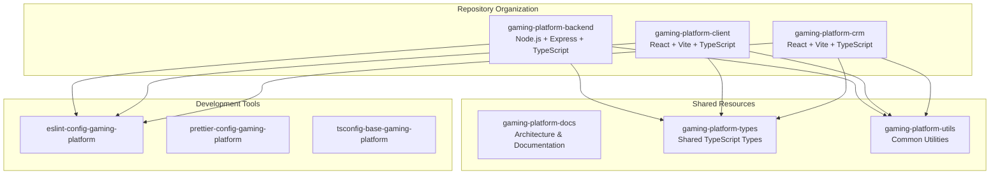
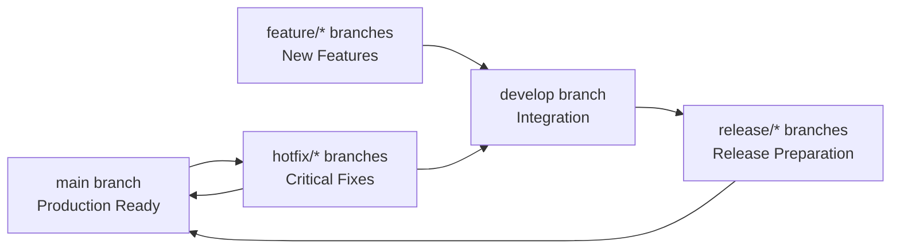

# Development Workflow and Repository Structure

## Overview

This document outlines the comprehensive development workflow and repository structure for the gaming platform, covering three separate repositories (backend, client, CRM), development processes, code quality standards, and team collaboration guidelines.

## 1. Repository Structure Overview



## 2. Backend Repository Structure

### gaming-platform-backend
```
gaming-platform-backend/
├── .github/
│   ├── workflows/
│   │   ├── ci.yml
│   │   ├── cd.yml
│   │   └── security-scan.yml
│   ├── ISSUE_TEMPLATE/
│   │   ├── bug_report.md
│   │   ├── feature_request.md
│   │   └── security_issue.md
│   └── pull_request_template.md
├── docs/
│   ├── api/
│   │   ├── authentication.md
│   │   ├── games.md
│   │   ├── tournaments.md
│   │   └── financial.md
│   ├── deployment/
│   │   ├── docker.md
│   │   ├── kubernetes.md
│   │   └── monitoring.md
│   └── development/
│       ├── setup.md
│       ├── testing.md
│       └── contributing.md
├── src/
│   ├── controllers/
│   │   ├── auth/
│   │   │   ├── AuthController.ts
│   │   │   ├── UserController.ts
│   │   │   └── KYCController.ts
│   │   ├── games/
│   │   │   ├── GameController.ts
│   │   │   ├── LobbyController.ts
│   │   │   └── BotController.ts
│   │   ├── tournaments/
│   │   │   ├── TournamentController.ts
│   │   │   └── BracketController.ts
│   │   ├── financial/
│   │   │   ├── PaymentController.ts
│   │   │   ├── TransactionController.ts
│   │   │   └── BalanceController.ts
│   │   └── admin/
│   │       ├── AdminController.ts
│   │       ├── AnalyticsController.ts
│   │       └── UserManagementController.ts
│   ├── services/
│   │   ├── auth/
│   │   │   ├── AuthService.ts
│   │   │   ├── JWTService.ts
│   │   │   └── PasswordService.ts
│   │   ├── games/
│   │   │   ├── GameService.ts
│   │   │   ├── ChessEngine.ts
│   │   │   ├── CheckersEngine.ts
│   │   │   ├── BackgammonEngine.ts
│   │   │   └── TicTacToeEngine.ts
│   │   ├── tournaments/
│   │   │   ├── TournamentService.ts
│   │   │   ├── BracketGenerator.ts
│   │   │   └── MatchScheduler.ts
│   │   ├── financial/
│   │   │   ├── PaymentService.ts
│   │   │   ├── BalanceService.ts
│   │   │   └── CommissionService.ts
│   │   ├── bots/
│   │   │   ├── BotService.ts
│   │   │   ├── AIEngine.ts
│   │   │   └── BotManager.ts
│   │   └── notifications/
│   │       ├── EmailService.ts
│   │       ├── PushService.ts
│   │       └── SocketService.ts
│   ├── models/
│   │   ├── User.ts
│   │   ├── Game.ts
│   │   ├── Tournament.ts
│   │   ├── Transaction.ts
│   │   ├── Bot.ts
│   │   └── Notification.ts
│   ├── middleware/
│   │   ├── auth.ts
│   │   ├── validation.ts
│   │   ├── rateLimit.ts
│   │   ├── cors.ts
│   │   ├── security.ts
│   │   └── logging.ts
│   ├── routes/
│   │   ├── auth.ts
│   │   ├── games.ts
│   │   ├── tournaments.ts
│   │   ├── financial.ts
│   │   ├── bots.ts
│   │   ├── admin.ts
│   │   └── health.ts
│   ├── utils/
│   │   ├── database.ts
│   │   ├── redis.ts
│   │   ├── logger.ts
│   │   ├── validation.ts
│   │   ├── encryption.ts
│   │   └── helpers.ts
│   ├── types/
│   │   ├── auth.ts
│   │   ├── games.ts
│   │   ├── tournaments.ts
│   │   ├── financial.ts
│   │   └── common.ts
│   ├── config/
│   │   ├── database.ts
│   │   ├── redis.ts
│   │   ├── jwt.ts
│   │   ├── email.ts
│   │   └── environment.ts
│   ├── tests/
│   │   ├── unit/
│   │   │   ├── services/
│   │   │   ├── controllers/
│   │   │   └── utils/
│   │   ├── integration/
│   │   │   ├── auth.test.ts
│   │   │   ├── games.test.ts
│   │   │   └── tournaments.test.ts
│   │   ├── e2e/
│   │   │   ├── auth.e2e.test.ts
│   │   │   ├── games.e2e.test.ts
│   │   │   └── tournaments.e2e.test.ts
│   │   └── fixtures/
│   │       ├── users.json
│   │       ├── games.json
│   │       └── tournaments.json
│   ├── scripts/
│   │   ├── seed-database.ts
│   │   ├── migrate.ts
│   │   ├── backup.ts
│   │   └── deploy.ts
│   └── app.ts
├── docker/
│   ├── Dockerfile
│   ├── Dockerfile.dev
│   ├── docker-compose.yml
│   └── docker-compose.dev.yml
├── k8s/
│   ├── namespace.yaml
│   ├── deployment.yaml
│   ├── service.yaml
│   ├── configmap.yaml
│   ├── secret.yaml
│   └── hpa.yaml
├── .env.example
├── .gitignore
├── .eslintrc.js
├── .prettierrc
├── jest.config.js
├── tsconfig.json
├── package.json
├── package-lock.json
├── README.md
├── CHANGELOG.md
├── LICENSE
└── CONTRIBUTING.md
```

## 3. Frontend Repository Structure

### gaming-platform-client
```
gaming-platform-client/
├── .github/
│   ├── workflows/
│   │   ├── ci.yml
│   │   ├── cd.yml
│   │   └── lighthouse.yml
│   └── pull_request_template.md
├── public/
│   ├── assets/
│   │   ├── images/
│   │   │   ├── games/
│   │   │   ├── avatars/
│   │   │   └── icons/
│   │   ├── sounds/
│   │   │   ├── game-sounds/
│   │   │   └── ui-sounds/
│   │   └── fonts/
│   ├── locales/
│   │   ├── en/
│   │   │   ├── common.json
│   │   │   ├── auth.json
│   │   │   ├── games.json
│   │   │   └── tournaments.json
│   │   └── ru/
│   │       ├── common.json
│   │       ├── auth.json
│   │       ├── games.json
│   │       └── tournaments.json
│   ├── favicon.ico
│   ├── manifest.json
│   └── robots.txt
├── src/
│   ├── components/
│   │   ├── common/
│   │   │   ├── Button/
│   │   │   │   ├── Button.tsx
│   │   │   │   ├── Button.module.css
│   │   │   │   ├── Button.test.tsx
│   │   │   │   └── index.ts
│   │   │   ├── Modal/
│   │   │   ├── Input/
│   │   │   ├── Loading/
│   │   │   └── ErrorBoundary/
│   │   ├── auth/
│   │   │   ├── LoginForm/
│   │   │   ├── RegisterForm/
│   │   │   ├── ForgotPasswordForm/
│   │   │   └── ProtectedRoute/
│   │   ├── games/
│   │   │   ├── GameBoard/
│   │   │   │   ├── ChessBoard/
│   │   │   │   ├── CheckersBoard/
│   │   │   │   ├── BackgammonBoard/
│   │   │   │   └── TicTacToeBoard/
│   │   │   ├── GameLobby/
│   │   │   ├── GameHistory/
│   │   │   └── GameControls/
│   │   ├── tournaments/
│   │   │   ├── TournamentList/
│   │   │   ├── TournamentBracket/
│   │   │   ├── TournamentRegistration/
│   │   │   └── TournamentSpectator/
│   │   ├── profile/
│   │   │   ├── UserProfile/
│   │   │   ├── UserSettings/
│   │   │   ├── TransactionHistory/
│   │   │   └── KYCVerification/
│   │   ├── financial/
│   │   │   ├── DepositModal/
│   │   │   ├── WithdrawModal/
│   │   │   ├── BalanceDisplay/
│   │   │   └── PaymentMethods/
│   │   └── layout/
│   │       ├── Header/
│   │       ├── Sidebar/
│   │       ├── Footer/
│   │       └── Navigation/
│   ├── pages/
│   │   ├── Home/
│   │   │   ├── HomePage.tsx
│   │   │   ├── HomePage.module.css
│   │   │   └── index.ts
│   │   ├── Auth/
│   │   │   ├── LoginPage.tsx
│   │   │   ├── RegisterPage.tsx
│   │   │   └── ForgotPasswordPage.tsx
│   │   ├── Games/
│   │   │   ├── GamesPage.tsx
│   │   │   ├── GamePage.tsx
│   │   │   └── LobbyPage.tsx
│   │   ├── Tournaments/
│   │   │   ├── TournamentsPage.tsx
│   │   │   ├── TournamentPage.tsx
│   │   │   └── TournamentBracketPage.tsx
│   │   ├── Profile/
│   │   │   ├── ProfilePage.tsx
│   │   │   ├── SettingsPage.tsx
│   │   │   └── HistoryPage.tsx
│   │   └── NotFound/
│   │       └── NotFoundPage.tsx
│   ├── hooks/
│   │   ├── useAuth.ts
│   │   ├── useSocket.ts
│   │   ├── useGame.ts
│   │   ├── useTournament.ts
│   │   ├── useBalance.ts
│   │   ├── useLocalStorage.ts
│   │   └── useTranslation.ts
│   ├── store/
│   │   ├── index.ts
│   │   ├── slices/
│   │   │   ├── authSlice.ts
│   │   │   ├── gameSlice.ts
│   │   │   ├── tournamentSlice.ts
│   │   │   ├── userSlice.ts
│   │   │   └── uiSlice.ts
│   │   ├── api/
│   │   │   ├── authApi.ts
│   │   │   ├── gameApi.ts
│   │   │   ├── tournamentApi.ts
│   │   │   ├── userApi.ts
│   │   │   └── financialApi.ts
│   │   └── middleware/
│   │       ├── authMiddleware.ts
│   │       └── errorMiddleware.ts
│   ├── services/
│   │   ├── api.ts
│   │   ├── socket.ts
│   │   ├── auth.ts
│   │   ├── storage.ts
│   │   └── i18n.ts
│   ├── utils/
│   │   ├── constants.ts
│   │   ├── helpers.ts
│   │   ├── validation.ts
│   │   ├── formatting.ts
│   │   └── gameLogic.ts
│   ├── types/
│   │   ├── auth.ts
│   │   ├── games.ts
│   │   ├── tournaments.ts
│   │   ├── user.ts
│   │   └── api.ts
│   ├── styles/
│   │   ├── globals.css
│   │   ├── variables.css
│   │   ├── components.css
│   │   └── themes/
│   │       ├── light.css
│   │       └── dark.css
│   ├── tests/
│   │   ├── __mocks__/
│   │   ├── components/
│   │   ├── pages/
│   │   ├── hooks/
│   │   ├── utils/
│   │   └── setup.ts
│   ├── App.tsx
│   ├── main.tsx
│   └── vite-env.d.ts
├── .env.example
├── .gitignore
├── .eslintrc.js
├── .prettierrc
├── vite.config.ts
├── tsconfig.json
├── tsconfig.node.json
├── package.json
├── package-lock.json
├── README.md
└── CONTRIBUTING.md
```

### gaming-platform-crm
```
gaming-platform-crm/
├── .github/
│   └── workflows/
│       ├── ci.yml
│       └── cd.yml
├── src/
│   ├── components/
│   │   ├── common/
│   │   │   ├── DataTable/
│   │   │   ├── Chart/
│   │   │   ├── Dashboard/
│   │   │   └── AdminLayout/
│   │   ├── users/
│   │   │   ├── UserList/
│   │   │   ├── UserDetails/
│   │   │   ├── UserActions/
│   │   │   └── KYCReview/
│   │   ├── tournaments/
│   │   │   ├── TournamentCreator/
│   │   │   ├── TournamentManager/
│   │   │   └── TournamentAnalytics/
│   │   ├── financial/
│   │   │   ├── TransactionMonitor/
│   │   │   ├── RevenueAnalytics/
│   │   │   └── PaymentManagement/
│   │   ├── bots/
│   │   │   ├── BotManager/
│   │   │   ├── BotConfiguration/
│   │   │   └── BotPerformance/
│   │   └── analytics/
│   │       ├── PlatformMetrics/
│   │       ├── UserAnalytics/
│   │       └── GameAnalytics/
│   ├── pages/
│   │   ├── Dashboard/
│   │   ├── Users/
│   │   ├── Games/
│   │   ├── Tournaments/
│   │   ├── Financial/
│   │   ├── Bots/
│   │   ├── Analytics/
│   │   └── Settings/
│   ├── hooks/
│   │   ├── useAdminAuth.ts
│   │   ├── useAnalytics.ts
│   │   ├── useUserManagement.ts
│   │   └── useTournamentManagement.ts
│   ├── store/
│   │   ├── slices/
│   │   │   ├── adminSlice.ts
│   │   │   ├── usersSlice.ts
│   │   │   ├── tournamentsSlice.ts
│   │   │   └── analyticsSlice.ts
│   │   └── api/
│   │       ├── adminApi.ts
│   │       ├── usersApi.ts
│   │       ├── tournamentsApi.ts
│   │       └── analyticsApi.ts
│   └── utils/
│       ├── adminHelpers.ts
│       ├── chartHelpers.ts
│       └── exportHelpers.ts
├── package.json
└── README.md
```

## 4. Development Workflow

### Git Workflow Strategy


### Branch Naming Convention
```bash
# Feature branches
feature/auth-system
feature/chess-engine
feature/tournament-brackets
feature/payment-integration

# Bug fix branches
bugfix/login-validation
bugfix/game-state-sync
bugfix/tournament-scoring

# Hotfix branches
hotfix/security-patch
hotfix/critical-bug-fix

# Release branches
release/v1.0.0
release/v1.1.0

# Chore branches
chore/update-dependencies
chore/refactor-auth-service
```

### Commit Message Convention
```bash
# Format: <type>(<scope>): <description>

# Types:
feat: new feature
fix: bug fix
docs: documentation changes
style: formatting, missing semicolons, etc.
refactor: code refactoring
test: adding or updating tests
chore: maintenance tasks

# Examples:
feat(auth): implement JWT authentication
fix(games): resolve chess move validation bug
docs(api): update authentication endpoints documentation
style(frontend): format code with prettier
refactor(database): optimize user queries
test(tournaments): add bracket generation tests
chore(deps): update dependencies to latest versions

# Breaking changes:
feat(api)!: change authentication endpoint structure

BREAKING CHANGE: The authentication endpoint now requires
a different request format. Update your client code accordingly.
```

## 5. Code Quality Standards

### ESLint Configuration
```javascript
// .eslintrc.js
module.exports = {
  root: true,
  env: {
    node: true,
    es2022: true,
  },
  extends: [
    'eslint:recommended',
    '@typescript-eslint/recommended',
    '@typescript-eslint/recommended-requiring-type-checking',
    'prettier',
  ],
  parser: '@typescript-eslint/parser',
  parserOptions: {
    ecmaVersion: 2022,
    sourceType: 'module',
    project: './tsconfig.json',
  },
  plugins: ['@typescript-eslint', 'import', 'security'],
  rules: {
    // TypeScript specific rules
    '@typescript-eslint/no-unused-vars': 'error',
    '@typescript-eslint/explicit-function-return-type': 'warn',
    '@typescript-eslint/no-explicit-any': 'warn',
    '@typescript-eslint/prefer-nullish-coalescing': 'error',
    '@typescript-eslint/prefer-optional-chain': 'error',
    
    // Import rules
    'import/order': [
      'error',
      {
        groups: [
          'builtin',
          'external',
          'internal',
          'parent',
          'sibling',
          'index',
        ],
        'newlines-between': 'always',
      },
    ],
    'import/no-duplicates': 'error',
    'import/no-unresolved': 'error',
    
    // Security rules
    'security/detect-object-injection': 'warn',
    'security/detect-non-literal-regexp': 'warn',
    'security/detect-unsafe-regex': 'error',
    
    // General rules
    'no-console': 'warn',
    'no-debugger': 'error',
    'prefer-const': 'error',
    'no-var': 'error',
    'eqeqeq': 'error',
    'curly': 'error',
  },
  overrides: [
    {
      files: ['**/*.test.ts', '**/*.test.tsx'],
      env: {
        jest: true,
      },
      rules: {
        '@typescript-eslint/no-explicit-any': 'off',
        'security/detect-object-injection': 'off',
      },
    },
  ],
};
```

### Prettier Configuration
```json
{
  "semi": true,
  "trailingComma": "es5",
  "singleQuote": true,
  "printWidth": 100,
  "tabWidth": 2,
  "useTabs": false,
  "bracketSpacing": true,
  "arrowParens": "avoid",
  "endOfLine": "lf",
  "quoteProps": "as-needed",
  "jsxSingleQuote": true,
  "bracketSameLine": false
}
```

### TypeScript Configuration
```json
{
  "compilerOptions": {
    "target": "ES2022",
    "module": "ESNext",
    "moduleResolution": "node",
    "lib": ["ES2022", "DOM", "DOM.Iterable"],
    "allowJs": false,
    "checkJs": false,
    "declaration": true,
    "declarationMap": true,
    "sourceMap": true,
    "outDir": "./dist",
    "rootDir": "./src",
    "removeComments": true,
    "strict": true,
    "noImplicitAny": true,
    "strictNullChecks": true,
    "strictFunctionTypes": true,
    "strictBindCallApply": true,
    "strictPropertyInitialization": true,
    "noImplicitReturns": true,
    "noImplicitOverride": true,
    "noPropertyAccessFromIndexSignature": true,
    "noUncheckedIndexedAccess": true,
    "exactOptionalPropertyTypes": true,
    "noImplicitThis": true,
    "useUnknownInCatchVariables": true,
    "alwaysStrict": true,
    "noUnusedLocals": true,
    "noUnusedParameters": true,
    "noFallthroughCasesInSwitch": true,
    "noUncheckedIndexedAccess": true,
    "allowUnusedLabels": false,
    "allowUnreachableCode": false,
    "skipLibCheck": true,
    "forceConsistentCasingInFileNames": true,
    "resolveJsonModule": true,
    "isolatedModules": true,
    "esModuleInterop": true,
    "experimentalDecorators": true,
    "emitDecoratorMetadata": true,
    "baseUrl": "./src",
    "paths": {
      "@/*": ["*"],
      "@/components/*": ["components/*"],
      "@/services/*": ["services/*"],
      "@/utils/*": ["utils/*"],
      "@/types/*": ["types/*"],
      "@/hooks/*": ["hooks/*"],
      "@/store/*": ["store/*"]
    }
  },
  "include": ["src/**/*"],
  "exclude": ["node_modules", "dist", "**/*.test.ts", "**/*.test.tsx"]
}
```

## 6. Testing Strategy

### Jest Configuration
```javascript
// jest.config.js
module.exports = {
  preset: 'ts-jest',
  testEnvironment: 'node',
  roots: ['<rootDir>/src'],
  testMatch: [
    '**/__tests__/**/*.+(ts|tsx|js)',
    '**/*.(test|spec).+(ts|tsx|js)',
  ],
  transform: {
    '^.+\\.(ts|tsx)$': 'ts-jest',
  },
  collectCoverageFrom: [
    'src/**/*.{ts,tsx}',
    '!src/**/*.d.ts',
    '!src/tests/**',
    '!src/scripts/**',
  ],
  coverageThreshold: {
    global: {
      branches: 80,
      functions: 80,
      lines: 80,
      statements: 80,
    },
  },
  setupFilesAfterEnv: ['<rootDir>/src/tests/setup.ts'],
  moduleNameMapping: {
    '^@/(.*)$': '<rootDir>/src/$1',
  },
  testTimeout: 10000,
};
```

### Test Structure
```typescript
// Example test file structure
describe('AuthService', () => {
  let authService: AuthService;
  let mockUserRepository: jest.Mocked<UserRepository>;
  let mockJWTService: jest.Mocked<JWTService>;

  beforeEach(() => {
    mockUserRepository = createMockUserRepository();
    mockJWTService = createMockJWTService();
    authService = new AuthService(mockUserRepository, mockJWTService);
  });

  afterEach(() => {
    jest.clearAllMocks();
  });

  describe('login', () => {
    it('should successfully authenticate user with valid credentials', async () => {
      // Arrange
      const loginData = {
        email: 'test@example.com',
        password: 'validPassword123',
      };
      const mockUser = createMockUser({ email: loginData.email });
      mockUserRepository.findByEmail.mockResolvedValue(mockUser);
      mockJWTService.generateTokens.mockResolvedValue({
        accessToken: 'access-token',
        refreshToken: 'refresh-token',
      });

      // Act
      const result = await authService.login(loginData);

      // Assert
      expect(result).toEqual({
        user: expect.objectContaining({ email: loginData.email }),
        tokens: {
          accessToken: 'access-token',
          refreshToken: 'refresh-token',
        },
      });
      expect(mockUserRepository.findByEmail).toHaveBeenCalledWith(loginData.email);
      expect(mockJWTService.generateTokens).toHaveBeenCalledWith(mockUser.id);
    });

    it('should throw error for invalid credentials', async () => {
      // Arrange
      const loginData = {
        email: 'test@example.com',
        password: 'invalidPassword',
      };
      mockUserRepository.findByEmail.mockResolvedValue(null);

      // Act & Assert
      await expect(authService.login(loginData)).rejects.toThrow('Invalid credentials');
    });
  });
});
```

## 7. Documentation Standards

### README Template
```markdown
# Gaming Platform [Component Name]

Brief description of the component and its purpose.

## Table of Contents

- [Installation](#installation)
- [Configuration](#configuration)
- [Usage](#usage)
- [API Documentation](#api-documentation)
- [Development](#development)
- [Testing](#testing)
- [Deployment](#deployment)
- [Contributing](#contributing)
- [License](#license)

## Installation

### Prerequisites

- Node.js 18+
- npm 8+
- MongoDB 6.0+
- Redis 7.0+

### Setup

```bash
# Clone the repository
git clone https://github.com/gaming-platform/gaming-platform-backend.git

# Install dependencies
npm install

# Copy environment variables
cp .env.example .env

# Configure your environment variables
# Edit .env file with your settings

# Run database migrations
npm run migrate

# Seed the database (optional)
npm run seed
```

## Configuration

### Environment Variables

| Variable | Description | Default | Required |
|----------|-------------|---------|----------|
| `NODE_ENV` | Environment mode | `development` | No |
| `PORT` | Server port | `3000` | No |
| `MONGODB_URI` | MongoDB connection string | - | Yes |
| `REDIS_URL` | Redis connection string | - | Yes |
| `JWT_SECRET` | JWT signing secret | - | Yes |

## Usage

### Development

```bash
# Start development server
npm run dev

# Run with debugging
npm run dev:debug

# Run linting
npm run lint

# Run type checking
npm run type-check
```

### Production

```bash
# Build the application
npm run build

# Start production server
npm start
```

## API Documentation

API documentation is available at `/api/docs` when running the server.

### Authentication

All API endpoints require authentication unless otherwise specified.

```bash
# Login
curl -X POST http://localhost:3000/api/auth/login \
  -H "Content-Type: application/json" \
  -d '{"email": "user@example.com", "password": "password"}'

# Use the returned token in subsequent requests
curl -X GET http://localhost:3000/api/user/profile \
  -H

  -H "Authorization: Bearer YOUR_ACCESS_TOKEN"
```

## Testing

```bash
# Run all tests
npm test

# Run tests in watch mode
npm run test:watch

# Run tests with coverage
npm run test:coverage

# Run specific test file
npm test -- AuthService.test.ts

# Run integration tests
npm run test:integration

# Run end-to-end tests
npm run test:e2e
```

## Deployment

### Docker

```bash
# Build Docker image
docker build -t gaming-platform-backend .

# Run container
docker run -p 3000:3000 gaming-platform-backend
```

### Kubernetes

```bash
# Apply Kubernetes manifests
kubectl apply -f k8s/

# Check deployment status
kubectl get pods -n gaming-platform
```

## Contributing

Please read [CONTRIBUTING.md](CONTRIBUTING.md) for details on our code of conduct and the process for submitting pull requests.

## License

This project is licensed under the MIT License - see the [LICENSE](LICENSE) file for details.
```

### API Documentation Standards
```yaml
# OpenAPI 3.0 specification example
openapi: 3.0.0
info:
  title: Gaming Platform API
  description: Comprehensive API for the gaming platform
  version: 1.0.0
  contact:
    name: Gaming Platform Team
    email: api@gaming-platform.com
  license:
    name: MIT
    url: https://opensource.org/licenses/MIT

servers:
  - url: https://api.gaming-platform.com/v1
    description: Production server
  - url: https://staging-api.gaming-platform.com/v1
    description: Staging server
  - url: http://localhost:3000/v1
    description: Development server

paths:
  /auth/login:
    post:
      summary: User login
      description: Authenticate user and return access tokens
      tags:
        - Authentication
      requestBody:
        required: true
        content:
          application/json:
            schema:
              type: object
              required:
                - email
                - password
              properties:
                email:
                  type: string
                  format: email
                  example: user@example.com
                password:
                  type: string
                  minLength: 8
                  example: securePassword123
                rememberMe:
                  type: boolean
                  default: false
      responses:
        '200':
          description: Login successful
          content:
            application/json:
              schema:
                type: object
                properties:
                  success:
                    type: boolean
                    example: true
                  data:
                    type: object
                    properties:
                      user:
                        $ref: '#/components/schemas/User'
                      tokens:
                        $ref: '#/components/schemas/AuthTokens'
        '400':
          $ref: '#/components/responses/BadRequest'
        '401':
          $ref: '#/components/responses/Unauthorized'
        '429':
          $ref: '#/components/responses/TooManyRequests'

components:
  schemas:
    User:
      type: object
      properties:
        id:
          type: string
          example: 507f1f77bcf86cd799439011
        username:
          type: string
          example: player123
        email:
          type: string
          format: email
          example: user@example.com
        isVerified:
          type: boolean
          example: true
        createdAt:
          type: string
          format: date-time
          example: 2023-01-01T00:00:00Z
    
    AuthTokens:
      type: object
      properties:
        accessToken:
          type: string
          example: eyJhbGciOiJIUzI1NiIsInR5cCI6IkpXVCJ9...
        refreshToken:
          type: string
          example: eyJhbGciOiJIUzI1NiIsInR5cCI6IkpXVCJ9...

  responses:
    BadRequest:
      description: Bad request
      content:
        application/json:
          schema:
            type: object
            properties:
              success:
                type: boolean
                example: false
              error:
                type: object
                properties:
                  code:
                    type: string
                    example: VALIDATION_ERROR
                  message:
                    type: string
                    example: Invalid input data
                  details:
                    type: array
                    items:
                      type: object

  securitySchemes:
    BearerAuth:
      type: http
      scheme: bearer
      bearerFormat: JWT

security:
  - BearerAuth: []
```

## 8. Code Review Process

### Pull Request Template
```markdown
## Description

Brief description of the changes made in this PR.

## Type of Change

- [ ] Bug fix (non-breaking change which fixes an issue)
- [ ] New feature (non-breaking change which adds functionality)
- [ ] Breaking change (fix or feature that would cause existing functionality to not work as expected)
- [ ] Documentation update
- [ ] Performance improvement
- [ ] Code refactoring

## Related Issues

Closes #[issue_number]

## Changes Made

- [ ] Change 1
- [ ] Change 2
- [ ] Change 3

## Testing

- [ ] Unit tests pass
- [ ] Integration tests pass
- [ ] E2E tests pass
- [ ] Manual testing completed

### Test Coverage

- Current coverage: X%
- Coverage change: +/-X%

## Screenshots (if applicable)

Add screenshots to help explain your changes.

## Checklist

- [ ] My code follows the style guidelines of this project
- [ ] I have performed a self-review of my own code
- [ ] I have commented my code, particularly in hard-to-understand areas
- [ ] I have made corresponding changes to the documentation
- [ ] My changes generate no new warnings
- [ ] I have added tests that prove my fix is effective or that my feature works
- [ ] New and existing unit tests pass locally with my changes
- [ ] Any dependent changes have been merged and published

## Additional Notes

Add any additional notes or context about the PR here.
```

### Code Review Guidelines
```markdown
# Code Review Guidelines

## Reviewer Responsibilities

### What to Look For

1. **Functionality**
   - Does the code do what it's supposed to do?
   - Are edge cases handled properly?
   - Is error handling appropriate?

2. **Code Quality**
   - Is the code readable and maintainable?
   - Are naming conventions followed?
   - Is the code properly structured?
   - Are there any code smells?

3. **Performance**
   - Are there any obvious performance issues?
   - Are database queries optimized?
   - Is caching used appropriately?

4. **Security**
   - Are there any security vulnerabilities?
   - Is input validation proper?
   - Are authentication and authorization handled correctly?

5. **Testing**
   - Are there adequate tests?
   - Do tests cover edge cases?
   - Are tests meaningful and not just for coverage?

6. **Documentation**
   - Is the code self-documenting?
   - Are complex algorithms explained?
   - Is API documentation updated?

### Review Process

1. **Initial Review** (within 24 hours)
   - Check for obvious issues
   - Verify CI/CD pipeline passes
   - Review high-level approach

2. **Detailed Review** (within 48 hours)
   - Line-by-line code review
   - Test the changes locally if needed
   - Provide constructive feedback

3. **Final Approval**
   - All feedback addressed
   - All checks passing
   - Documentation updated

### Feedback Guidelines

- Be constructive and specific
- Explain the "why" behind suggestions
- Offer solutions, not just problems
- Use "we" instead of "you"
- Acknowledge good practices

### Example Comments

**Good:**
```
Consider using a Map instead of an object here for better performance 
when dealing with large datasets. Maps have O(1) lookup time and 
better memory usage for this use case.
```

**Bad:**
```
This is wrong.
```
```

## 9. Release Management

### Semantic Versioning
```bash
# Version format: MAJOR.MINOR.PATCH

# MAJOR version: incompatible API changes
1.0.0 -> 2.0.0

# MINOR version: backwards-compatible functionality
1.0.0 -> 1.1.0

# PATCH version: backwards-compatible bug fixes
1.0.0 -> 1.0.1

# Pre-release versions
1.0.0-alpha.1
1.0.0-beta.1
1.0.0-rc.1
```

### Release Process
```yaml
# .github/workflows/release.yml
name: Release

on:
  push:
    tags:
      - 'v*'

jobs:
  release:
    runs-on: ubuntu-latest
    steps:
      - uses: actions/checkout@v3
        with:
          fetch-depth: 0

      - name: Setup Node.js
        uses: actions/setup-node@v3
        with:
          node-version: 18
          cache: 'npm'

      - name: Install dependencies
        run: npm ci

      - name: Run tests
        run: npm test

      - name: Build application
        run: npm run build

      - name: Generate changelog
        run: |
          npx conventional-changelog-cli -p angular -i CHANGELOG.md -s
          git add CHANGELOG.md

      - name: Create GitHub Release
        uses: actions/create-release@v1
        env:
          GITHUB_TOKEN: ${{ secrets.GITHUB_TOKEN }}
        with:
          tag_name: ${{ github.ref }}
          release_name: Release ${{ github.ref }}
          body_path: CHANGELOG.md
          draft: false
          prerelease: false

      - name: Build and push Docker image
        run: |
          docker build -t gaming-platform/backend:${{ github.ref_name }} .
          docker push gaming-platform/backend:${{ github.ref_name }}

      - name: Deploy to production
        run: |
          kubectl set image deployment/backend-api \
            backend-api=gaming-platform/backend:${{ github.ref_name }} \
            -n gaming-platform
```

### Changelog Template
```markdown
# Changelog

All notable changes to this project will be documented in this file.

The format is based on [Keep a Changelog](https://keepachangelog.com/en/1.0.0/),
and this project adheres to [Semantic Versioning](https://semver.org/spec/v2.0.0.html).

## [Unreleased]

### Added
- New features that have been added

### Changed
- Changes in existing functionality

### Deprecated
- Soon-to-be removed features

### Removed
- Features that have been removed

### Fixed
- Bug fixes

### Security
- Security improvements

## [1.1.0] - 2023-12-01

### Added
- Tournament system with bracket generation
- Real-time spectator mode for games
- Bot AI with multiple difficulty levels
- Multi-language support (English and Russian)

### Changed
- Improved game engine performance
- Updated user interface design
- Enhanced security measures

### Fixed
- Fixed chess move validation bug
- Resolved tournament bracket display issues
- Fixed memory leaks in Socket.io connections

### Security
- Implemented rate limiting for API endpoints
- Added input sanitization for user data
- Updated dependencies to patch security vulnerabilities

## [1.0.0] - 2023-11-01

### Added
- Initial release
- User authentication and registration
- Chess, Checkers, Backgammon, and Tic-tac-toe games
- Basic tournament functionality
- Payment system integration
- Admin dashboard

[Unreleased]: https://github.com/gaming-platform/backend/compare/v1.1.0...HEAD
[1.1.0]: https://github.com/gaming-platform/backend/compare/v1.0.0...v1.1.0
[1.0.0]: https://github.com/gaming-platform/backend/releases/tag/v1.0.0
```

## 10. Development Environment Setup

### Local Development Setup Script
```bash
#!/bin/bash
# setup-dev-environment.sh

set -e

echo "🚀 Setting up Gaming Platform development environment..."

# Check prerequisites
check_prerequisites() {
    echo "📋 Checking prerequisites..."
    
    # Check Node.js
    if ! command -v node &> /dev/null; then
        echo "❌ Node.js is not installed. Please install Node.js 18+"
        exit 1
    fi
    
    # Check npm
    if ! command -v npm &> /dev/null; then
        echo "❌ npm is not installed. Please install npm 8+"
        exit 1
    fi
    
    # Check Docker
    if ! command -v docker &> /dev/null; then
        echo "❌ Docker is not installed. Please install Docker"
        exit 1
    fi
    
    # Check Docker Compose
    if ! command -v docker-compose &> /dev/null; then
        echo "❌ Docker Compose is not installed. Please install Docker Compose"
        exit 1
    fi
    
    echo "✅ All prerequisites are installed"
}

# Setup backend
setup_backend() {
    echo "🔧 Setting up backend..."
    
    if [ ! -d "gaming-platform-backend" ]; then
        git clone https://github.com/gaming-platform/gaming-platform-backend.git
    fi
    
    cd gaming-platform-backend
    npm install
    cp .env.example .env
    
    echo "📝 Please configure your .env file with the following:"
    echo "   - MONGODB_URI"
    echo "   - REDIS_URL"
    echo "   - JWT_SECRET"
    echo "   - EMAIL_CONFIG"
    
    cd ..
}

# Setup client
setup_client() {
    echo "🎨 Setting up client..."
    
    if [ ! -d "gaming-platform-client" ]; then
        git clone https://github.com/gaming-platform/gaming-platform-client.git
    fi
    
    cd gaming-platform-client
    npm install
    cp .env.example .env
    
    echo "📝 Please configure your .env file with API endpoints"
    
    cd ..
}

# Setup CRM
setup_crm() {
    echo "👨‍💼 Setting up CRM..."
    
    if [ ! -d "gaming-platform-crm" ]; then
        git clone https://github.com/gaming-platform/gaming-platform-crm.git
    fi
    
    cd gaming-platform-crm
    npm install
    cp .env.example .env
    
    cd ..
}

# Setup databases
setup_databases() {
    echo "🗄️ Setting up databases..."
    
    # Start MongoDB and Redis with Docker Compose
    cat > docker-compose.dev.yml << EOF
version: '3.8'
services:
  mongodb:
    image: mongo:6.0
    ports:
      - "27017:27017"
    environment:
      MONGO_INITDB_ROOT_USERNAME: admin
      MONGO_INITDB_ROOT_PASSWORD: password
      MONGO_INITDB_DATABASE: gaming_platform_dev
    volumes:
      - mongodb_data:/data/db

  redis:
    image: redis:7-alpine
    ports:
      - "6379:6379"
    volumes:
      - redis_data:/data

volumes:
  mongodb_data:
  redis_data:
EOF
    
    docker-compose -f docker-compose.dev.yml up -d
    
    echo "⏳ Waiting for databases to start..."
    sleep 10
    
    echo "✅ Databases are running"
}

# Setup Git hooks
setup_git_hooks() {
    echo "🪝 Setting up Git hooks..."
    
    # Pre-commit hook
    cat > .git/hooks/pre-commit << 'EOF'
#!/bin/bash
# Pre-commit hook

echo "🔍 Running pre-commit checks..."

# Run linting
npm run lint
if [ $? -ne 0 ]; then
    echo "❌ Linting failed. Please fix the issues before committing."
    exit 1
fi

# Run type checking
npm run type-check
if [ $? -ne 0 ]; then
    echo "❌ Type checking failed. Please fix the issues before committing."
    exit 1
fi

# Run tests
npm test
if [ $? -ne 0 ]; then
    echo "❌ Tests failed. Please fix the issues before committing."
    exit 1
fi

echo "✅ All pre-commit checks passed"
EOF

    chmod +x .git/hooks/pre-commit
    
    echo "✅ Git hooks configured"
}

# Main setup function
main() {
    check_prerequisites
    setup_backend
    setup_client
    setup_crm
    setup_databases
    setup_git_hooks
    
    echo ""
    echo "🎉 Development environment setup complete!"
    echo ""
    echo "📚 Next steps:"
    echo "   1. Configure environment variables in each project"
    echo "   2. Run 'npm run dev' in each project directory"
    echo "   3. Visit http://localhost:5173 for the client"
    echo "   4. Visit http://localhost:5174 for the CRM"
    echo "   5. API will be available at http://localhost:3000"
    echo ""
    echo