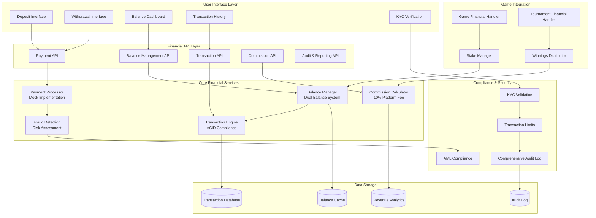

# Financial System and Commission Architecture

## Overview

This document outlines the comprehensive financial system architecture for the gaming platform, including mock payment processing, balance management, commission calculation, transaction handling, and revenue tracking with full audit capabilities.

## 1. Financial System Overview



## 2. Core Financial Architecture

### Financial Entity Structures
```typescript
interface UserBalance {
  userId: string;
  mainBalance: number;      // Real money balance
  internalBalance: number;  // Platform currency/bonus balance
  lockedBalance: number;    // Funds locked in active games
  lastUpdated: Date;
  version: number;          // For optimistic locking
}

interface Transaction {
  id: string;
  userId: string;
  type: TransactionType;
  amount: number;
  balanceType: 'main' | 'internal';
  status: TransactionStatus;
  reference?: TransactionReference;
  balances: {
    before: UserBalance;
    after: UserBalance;
  };
  fees?: {
    platformFee: number;
    processingFee: number;
    totalFees: number;
  };
  metadata: TransactionMetadata;
  createdAt: Date;
  processedAt?: Date;
  failedAt?: Date;
  failureReason?: string;
}

enum TransactionType {
  DEPOSIT = 'deposit',
  WITHDRAWAL = 'withdrawal',
  GAME_STAKE = 'game_stake',
  GAME_WIN = 'game_win',
  GAME_LOSS = 'game_loss',
  GAME_REFUND = 'game_refund',
  TOURNAMENT_ENTRY = 'tournament_entry',
  TOURNAMENT_WIN = 'tournament_win',
  COMMISSION = 'commission',
  BONUS = 'bonus',
  PENALTY = 'penalty',
  ADJUSTMENT = 'adjustment'
}

enum TransactionStatus {
  PENDING = 'pending',
  PROCESSING = 'processing',
  COMPLETED = 'completed',
  FAILED = 'failed',
  CANCELLED = 'cancelled',
  REFUNDED = 'refunded'
}

interface TransactionReference {
  type: 'game' | 'tournament' | 'payment' | 'manual';
  id: string;
  description?: string;
}

interface TransactionMetadata {
  ipAddress?: string;
  userAgent?: string;
  paymentMethod?: string;
  paymentProvider?: string;
  gameType?: string;
  opponentId?: string;
  tournamentId?: string;
  adminNote?: string;
  riskScore?: number;
}
```

### Balance Management System
```typescript
class BalanceManager {
  private balanceCache: Map<string, UserBalance> = new Map();
  private lockManager: LockManager;
  private auditLogger: AuditLogger;

  constructor(
    private transactionEngine: TransactionEngine,
    private fraudDetector: FraudDetector
  ) {
    this.lockManager = new LockManager();
    this.auditLogger = new AuditLogger();
  }

  async getUserBalance(userId: string): Promise<UserBalance> {
    // Try cache first
    let balance = this.balanceCache.get(userId);
    
    if (!balance) {
      // Load from database
      balance = await this.loadBalanceFromDB(userId);
      if (balance) {
        this.balanceCache.set(userId, balance);
      } else {
        // Create new balance record
        balance = await this.createNewBalance(userId);
      }
    }

    return balance;
  }

  async updateBalance(
    userId: string, 
    amount: number, 
    balanceType: 'main' | 'internal',
    transactionData: Partial<Transaction>
  ): Promise<Transaction> {
    // Acquire lock for user balance
    const lock = await this.lockManager.acquireLock(`balance:${userId}`, 5000);
    
    try {
      // Get current balance
      const currentBalance = await this.getUserBalance(userId);
      
      // Validate transaction
      await this.validateTransaction(userId, amount, balanceType, currentBalance);
      
      // Calculate new balance
      const newBalance = this.calculateNewBalance(currentBalance, amount, balanceType);
      
      // Create transaction record
      const transaction = await this.transactionEngine.createTransaction({
        ...transactionData,
        userId,
        amount,
        balanceType,
        balances: {
          before: { ...currentBalance },
          after: newBalance
        }
      });

      // Update balance in database and cache
      await this.persistBalance(newBalance);
      this.balanceCache.set(userId, newBalance);

      // Log audit trail
      await this.auditLogger.logBalanceUpdate(userId, transaction);

      return transaction;
    } finally {
      await this.lockManager.releaseLock(lock);
    }
  }

  private async validateTransaction(
    userId: string, 
    amount: number, 
    balanceType: 'main' | 'internal',
    currentBalance: UserBalance
  ): Promise<void> {
    // Check for sufficient funds (for debits)
    if (amount < 0) {
      const availableBalance = balanceType === 'main' 
        ? currentBalance.mainBalance 
        : currentBalance.internalBalance;
      
      if (Math.abs(amount) > availableBalance) {
        throw new InsufficientFundsError('Insufficient balance for transaction');
      }
    }

    // Check transaction limits
    await this.checkTransactionLimits(userId, amount, balanceType);

    // Fraud detection
    const riskAssessment = await this.fraudDetector.assessTransaction(userId, amount, balanceType);
    if (riskAssessment.riskLevel === 'HIGH') {
      throw new FraudDetectionError('Transaction flagged as high risk');
    }
  }

  private calculateNewBalance(
    currentBalance: UserBalance, 
    amount: number, 
    balanceType: 'main' | 'internal'
  ): UserBalance {
    const newBalance = { ...currentBalance };
    
    if (balanceType === 'main') {
      newBalance.mainBalance += amount;
    } else {
      newBalance.internalBalance += amount;
    }
    
    newBalance.lastUpdated = new Date();
    newBalance.version += 1;
    
    return newBalance;
  }

  async lockFunds(userId: string, amount: number, reason: string): Promise<string> {
    const lockId = generateId();
    
    await this.updateBalance(userId, -amount, 'main', {
      type: TransactionType.ADJUSTMENT,
      status: TransactionStatus.COMPLETED,
      metadata: {
        adminNote: `Funds locked: ${reason}`,
        lockId
      }
    });

    // Update locked balance
    const balance = await this.getUserBalance(userId);
    balance.lockedBalance += amount;
    await this.persistBalance(balance);

    return lockId;
  }

  async unlockFunds(userId: string, lockId: string): Promise<void> {
    // Find the lock transaction
    const lockTransaction = await this.transactionEngine.findTransactionByLockId(lockId);
    if (!lockTransaction) {
      throw new Error('Lock transaction not found');
    }

    // Release the funds
    await this.updateBalance(userId, lockTransaction.amount, 'main', {
      type: TransactionType.ADJUSTMENT,
      status: TransactionStatus.COMPLETED,
      metadata: {
        adminNote: `Funds unlocked: ${lockId}`,
        originalLockId: lockId
      }
    });

    // Update locked balance
    const balance = await this.getUserBalance(userId);
    balance.lockedBalance -= Math.abs(lockTransaction.amount);
    await this.persistBalance(balance);
  }
}
```

## 3. Payment Processing System

### Mock Payment Processor
```typescript
class MockPaymentProcessor {
  private paymentMethods: Map<string, PaymentMethod> = new Map();
  private processingDelays: Map<string, number> = new Map();

  constructor() {
    this.initializePaymentMethods();
  }

  async processDeposit(depositRequest: DepositRequest): Promise<PaymentResult> {
    // Validate deposit request
    await this.validateDepositRequest(depositRequest);

    // Simulate payment processing delay
    const delay = this.getProcessingDelay(depositRequest.method);
    await this.simulateProcessingDelay(delay);

    // Simulate payment success/failure
    const result = await this.simulatePaymentOutcome(depositRequest);

    // Log payment attempt
    await this.logPaymentAttempt(depositRequest, result);

    return result;
  }

  async processWithdrawal(withdrawalRequest: WithdrawalRequest): Promise<PaymentResult> {
    // Validate withdrawal request
    await this.validateWithdrawalRequest(withdrawalRequest);

    // Check KYC status
    await this.validateKYCStatus(withdrawalRequest.userId);

    // Simulate processing delay
    const delay = this.getProcessingDelay(withdrawalRequest.method);
    await this.simulateProcessingDelay(delay);

    // Simulate withdrawal outcome
    const result = await this.simulateWithdrawalOutcome(withdrawalRequest);

    // Log withdrawal attempt
    await this.logPaymentAttempt(withdrawalRequest, result);

    return result;
  }

  private async simulatePaymentOutcome(request: DepositRequest): Promise<PaymentResult> {
    // Simulate different outcomes based on amount and method
    const successRate = this.calculateSuccessRate(request);
    const isSuccessful = Math.random() < successRate;

    if (isSuccessful) {
      return {
        status: 'success',
        transactionId: generateTransactionId(),
        amount: request.amount,
        fees: this.calculateFees(request),
        processedAt: new Date(),
        providerResponse: this.generateMockProviderResponse('success')
      };
    } else {
      return {
        status: 'failed',
        transactionId: generateTransactionId(),
        amount: request.amount,
        failureReason: this.generateFailureReason(),
        processedAt: new Date(),
        providerResponse: this.generateMockProviderResponse('failed')
      };
    }
  }

  private calculateSuccessRate(request: DepositRequest | WithdrawalRequest): number {
    let baseRate = 0.95; // 95% base success rate

    // Adjust based on amount
    if (request.amount > 10000) baseRate -= 0.1; // Large amounts more likely to fail
    if (request.amount < 10) baseRate -= 0.05; // Very small amounts might fail

    // Adjust based on payment method
    switch (request.method) {
      case 'card': baseRate -= 0.02; break;
      case 'bank_transfer': baseRate += 0.02; break;
      case 'crypto': baseRate -= 0.05; break;
      case 'paypal': baseRate -= 0.01; break;
    }

    return Math.max(0.7, Math.min(0.99, baseRate));
  }

  private calculateFees(request: DepositRequest | WithdrawalRequest): PaymentFees {
    const feeRates = {
      card: 0.029, // 2.9%
      bank_transfer: 0.01, // 1%
      crypto: 0.015, // 1.5%
      paypal: 0.034 // 3.4%
    };

    const rate = feeRates[request.method] || 0.025;
    const processingFee = request.amount * rate;
    const fixedFee = request.method === 'bank_transfer' ? 1.0 : 0.3;

    return {
      processingFee,
      fixedFee,
      totalFees: processingFee + fixedFee
    };
  }

  private generateFailureReason(): string {
    const reasons = [
      'Insufficient funds',
      'Card declined',
      'Invalid payment details',
      'Bank rejection',
      'Fraud prevention',
      'Technical error',
      'Account verification required'
    ];

    return reasons[Math.floor(Math.random() * reasons.length)];
  }

  private async simulateProcessingDelay(delayMs: number): Promise<void> {
    return new Promise(resolve => setTimeout(resolve, delayMs));
  }

  private getProcessingDelay(method: string): number {
    const delays = {
      card: 2000,        // 2 seconds
      paypal: 3000,      // 3 seconds
      crypto: 5000,      // 5 seconds
      bank_transfer: 1000 // 1 second (instant for demo)
    };

    return delays[method] || 2000;
  }
}
```

## 4. Commission and Revenue System

### Commission Calculator
```typescript
class CommissionCalculator {
  private readonly PLATFORM_COMMISSION_RATE = 0.10; // 10%
  private revenueTracker: RevenueTracker;

  constructor() {
    this.revenueTracker = new RevenueTracker();
  }

  async calculateGameCommission(gameData: GameFinancialData): Promise<CommissionResult> {
    const totalPot = gameData.stake * 2; // Both players' stakes
    const commission = totalPot * this.PLATFORM_COMMISSION_RATE;
    
    // Calculate winnings after commission
    const netPot = totalPot - commission;
    
    let winnings: GameWinnings;
    
    if (gameData.result === 'draw') {
      // In case of draw, return stakes minus commission
      const returnAmount = gameData.stake - (commission / 2);
      winnings = {
        player1: returnAmount,
        player2: returnAmount,
        commission: commission
      };
    } else {
      // Winner takes all minus commission
      winnings = {
        player1: gameData.result === 'player1_wins' ? netPot : 0,
        player2: gameData.result === 'player2_wins' ? netPot : 0,
        commission: commission
      };
    }

    // Track revenue
    await this.revenueTracker.recordGameRevenue({
      gameId: gameData.gameId,
      gameType: gameData.gameType,
      totalPot,
      commission,
      timestamp: new Date()
    });

    return {
      totalPot,
      commission,
      winnings,
      commissionRate: this.PLATFORM_COMMISSION_RATE
    };
  }

  async calculateTournamentCommission(tournamentData: TournamentFinancialData): Promise<CommissionResult> {
    const totalEntryFees = tournamentData.entryFee * tournamentData.participants;
    const commission = totalEntryFees * this.PLATFORM_COMMISSION_RATE;
    const prizePool = totalEntryFees - commission;

    // Calculate prize distribution
    const prizeDistribution = this.calculatePrizeDistribution(prizePool, tournamentData.participants);

    // Track revenue
    await this.revenueTracker.recordTournamentRevenue({
      tournamentId: tournamentData.tournamentId,
      gameType: tournamentData.gameType,
      totalEntryFees,
      commission,
      participants: tournamentData.participants,
      timestamp: new Date()
    });

    return {
      totalPot: totalEntryFees,
      commission,
      prizePool,
      prizeDistribution,
      commissionRate: this.PLATFORM_COMMISSION_RATE
    };
  }

  private calculatePrizeDistribution(prizePool: number, participants: number): PrizeDistribution[] {
    if (participants <= 2) {
      return [{ position: 1, amount: prizePool, percentage: 100 }];
    } else if (participants <= 8) {
      return [
        { position: 1, amount: prizePool * 0.7, percentage: 70 },
        { position: 2, amount: prizePool * 0.3, percentage: 30 }
      ];
    } else if (participants <= 16) {
      return [
        { position: 1, amount: prizePool * 0.5, percentage: 50 },
        { position: 2, amount: prizePool * 0.3, percentage: 30 },
        { position: 3, amount: prizePool * 0.2, percentage: 20 }
      ];
    } else {
      return [
        { position: 1, amount: prizePool * 0.4, percentage: 40 },
        { position: 2, amount: prizePool * 0.25, percentage: 25 },
        { position: 3, amount: prizePool * 0.2, percentage: 20 },
        { position: 4, amount: prizePool * 0.15, percentage: 15 }
      ];
    }
  }

  async getRevenueAnalytics(period: AnalyticsPeriod): Promise<RevenueAnalytics> {
    return await this.revenueTracker.getAnalytics(period);
  }
}
```

### Revenue Tracking System
```typescript
class RevenueTracker {
  async recordGameRevenue(data: GameRevenueData): Promise<void> {
    const revenueRecord: RevenueRecord = {
      id: generateId(),
      type: 'game',
      source: data.gameType,
      amount: data.commission,
      metadata: {
        gameId: data.gameId,
        totalPot: data.totalPot,
        commissionRate: data.commission / data.totalPot
      },
      timestamp: data.timestamp
    };

    await this.saveRevenueRecord(revenueRecord);
    await this.updateDailyRevenue(revenueRecord);
  }

  async recordTournamentRevenue(data: TournamentRevenueData): Promise<void> {
    const revenueRecord: RevenueRecord = {
      id: generateId(),
      type: 'tournament',
      source: data.gameType,
      amount: data.commission,
      metadata: {
        tournamentId: data.tournamentId,
        totalEntryFees: data.totalEntryFees,
        participants: data.participants,
        commissionRate: data.commission / data.totalEntryFees
      },
      timestamp: data.timestamp
    };

    await this.saveRevenueRecord(revenueRecord);
    await this.updateDailyRevenue(revenueRecord);
  }

  async getAnalytics(period: AnalyticsPeriod): Promise<RevenueAnalytics> {
    const startDate = this.calculateStartDate(period);
    const endDate = new Date();

    const records = await this.getRevenueRecords(startDate, endDate);

    return {
      totalRevenue: records.reduce((sum, record) => sum + record.amount, 0),
      gameRevenue: this.calculateGameRevenue(records),
      tournamentRevenue: this.calculateTournamentRevenue(records),
      revenueByGameType: this.calculateRevenueByGameType(records),
      revenueByDay: this.calculateDailyRevenue(records),
      averageCommissionRate: this.calculateAverageCommissionRate(records),
      topRevenueGames: this.getTopRevenueGames(records),
      growthRate: await this.calculateGrowthRate(period)
    };
  }

  private calculateGameRevenue(records: RevenueRecord[]): number {
    return records
      .filter(record => record.type === 'game')
      .reduce((sum, record) => sum + record.amount, 0);
  }

  private calculateTournamentRevenue(records: RevenueRecord[]): number {
    return records
      .filter(record => record.type === 'tournament')
      .reduce((sum, record) => sum + record.amount, 0);
  }

  private calculateRevenueByGameType(records: RevenueRecord[]): Record<string, number> {
    const revenueByType: Record<string, number> = {};

    for (const record of records) {
      revenueByType[record.source] = (revenueByType[record.source] || 0) + record.amount;
    }

    return revenueByType;
  }

  private calculateDailyRevenue(records: RevenueRecord[]): DailyRevenue[] {
    const dailyRevenue: Map<string, number> = new Map();

    for (const record of records) {
      const date = record.timestamp.toISOString().split('T')[0];
      dailyRevenue.set(date, (dailyRevenue.get(date) || 0) + record.amount);
    }

    return Array.from(dailyRevenue.entries()).map(([date, amount]) => ({
      date,
      amount
    }));
  }

  private async calculateGrowthRate(period: AnalyticsPeriod): Promise<number> {
    const currentPeriodRevenue = await this.getRevenueForPeriod(period);
    const previousPeriodRevenue = await this.getRevenueForPreviousPeriod(period);

    if (previousPeriodRevenue === 0) return 0;

    return ((currentPeriodRevenue - previousPeriodRevenue) / previousPeriodRevenue) * 100;
  }
}
```

## 5. Game Financial Integration

### Game Financial Handler
```typescript
class GameFinancialHandler {
  constructor(
    private balanceManager: BalanceManager,
    private commissionCalculator: CommissionCalculator,
    private transactionEngine: TransactionEngine
  ) {}

  async handleGameStart(gameData: GameStartData): Promise<void> {
    const { gameId, player1Id, player2Id, stake } = gameData;

    // Lock stakes from both players
    await Promise.all([
      this.lockPlayerStake(player1Id, stake, gameId),
      this.lockPlayerStake(player2Id, stake, gameId)
    ]);
  }

  async handleGameEnd(gameResult: GameResult): Promise<void> {
    const { gameId, player1Id, player2Id, stake, result } = gameResult;

    // Calculate commission and winnings
    const commissionResult = await this.commissionCalculator.calculateGameCommission({
      gameId,
      gameType: gameResult.gameType,
      stake,
      result,
      player1Id,
      player2Id
    });

    // Process winnings distribution
    await this.distributeWinnings(gameResult, commissionResult);

    // Record platform commission
    await this.recordPlatformCommission(commissionResult);
  }

  private async lockPlayerStake(playerId: string, stake: number, gameId: string): Promise<void> {
    // Deduct stake from player's balance
    await this.balanceManager.updateBalance(playerId, -stake, 'main', {
      type: TransactionType.GAME_STAKE,
      status: TransactionStatus.COMPLETED,
      reference: {
        type: 'game',
        id: gameId,
        description: 'Game stake locked'
      },
      metadata: {
        gameId
      }
    });
  }

  private async distributeWinnings(gameResult: GameResult, commissionResult: CommissionResult): Promise<void> {
    const { player1Id, player2Id, gameId } = gameResult;
    const { winnings } = commissionResult;

    // Distribute winnings to player 1
    if (winnings.player1 > 0) {
      await this.balanceManager.updateBalance(player1Id, winnings.player1, 'main', {
        type: TransactionType.GAME_WIN,
        status: TransactionStatus.COMPLETED,
        reference: {
          type: 'game',
          id: gameId,
          description: 'Game winnings'
        },
        metadata: {
          gameId,
          opponentId: player2Id,
          originalStake: gameResult.stake,
          commission: commissionResult.commission
        }
      });
    }

    // Distribute winnings to player 2
    if (winnings.player2 > 0) {
      await this.balanceManager.updateBalance(player2Id, winnings.player2, 'main', {
        type: TransactionType.GAME_WIN,
        status: TransactionStatus.COMPLETED,
        reference: {
          type: 'game',
          id: gameId,
          description: 'Game winnings'
        },
        metadata: {
          gameId,
          opponentId: player1Id,
          originalStake: gameResult.stake,
          commission: commissionResult.commission
        }
      });
    }
  }

  private async recordPlatformCommission(commissionResult: CommissionResult): Promise<void> {
    // Record commission as platform revenue
    await this.transactionEngine.createTransaction({
      userId: 'platform',
      type: TransactionType.COMMISSION,
      amount: commissionResult.commission,
      balanceType: 'main',
      status: TransactionStatus.COMPLETED,
      metadata: {
        commissionRate: commissionResult.commissionRate,
        totalPot: commissionResult.totalPot
      }
    });
  }

  async handleGameCancellation(gameData: GameCancellationData): Promise<void> {
    const { gameId, player1Id, player2Id, stake, reason } = gameData;

    // Refund stakes to both players
    await Promise.all([
      this.refundPlayerStake(player1Id, stake, gameId, reason),
      this.refundPlayerStake(player2Id, stake, gameId, reason)
    ]);
  }

  private async refundPlayerStake(playerId: string, stake: number, gameId: string, reason: string): Promise<void> {
    await this.balanceManager.updateBalance(playerId, stake, 'main', {
      type: TransactionType.GAME_REFUND,
      status: TransactionStatus.COMPLETED,
      reference: {
        type: 'game',
        id: gameId,
        description: `Game refund: ${reason}`
      },
      metadata: {
        gameId,
        refundReason: reason
      }
    });
  }
}
```

## 6. Fraud Detection and Risk Management

### Fraud Detection System
```typescript
class FraudDetectionSystem {
  private riskRules: RiskRule[] = [];
  private userRiskProfiles: Map<string, UserRiskProfile> = new Map();

  constructor() {
    this.initializeRiskRules();
  }

  async assessTransaction(userId: string, amount: number, balanceType: string): Promise<RiskAssessment> {
    const userProfile = await this.getUserRiskProfile(userId);
    const riskFactors: RiskFactor[] = [];

    // Apply risk rules
    for (const rule of this.riskRules) {
      const factor = await rule.evaluate(userId, amount, balanceType, userProfile);
      if (factor) {
        riskFactors.push(factor);
      }
    }

    // Calculate overall risk score
    const riskScore = this.calculateRiskScore(riskFactors);
    const riskLevel = this.determineRiskLevel(riskScore);

    // Update user risk profile
    await this.updateUserRiskProfile(userId, riskScore, riskFactors);

    return {
      riskScore,
      riskLevel,
      riskFactors,
      requiresReview: riskLevel === 'HIGH' || riskLevel === 'CRITICAL',
      recommendedAction: this.getRecommendedAction(riskLevel)
    };
  }

  private initializeRiskRules(): void {
    this.riskRules = [
      new VelocityRule(),           // Multiple transactions in short time
      new AmountRule(),             // Unusually large amounts
      new PatternRule(),            // Suspicious patterns
      new GeolocationRule(),        // Unusual locations
      new DeviceRule(),             // New or suspicious devices
      new BehaviorRule(),           // Unusual user behavior
      new TimeRule(),               // Transactions at unusual times
      new FrequencyRule()           // High frequency transactions
    ];
  }

  private calculateRiskScore(riskFactors: RiskFactor[]): number {
    if (riskFactors.length === 0) return 0;

    const weightedScore = riskFactors.reduce((total, factor) => {
      return total + (factor.score * factor.weight);
    }, 0);

    const totalWeight = riskFactors.reduce((total, factor) => total + factor.weight, 0);

    return totalWeight > 0 ? weightedScore / totalWeight : 0;
  }

  private determineRiskLevel(riskScore: number): RiskLevel {
    if (riskScore >= 0.8) return 'CRITICAL';
    if (riskScore >= 0.6) return 'HIGH';
    if (riskScore >= 0.4) return 'MEDIUM';
    if (riskScore >= 0.2) return 'LOW';
    return 'MINIMAL';
  }

  private getRecommendedAction(

  private getRecommendedAction(riskLevel: RiskLevel): string {
    switch (riskLevel) {
      case 'CRITICAL': return 'BLOCK_TRANSACTION';
      case 'HIGH': return 'MANUAL_REVIEW';
      case 'MEDIUM': return 'ADDITIONAL_VERIFICATION';
      case 'LOW': return 'MONITOR';
      default: return 'ALLOW';
    }
  }
}

// Risk Rule Implementations
class VelocityRule implements RiskRule {
  async evaluate(userId: string, amount: number, balanceType: string, profile: UserRiskProfile): Promise<RiskFactor | null> {
    const recentTransactions = await this.getRecentTransactions(userId, 3600000); // Last hour
    
    if (recentTransactions.length > 10) {
      return {
        type: 'velocity',
        score: Math.min(1.0, recentTransactions.length / 20),
        weight: 0.8,
        description: `${recentTransactions.length} transactions in the last hour`
      };
    }
    
    return null;
  }
}

class AmountRule implements RiskRule {
  async evaluate(userId: string, amount: number, balanceType: string, profile: UserRiskProfile): Promise<RiskFactor | null> {
    const userAverage = profile.averageTransactionAmount || 100;
    const ratio = amount / userAverage;
    
    if (ratio > 10) { // Transaction is 10x larger than usual
      return {
        type: 'amount',
        score: Math.min(1.0, ratio / 50),
        weight: 0.7,
        description: `Transaction amount ${ratio.toFixed(1)}x larger than average`
      };
    }
    
    return null;
  }
}
```

## 7. KYC Integration and Compliance

### KYC Financial Validator
```typescript
class KYCFinancialValidator {
  private kycLimits: KYCLimits = {
    unverified: {
      dailyDeposit: 100,
      dailyWithdrawal: 50,
      monthlyDeposit: 500,
      monthlyWithdrawal: 200
    },
    basic: {
      dailyDeposit: 1000,
      dailyWithdrawal: 500,
      monthlyDeposit: 10000,
      monthlyWithdrawal: 5000
    },
    enhanced: {
      dailyDeposit: 10000,
      dailyWithdrawal: 10000,
      monthlyDeposit: 100000,
      monthlyWithdrawal: 100000
    },
    premium: {
      dailyDeposit: 50000,
      dailyWithdrawal: 50000,
      monthlyDeposit: 500000,
      monthlyWithdrawal: 500000
    }
  };

  async validateTransactionLimits(userId: string, amount: number, type: 'deposit' | 'withdrawal'): Promise<ValidationResult> {
    const user = await this.userService.getUser(userId);
    const kycLevel = this.determineKYCLevel(user);
    const limits = this.kycLimits[kycLevel];

    // Check daily limits
    const dailyUsage = await this.getDailyUsage(userId, type);
    const dailyLimit = type === 'deposit' ? limits.dailyDeposit : limits.dailyWithdrawal;
    
    if (dailyUsage + amount > dailyLimit) {
      return {
        isValid: false,
        error: `Daily ${type} limit exceeded. Limit: ${dailyLimit}, Current usage: ${dailyUsage}`,
        requiredAction: 'UPGRADE_KYC'
      };
    }

    // Check monthly limits
    const monthlyUsage = await this.getMonthlyUsage(userId, type);
    const monthlyLimit = type === 'deposit' ? limits.monthlyDeposit : limits.monthlyWithdrawal;
    
    if (monthlyUsage + amount > monthlyLimit) {
      return {
        isValid: false,
        error: `Monthly ${type} limit exceeded. Limit: ${monthlyLimit}, Current usage: ${monthlyUsage}`,
        requiredAction: 'UPGRADE_KYC'
      };
    }

    return { isValid: true };
  }

  private determineKYCLevel(user: any): KYCLevel {
    if (!user.isVerified) return 'unverified';
    
    switch (user.kyc.status) {
      case 'approved':
        return user.kyc.level || 'basic';
      case 'pending':
        return 'unverified';
      default:
        return 'unverified';
    }
  }

  async requiresKYCUpgrade(userId: string, requestedAmount: number, type: 'deposit' | 'withdrawal'): Promise<KYCUpgradeRequirement> {
    const currentLevel = await this.getCurrentKYCLevel(userId);
    const requiredLevel = this.calculateRequiredKYCLevel(requestedAmount, type);

    if (this.isKYCLevelSufficient(currentLevel, requiredLevel)) {
      return { required: false };
    }

    return {
      required: true,
      currentLevel,
      requiredLevel,
      upgradeSteps: this.getUpgradeSteps(currentLevel, requiredLevel),
      estimatedTime: this.getEstimatedUpgradeTime(currentLevel, requiredLevel)
    };
  }

  private calculateRequiredKYCLevel(amount: number, type: string): KYCLevel {
    if (amount <= 100) return 'unverified';
    if (amount <= 1000) return 'basic';
    if (amount <= 10000) return 'enhanced';
    return 'premium';
  }

  private getUpgradeSteps(current: KYCLevel, required: KYCLevel): KYCUpgradeStep[] {
    const steps: KYCUpgradeStep[] = [];
    
    if (current === 'unverified' && required !== 'unverified') {
      steps.push({
        step: 'email_verification',
        description: 'Verify your email address',
        required: true
      });
    }

    if ((current === 'unverified' || current === 'basic') && (required === 'enhanced' || required === 'premium')) {
      steps.push({
        step: 'document_upload',
        description: 'Upload government-issued ID and proof of address',
        required: true
      });
    }

    if (required === 'premium') {
      steps.push({
        step: 'enhanced_verification',
        description: 'Additional verification including source of funds',
        required: true
      });
    }

    return steps;
  }
}
```

## 8. Transaction Engine and ACID Compliance

### Transaction Engine
```typescript
class TransactionEngine {
  private transactionQueue: Queue<TransactionRequest> = new Queue();
  private processingLocks: Map<string, boolean> = new Map();

  constructor(
    private database: Database,
    private auditLogger: AuditLogger
  ) {
    this.startTransactionProcessor();
  }

  async createTransaction(transactionData: Partial<Transaction>): Promise<Transaction> {
    const transaction: Transaction = {
      id: generateId(),
      ...transactionData,
      status: TransactionStatus.PENDING,
      createdAt: new Date()
    } as Transaction;

    // Add to processing queue
    await this.transactionQueue.enqueue({
      transaction,
      retryCount: 0,
      maxRetries: 3
    });

    return transaction;
  }

  private async startTransactionProcessor(): Promise<void> {
    while (true) {
      try {
        const request = await this.transactionQueue.dequeue();
        if (request) {
          await this.processTransaction(request);
        } else {
          await this.sleep(100); // Wait 100ms if no transactions
        }
      } catch (error) {
        console.error('Transaction processor error:', error);
        await this.sleep(1000); // Wait 1s on error
      }
    }
  }

  private async processTransaction(request: TransactionRequest): Promise<void> {
    const { transaction } = request;
    const lockKey = `transaction:${transaction.userId}`;

    // Prevent concurrent processing for same user
    if (this.processingLocks.get(lockKey)) {
      await this.transactionQueue.enqueue(request); // Re-queue
      return;
    }

    this.processingLocks.set(lockKey, true);

    try {
      await this.executeTransactionWithACID(transaction);
    } catch (error) {
      await this.handleTransactionError(request, error);
    } finally {
      this.processingLocks.delete(lockKey);
    }
  }

  private async executeTransactionWithACID(transaction: Transaction): Promise<void> {
    const session = await this.database.startSession();
    
    try {
      await session.withTransaction(async () => {
        // Update transaction status
        transaction.status = TransactionStatus.PROCESSING;
        await this.saveTransaction(transaction, session);

        // Execute the transaction logic
        await this.executeTransactionLogic(transaction, session);

        // Update final status
        transaction.status = TransactionStatus.COMPLETED;
        transaction.processedAt = new Date();
        await this.saveTransaction(transaction, session);

        // Log audit trail
        await this.auditLogger.logTransaction(transaction, session);
      });
    } catch (error) {
      transaction.status = TransactionStatus.FAILED;
      transaction.failedAt = new Date();
      transaction.failureReason = error.message;
      await this.saveTransaction(transaction);
      throw error;
    } finally {
      await session.endSession();
    }
  }

  private async executeTransactionLogic(transaction: Transaction, session: any): Promise<void> {
    switch (transaction.type) {
      case TransactionType.DEPOSIT:
        await this.processDeposit(transaction, session);
        break;
      case TransactionType.WITHDRAWAL:
        await this.processWithdrawal(transaction, session);
        break;
      case TransactionType.GAME_STAKE:
        await this.processGameStake(transaction, session);
        break;
      case TransactionType.GAME_WIN:
        await this.processGameWin(transaction, session);
        break;
      case TransactionType.COMMISSION:
        await this.processCommission(transaction, session);
        break;
      default:
        throw new Error(`Unsupported transaction type: ${transaction.type}`);
    }
  }

  private async processDeposit(transaction: Transaction, session: any): Promise<void> {
    // Update user balance
    await this.updateUserBalance(
      transaction.userId,
      transaction.amount,
      transaction.balanceType,
      session
    );

    // Record deposit in financial records
    await this.recordFinancialEntry(transaction, 'credit', session);
  }

  private async processWithdrawal(transaction: Transaction, session: any): Promise<void> {
    // Validate sufficient balance
    const currentBalance = await this.getUserBalance(transaction.userId, session);
    const availableBalance = transaction.balanceType === 'main' 
      ? currentBalance.mainBalance 
      : currentBalance.internalBalance;

    if (availableBalance < transaction.amount) {
      throw new InsufficientFundsError('Insufficient balance for withdrawal');
    }

    // Update user balance
    await this.updateUserBalance(
      transaction.userId,
      -transaction.amount,
      transaction.balanceType,
      session
    );

    // Record withdrawal in financial records
    await this.recordFinancialEntry(transaction, 'debit', session);
  }

  private async handleTransactionError(request: TransactionRequest, error: Error): Promise<void> {
    request.retryCount++;

    if (request.retryCount < request.maxRetries) {
      // Exponential backoff
      const delay = Math.pow(2, request.retryCount) * 1000;
      setTimeout(() => {
        this.transactionQueue.enqueue(request);
      }, delay);
    } else {
      // Max retries exceeded, mark as failed
      request.transaction.status = TransactionStatus.FAILED;
      request.transaction.failedAt = new Date();
      request.transaction.failureReason = `Max retries exceeded: ${error.message}`;
      await this.saveTransaction(request.transaction);
      
      // Notify administrators
      await this.notifyTransactionFailure(request.transaction, error);
    }
  }
}
```

## 9. Financial Reporting and Analytics

### Financial Analytics Engine
```typescript
class FinancialAnalyticsEngine {
  async generateFinancialReport(period: AnalyticsPeriod): Promise<FinancialReport> {
    const startDate = this.calculateStartDate(period);
    const endDate = new Date();

    const [
      revenueData,
      transactionData,
      userFinancialData,
      gameFinancialData
    ] = await Promise.all([
      this.getRevenueData(startDate, endDate),
      this.getTransactionData(startDate, endDate),
      this.getUserFinancialData(startDate, endDate),
      this.getGameFinancialData(startDate, endDate)
    ]);

    return {
      period: {
        start: startDate,
        end: endDate,
        type: period
      },
      revenue: {
        total: revenueData.total,
        bySource: revenueData.bySource,
        growth: revenueData.growth,
        projectedMonthly: this.projectMonthlyRevenue(revenueData)
      },
      transactions: {
        total: transactionData.count,
        volume: transactionData.volume,
        averageAmount: transactionData.averageAmount,
        successRate: transactionData.successRate,
        byType: transactionData.byType
      },
      users: {
        totalBalance: userFinancialData.totalBalance,
        averageBalance: userFinancialData.averageBalance,
        depositingUsers: userFinancialData.depositingUsers,
        withdrawingUsers: userFinancialData.withdrawingUsers,
        netFlow: userFinancialData.netFlow
      },
      games: {
        totalStakes: gameFinancialData.totalStakes,
        totalCommission: gameFinancialData.totalCommission,
        averageStake: gameFinancialData.averageStake,
        commissionRate: gameFinancialData.commissionRate,
        byGameType: gameFinancialData.byGameType
      },
      kpi: this.calculateKPIs(revenueData, transactionData, userFinancialData, gameFinancialData)
    };
  }

  private calculateKPIs(
    revenueData: any,
    transactionData: any,
    userFinancialData: any,
    gameFinancialData: any
  ): FinancialKPIs {
    return {
      arpu: userFinancialData.totalUsers > 0 ? revenueData.total / userFinancialData.totalUsers : 0,
      ltv: this.calculateLifetimeValue(userFinancialData),
      churnRate: this.calculateChurnRate(userFinancialData),
      conversionRate: this.calculateConversionRate(userFinancialData),
      retentionRate: this.calculateRetentionRate(userFinancialData),
      profitMargin: this.calculateProfitMargin(revenueData, transactionData),
      cashFlow: userFinancialData.netFlow,
      burnRate: this.calculateBurnRate(transactionData)
    };
  }

  async generateUserFinancialSummary(userId: string, period: AnalyticsPeriod): Promise<UserFinancialSummary> {
    const startDate = this.calculateStartDate(period);
    const endDate = new Date();

    const transactions = await this.getUserTransactions(userId, startDate, endDate);
    const currentBalance = await this.getUserBalance(userId);

    return {
      userId,
      period: { start: startDate, end: endDate },
      currentBalance,
      transactions: {
        total: transactions.length,
        deposits: transactions.filter(t => t.type === TransactionType.DEPOSIT),
        withdrawals: transactions.filter(t => t.type === TransactionType.WITHDRAWAL),
        gameTransactions: transactions.filter(t => 
          [TransactionType.GAME_STAKE, TransactionType.GAME_WIN, TransactionType.GAME_LOSS].includes(t.type)
        ),
        tournamentTransactions: transactions.filter(t => 
          [TransactionType.TOURNAMENT_ENTRY, TransactionType.TOURNAMENT_WIN].includes(t.type)
        )
      },
      summary: {
        totalDeposited: this.sumTransactionsByType(transactions, TransactionType.DEPOSIT),
        totalWithdrawn: this.sumTransactionsByType(transactions, TransactionType.WITHDRAWAL),
        totalGameStakes: this.sumTransactionsByType(transactions, TransactionType.GAME_STAKE),
        totalGameWinnings: this.sumTransactionsByType(transactions, TransactionType.GAME_WIN),
        netGameResult: this.calculateNetGameResult(transactions),
        totalCommissionPaid: this.calculateTotalCommissionPaid(transactions)
      },
      insights: {
        mostActiveGameType: this.getMostActiveGameType(transactions),
        averageStakeSize: this.calculateAverageStakeSize(transactions),
        winRate: this.calculateWinRate(transactions),
        profitability: this.calculateUserProfitability(transactions)
      }
    };
  }

  private calculateNetGameResult(transactions: Transaction[]): number {
    const winnings = this.sumTransactionsByType(transactions, TransactionType.GAME_WIN);
    const stakes = this.sumTransactionsByType(transactions, TransactionType.GAME_STAKE);
    return winnings - stakes;
  }

  private calculateUserProfitability(transactions: Transaction[]): UserProfitability {
    const deposits = this.sumTransactionsByType(transactions, TransactionType.DEPOSIT);
    const withdrawals = this.sumTransactionsByType(transactions, TransactionType.WITHDRAWAL);
    const netGameResult = this.calculateNetGameResult(transactions);
    
    return {
      netDeposits: deposits - withdrawals,
      netGameResult,
      overallProfit: netGameResult,
      profitMargin: deposits > 0 ? (netGameResult / deposits) * 100 : 0
    };
  }
}
```

## 10. Financial Security and Compliance

### Compliance Monitor
```typescript
class ComplianceMonitor {
  private complianceRules: ComplianceRule[] = [];
  private alertThresholds: AlertThresholds;

  constructor() {
    this.initializeComplianceRules();
    this.alertThresholds = {
      largeTransaction: 10000,
      velocityLimit: 50000, // Per day
      suspiciousPattern: 0.8, // Risk score threshold
      kycRequired: 1000
    };
  }

  async monitorTransaction(transaction: Transaction): Promise<ComplianceResult> {
    const violations: ComplianceViolation[] = [];
    const alerts: ComplianceAlert[] = [];

    // Check all compliance rules
    for (const rule of this.complianceRules) {
      const result = await rule.evaluate(transaction);
      
      if (result.violation) {
        violations.push(result.violation);
      }
      
      if (result.alert) {
        alerts.push(result.alert);
      }
    }

    // Generate compliance report
    const complianceResult: ComplianceResult = {
      transactionId: transaction.id,
      compliant: violations.length === 0,
      violations,
      alerts,
      riskScore: this.calculateComplianceRiskScore(violations, alerts),
      recommendedAction: this.getRecommendedComplianceAction(violations, alerts)
    };

    // Log compliance check
    await this.logComplianceCheck(transaction, complianceResult);

    // Send alerts if necessary
    if (alerts.length > 0 || violations.length > 0) {
      await this.sendComplianceAlerts(complianceResult);
    }

    return complianceResult;
  }

  private initializeComplianceRules(): void {
    this.complianceRules = [
      new AMLRule(),                    // Anti-Money Laundering
      new CTFRule(),                    // Counter-Terrorism Financing
      new LargeTransactionRule(),       // Large transaction reporting
      new VelocityRule(),              // Transaction velocity monitoring
      new PatternAnalysisRule(),       // Suspicious pattern detection
      new SanctionsRule(),             // Sanctions list checking
      new PEPRule(),                   // Politically Exposed Persons
      new JurisdictionRule()           // Jurisdiction compliance
    ];
  }

  async generateComplianceReport(period: AnalyticsPeriod): Promise<ComplianceReport> {
    const startDate = this.calculateStartDate(period);
    const endDate = new Date();

    const [
      transactions,
      violations,
      alerts,
      investigations
    ] = await Promise.all([
      this.getTransactionsInPeriod(startDate, endDate),
      this.getViolationsInPeriod(startDate, endDate),
      this.getAlertsInPeriod(startDate, endDate),
      this.getInvestigationsInPeriod(startDate, endDate)
    ]);

    return {
      period: { start: startDate, end: endDate },
      summary: {
        totalTransactions: transactions.length,
        flaggedTransactions: violations.length + alerts.length,
        complianceRate: ((transactions.length - violations.length) / transactions.length) * 100,
        averageRiskScore: this.calculateAverageRiskScore(transactions)
      },
      violations: {
        total: violations.length,
        byType: this.groupViolationsByType(violations),
        resolved: violations.filter(v => v.status === 'resolved').length,
        pending: violations.filter(v => v.status === 'pending').length
      },
      alerts: {
        total: alerts.length,
        byType: this.groupAlertsByType(alerts),
        escalated: alerts.filter(a => a.escalated).length
      },
      investigations: {
        total: investigations.length,
        ongoing: investigations.filter(i => i.status === 'ongoing').length,
        completed: investigations.filter(i => i.status === 'completed').length,
        averageDuration: this.calculateAverageInvestigationDuration(investigations)
      },
      recommendations: this.generateComplianceRecommendations(violations, alerts, investigations)
    };
  }
}
```

This comprehensive financial system architecture provides a robust, secure, and compliant foundation for handling all monetary transactions within the gaming platform while maintaining transparency, auditability, and regulatory compliance.