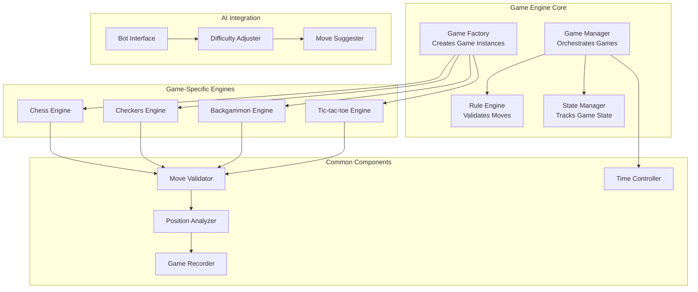

# Game Engine Architectures

## Overview

This document outlines the comprehensive game engine architectures for all four supported games: Chess, Checkers, Backgammon, and Tic-tac-toe. Each engine is designed with modularity, extensibility, and performance in mind while maintaining strict rule enforcement and state consistency.

## 1. Core Game Engine Architecture



### Base Game Engine Interface
```typescript
abstract class BaseGameEngine {
  protected gameId: string;
  protected gameType: GameType;
  protected players: [Player, Player];
  protected gameState: GameState;
  protected moveHistory: Move[];
  protected timeController: TimeController;

  constructor(gameId: string, gameType: GameType, players: [Player, Player]) {
    this.gameId = gameId;
    this.gameType = gameType;
    this.players = players;
    this.gameState = this.initializeGameState();
    this.moveHistory = [];
    this.timeController = new TimeController();
  }

  // Abstract methods to be implemented by specific games
  abstract initializeGameState(): GameState;
  abstract validateMove(move: Move, player: Player): ValidationResult;
  abstract executeMove(move: Move, player: Player): MoveResult;
  abstract checkGameEnd(): GameEndResult | null;
  abstract getValidMoves(player: Player): Move[];
  abstract evaluatePosition(): PositionEvaluation;
  abstract serializeState(): SerializedGameState;
  abstract deserializeState(state: SerializedGameState): void;

  // Common methods
  async makeMove(move: Move, playerId: string): Promise<MoveResult> {
    const player = this.getPlayerById(playerId);
    if (!player) {
      throw new Error('Invalid player');
    }

    // Validate turn order
    if (!this.isPlayerTurn(player)) {
      throw new Error('Not your turn');
    }

    // Validate move
    const validation = this.validateMove(move, player);
    if (!validation.isValid) {
      throw new Error(validation.error || 'Invalid move');
    }

    // Execute move
    const result = this.executeMove(move, player);
    
    // Record move
    this.recordMove(move, player, result);
    
    // Update time
    this.timeController.recordMove(player.id);
    
    // Check for game end
    const gameEnd = this.checkGameEnd();
    if (gameEnd) {
      result.gameEnded = true;
      result.gameResult = gameEnd;
    }

    return result;
  }

  protected recordMove(move: Move, player: Player, result: MoveResult): void {
    const moveRecord: MoveRecord = {
      move,
      player: player.id,
      timestamp: new Date(),
      resultingState: this.serializeState(),
      notation: this.generateNotation(move),
      timeLeft: this.timeController.getTimeLeft(player.id)
    };

    this.moveHistory.push(moveRecord);
  }

  protected abstract generateNotation(move: Move): string;
}
```

## 2. Chess Engine Architecture

### Chess-Specific Implementation
```typescript
interface ChessPosition {
  board: ChessPiece[][];
  activeColor: 'white' | 'black';
  castlingRights: {
    whiteKingside: boolean;
    whiteQueenside: boolean;
    blackKingside: boolean;
    blackQueenside: boolean;
  };
  enPassantTarget: ChessSquare | null;
  halfmoveClock: number;
  fullmoveNumber: number;
}

interface ChessPiece {
  type: 'pawn' | 'rook' | 'knight' | 'bishop' | 'queen' | 'king';
  color: 'white' | 'black';
  hasMoved: boolean;
}

interface ChessMove {
  from: ChessSquare;
  to: ChessSquare;
  promotion?: 'queen' | 'rook' | 'bishop' | 'knight';
  isCapture: boolean;
  isCastling: boolean;
  isEnPassant: boolean;
}

class ChessEngine extends BaseGameEngine {
  private position: ChessPosition;

  initializeGameState(): ChessPosition {
    return {
      board: this.createInitialBoard(),
      activeColor: 'white',
      castlingRights: {
        whiteKingside: true,
        whiteQueenside: true,
        blackKingside: true,
        blackQueenside: true
      },
      enPassantTarget: null,
      halfmoveClock: 0,
      fullmoveNumber: 1
    };
  }

  validateMove(move: ChessMove, player: Player): ValidationResult {
    // Check if it's the player's turn
    if ((this.position.activeColor === 'white' && player.color !== 'white') ||
        (this.position.activeColor === 'black' && player.color !== 'black')) {
      return { isValid: false, error: 'Not your turn' };
    }

    // Check if piece exists at source square
    const piece = this.getPieceAt(move.from);
    if (!piece || piece.color !== player.color) {
      return { isValid: false, error: 'No piece or wrong color' };
    }

    // Validate piece-specific movement
    if (!this.isValidPieceMove(piece, move)) {
      return { isValid: false, error: 'Invalid piece movement' };
    }

    // Check if path is clear (for sliding pieces)
    if (this.isSlidingPiece(piece) && !this.isPathClear(move.from, move.to)) {
      return { isValid: false, error: 'Path is blocked' };
    }

    // Check if move would leave king in check
    if (this.wouldLeaveKingInCheck(move, player.color)) {
      return { isValid: false, error: 'Move would leave king in check' };
    }

    return { isValid: true };
  }

  executeMove(move: ChessMove, player: Player): MoveResult {
    const capturedPiece = this.getPieceAt(move.to);
    
    // Handle special moves
    if (move.isCastling) {
      this.executeCastling(move);
    } else if (move.isEnPassant) {
      this.executeEnPassant(move);
    } else {
      // Regular move
      this.movePiece(move.from, move.to);
      
      // Handle promotion
      if (move.promotion) {
        this.promotePawn(move.to, move.promotion);
      }
    }

    // Update position metadata
    this.updatePositionMetadata(move, capturedPiece);

    return {
      move,
      capturedPiece,
      newPosition: { ...this.position },
      isCheck: this.isInCheck(this.position.activeColor),
      gameEnded: false
    };
  }

  checkGameEnd(): GameEndResult | null {
    const currentPlayer = this.position.activeColor;
    const validMoves = this.getValidMoves({ color: currentPlayer } as Player);

    if (validMoves.length === 0) {
      if (this.isInCheck(currentPlayer)) {
        // Checkmate
        return {
          result: currentPlayer === 'white' ? 'black_wins' : 'white_wins',
          reason: 'checkmate'
        };
      } else {
        // Stalemate
        return {
          result: 'draw',
          reason: 'stalemate'
        };
      }
    }

    // Check for insufficient material
    if (this.isInsufficientMaterial()) {
      return {
        result: 'draw',
        reason: 'insufficient_material'
      };
    }

    // Check for fifty-move rule
    if (this.position.halfmoveClock >= 100) {
      return {
        result: 'draw',
        reason: 'fifty_move_rule'
      };
    }

    // Check for threefold repetition
    if (this.isThreefoldRepetition()) {
      return {
        result: 'draw',
        reason: 'threefold_repetition'
      };
    }

    return null;
  }

  getValidMoves(player: Player): ChessMove[] {
    const moves: ChessMove[] = [];
    
    for (let rank = 0; rank < 8; rank++) {
      for (let file = 0; file < 8; file++) {
        const piece = this.position.board[rank][file];
        if (piece && piece.color === player.color) {
          const pieceMoves = this.generatePieceMoves({ rank, file }, piece);
          moves.push(...pieceMoves.filter(move => 
            this.validateMove(move, player).isValid
          ));
        }
      }
    }

    return moves;
  }

  private generatePieceMoves(square: ChessSquare, piece: ChessPiece): ChessMove[] {
    switch (piece.type) {
      case 'pawn': return this.generatePawnMoves(square, piece);
      case 'rook': return this.generateRookMoves(square);
      case 'knight': return this.generateKnightMoves(square);
      case 'bishop': return this.generateBishopMoves(square);
      case 'queen': return this.generateQueenMoves(square);
      case 'king': return this.generateKingMoves(square, piece);
      default: return [];
    }
  }

  generateNotation(move: ChessMove): string {
    // Implement algebraic notation
    const piece = this.getPieceAt(move.from);
    let notation = '';

    if (move.isCastling) {
      return move.to.file > move.from.file ? 'O-O' : 'O-O-O';
    }

    // Piece notation (except pawns)
    if (piece.type !== 'pawn') {
      notation += piece.type.charAt(0).toUpperCase();
    }

    // Disambiguation if needed
    const ambiguousMoves = this.getAmbiguousMoves(move, piece);
    if (ambiguousMoves.length > 1) {
      notation += this.getDisambiguation(move, ambiguousMoves);
    }

    // Capture notation
    if (move.isCapture) {
      if (piece.type === 'pawn') {
        notation += String.fromCharCode(97 + move.from.file);
      }
      notation += 'x';
    }

    // Destination square
    notation += this.squareToAlgebraic(move.to);

    // Promotion
    if (move.promotion) {
      notation += '=' + move.promotion.charAt(0).toUpperCase();
    }

    // Check/checkmate
    const tempPosition = this.simulateMove(move);
    if (this.isInCheck(tempPosition.activeColor)) {
      const hasValidMoves = this.getValidMoves({ color: tempPosition.activeColor } as Player).length > 0;
      notation += hasValidMoves ? '+' : '#';
    }

    return notation;
  }
}
```

## 3. Checkers Engine Architecture

### Checkers-Specific Implementation
```typescript
interface CheckersPosition {
  board: CheckersPiece[][];
  activeColor: 'red' | 'black';
  mustCapture: boolean;
  forcedCaptures: CheckersMove[];
}

interface CheckersPiece {
  type: 'man' | 'king';
  color: 'red' | 'black';
}

interface CheckersMove {
  from: CheckersSquare;
  to: CheckersSquare;
  captures: CheckersSquare[];
  isJump: boolean;
  promotion?: boolean;
}

class CheckersEngine extends BaseGameEngine {
  private position: CheckersPosition;

  initializeGameState(): CheckersPosition {
    return {
      board: this.createInitialBoard(),
      activeColor: 'red', // Red moves first
      mustCapture: false,
      forcedCaptures: []
    };
  }

  validateMove(move: CheckersMove, player: Player): ValidationResult {
    // Check turn
    if (this.position.activeColor !== player.color) {
      return { isValid: false, error: 'Not your turn' };
    }

    // Check if piece exists
    const piece = this.getPieceAt(move.from);
    if (!piece || piece.color !== player.color) {
      return { isValid: false, error: 'No piece or wrong color' };
    }

    // If captures are forced, must make a capture
    if (this.position.mustCapture && !move.isJump) {
      return { isValid: false, error: 'Must capture when possible' };
    }

    // Validate piece movement rules
    if (!this.isValidCheckersMove(piece, move)) {
      return { isValid: false, error: 'Invalid piece movement' };
    }

    // Validate captures
    if (move.isJump && !this.areValidCaptures(move)) {
      return { isValid: false, error: 'Invalid captures' };
    }

    return { isValid: true };
  }

  executeMove(move: CheckersMove, player: Player): MoveResult {
    const capturedPieces: CheckersPiece[] = [];

    // Remove captured pieces
    if (move.isJump) {
      for (const captureSquare of move.captures) {
        const capturedPiece = this.getPieceAt(captureSquare);
        if (capturedPiece) {
          capturedPieces.push(capturedPiece);
          this.removePieceAt(captureSquare);
        }
      }
    }

    // Move piece
    const piece = this.getPieceAt(move.from);
    this.removePieceAt(move.from);
    this.placePieceAt(move.to, piece);

    // Handle promotion
    if (move.promotion || this.shouldPromote(move.to, piece)) {
      this.promotePiece(move.to);
    }

    // Check for additional captures
    const additionalCaptures = this.getAdditionalCaptures(move.to, piece);
    const hasAdditionalCaptures = additionalCaptures.length > 0;

    // Update turn only if no additional captures
    if (!hasAdditionalCaptures) {
      this.position.activeColor = this.position.activeColor === 'red' ? 'black' : 'red';
      this.updateForcedCaptures();
    }

    return {
      move,
      capturedPieces,
      newPosition: { ...this.position },
      hasAdditionalCaptures,
      gameEnded: false
    };
  }

  checkGameEnd(): GameEndResult | null {
    const currentPlayer = this.position.activeColor;
    const validMoves = this.getValidMoves({ color: currentPlayer } as Player);

    if (validMoves.length === 0) {
      return {
        result: currentPlayer === 'red' ? 'black_wins' : 'red_wins',
        reason: 'no_moves'
      };
    }

    // Check if player has no pieces
    if (this.countPieces(currentPlayer) === 0) {
      return {
        result: currentPlayer === 'red' ? 'black_wins' : 'red_wins',
        reason: 'no_pieces'
      };
    }

    return null;
  }

  private updateForcedCaptures(): void {
    const captures = this.getAllCaptures(this.position.activeColor);
    this.position.forcedCaptures = captures;
    this.position.mustCapture = captures.length > 0;
  }

  private getAllCaptures(color: 'red' | 'black'): CheckersMove[] {
    const captures: CheckersMove[] = [];
    
    for (let row = 0; row < 8; row++) {
      for (let col = 0; col < 8; col++) {
        const piece = this.position.board[row][col];
        if (piece && piece.color === color) {
          const pieceCaptures = this.getPieceCaptures({ row, col }, piece);
          captures.push(...pieceCaptures);
        }
      }
    }

    return captures;
  }

  generateNotation(move: CheckersMove): string {
    let notation = this.squareToNotation(move.from);
    
    if (move.isJump) {
      notation += 'x';
      // Add all captured squares
      for (const capture of move.captures) {
        notation += this.squareToNotation(capture) + 'x';
      }
      notation = notation.slice(0, -1); // Remove last 'x'
    } else {
      notation += '-';
    }
    
    notation += this.squareToNotation(move.to);

    if (move.promotion) {
      notation += '(K)';
    }

    return notation;
  }
}
```

## 4. Backgammon Engine Architecture

### Backgammon-Specific Implementation
```typescript
interface BackgammonPosition {
  board: number[]; // 24 points, positive for white, negative for black
  bar: { white: number; black: number };
  off: { white: number; black: number };
  activeColor: 'white' | 'black';
  dice: [number, number];
  availableMoves: number[];
  doubleValue: number;
  canDouble: { white: boolean; black: boolean };
}

interface BackgammonMove {
  from: number; // 1-24 or 0 for bar
  to: number;   // 1-24 or 25 for off
  die: number;
}

class BackgammonEngine extends BaseGameEngine {
  private position: BackgammonPosition;

  initializeGameState(): BackgammonPosition {
    return {
      board: this.createInitialBoard(),
      bar: { white: 0, black: 0 },
      off: { white: 0, black: 0 },
      activeColor: this.rollForFirstMove(),
      dice: [0, 0],
      availableMoves: [],
      doubleValue: 1,
      canDouble: { white: true, black: true }
    };
  }

  rollDice(): [number, number] {
    const die1 = Math.floor(Math.random() * 6) + 1;
    const die2 = Math.floor(Math.random() * 6) + 1;
    
    this.position.dice = [die1, die2];
    this.position.availableMoves = this.calculateAvailableMoves();
    
    return [die1, die2];
  }

  validateMove(move: BackgammonMove, player: Player): ValidationResult {
    // Check turn
    if (this.position.activeColor !== player.color) {
      return { isValid: false, error: 'Not your turn' };
    }

    // Check if die value is available
    if (!this.position.availableMoves.includes(move.die)) {
      return { isValid: false, error: 'Die value not available' };
    }

    // Check if piece exists at source
    if (!this.hasPieceAt(move.from, player.color)) {
      return { isValid: false, error: 'No piece at source' };
    }

    // Check if move is legal
    if (!this.isLegalBackgammonMove(move, player.color)) {
      return { isValid: false, error: 'Illegal move' };
    }

    return { isValid: true };
  }

  executeMove(move: BackgammonMove, player: Player): MoveResult {
    const hitPiece = this.executeBackgammonMove(move, player.color);
    
    // Remove used die
    const dieIndex = this.position.availableMoves.indexOf(move.die);
    this.position.availableMoves.splice(dieIndex, 1);

    // Check if turn is complete
    const turnComplete = this.position.availableMoves.length === 0 || 
                        this.getValidMoves(player).length === 0;

    if (turnComplete) {
      this.position.activeColor = this.position.activeColor === 'white' ? 'black' : 'white';
      this.position.canDouble.white = true;
      this.position.canDouble.black = true;
    }

    return {
      move,
      hitPiece,
      newPosition: { ...this.position },
      turnComplete,
      gameEnded: false
    };
  }

  checkGameEnd(): GameEndResult | null {
    // Check if either player has borne off all pieces
    if (this.position.off.white === 15) {
      const isGammon = this.position.off.black === 0;
      const isBackgammon = isGammon && this.hasBlackInHomeOrBar();
      
      return {
        result: 'white_wins',
        reason: isBackgammon ? 'backgammon' : isGammon ? 'gammon' : 'normal',
        points: isBackgammon ? 3 : isGammon ? 2 : 1
      };
    }

    if (this.position.off.black === 15) {
      const isGammon = this.position.off.white === 0;
      const isBackgammon = isGammon && this.hasWhiteInHomeOrBar();
      
      return {
        result: 'black_wins',
        reason: isBackgammon ? 'backgammon' : isGammon ? 'gammon' : 'normal',
        points: isBackgammon ? 3 : isGammon ? 2 : 1
      };
    }

    return null;
  }

  private calculateAvailableMoves(): number[] {
    const [die1, die2] = this.position.dice;
    
    if (die1 === die2) {
      // Doubles: four moves of the same value
      return [die1, die1, die1, die1];
    } else {
      // Regular roll: two different values
      return [die1, die2];
    }
  }

  private isLegalBackgammonMove(move: BackgammonMove, color: 'white' | 'black'): boolean {
    // Must move from bar first if pieces are on bar
    if (this.position.bar[color] > 0 && move.from !== 0) {
      return false;
    }

    // Check destination availability
    const destination = move.to;
    if (destination <= 24) {
      const opponentColor = color === 'white' ? 'black' : 'white';
      const opponentPieces = this.getPiecesAt(destination, opponentColor);
      if (opponentPieces >= 2) {
        return false; // Point is blocked
      }
    }

    // Bearing off rules
    if (destination === 25) {
      if (!this.canBearOff(color)) {
        return false;
      }
      
      // Must use exact die value or higher point if no pieces on exact point
      const exactPoint = color === 'white' ? move.from : 25 - move.from;
      if (exactPoint !== move.die) {
        return this.isValidBearOffWithHigherDie(move, color);
      }
    }

    return true;
  }

  generateNotation(move: BackgammonMove): string {
    let from: string;
    let to: string;

    if (move.from === 0) {
      from = 'bar';
    } else {
      from = move.from.toString();
    }

    if (move.to === 25) {
      to = 'off';
    } else {
      to = move.to.toString();
    }

    return `${from}/${to}`;
  }
}
```

## 5. Tic-tac-toe Engine Architecture

### Tic-tac-toe-Specific Implementation
```typescript
interface TicTacToePosition {
  board: ('X' | 'O' | null)[][];
  activePlayer: 'X' | 'O';
  moveCount: number;
}

interface TicTacToeMove {
  row: number;
  col: number;
}

class TicTacToeEngine extends BaseGameEngine {
  private position: TicTacToePosition;

  initializeGameState(): TicTacToePosition {
    return {
      board: Array(3).fill(null).map(() => Array(3).fill(null)),
      activePlayer: Math.random() < 0.5 ? 'X' : 'O', // Random first player
      moveCount: 0
    };
  }

  validateMove(move: TicTacToeMove, player: Player): ValidationResult {
    // Check turn
    if (this.position.activePlayer !== player.symbol) {
      return { isValid: false, error: 'Not your turn' };
    }

    // Check bounds
    if (move.row < 0 || move.row > 2 || move.col < 0 || move.col > 2) {
      return { isValid: false, error: 'Move out of bounds' };
    }

    // Check if square is empty
    if (this.position.board[move.row][move.col] !== null) {
      return { isValid: false, error: 'Square already occupied' };
    }

    return { isValid: true };
  }

  executeMove(move: TicTacToeMove, player: Player): MoveResult {
    // Place symbol
    this.position.board[move.row][move.col] = player.symbol;
    this.position.moveCount++;

    // Switch turns
    this.position.activePlayer = this.position.activePlayer === 'X' ? 'O' : 'X';

    return {
      move,
      newPosition: { ...this.position },
      gameEnded: false
    };
  }

  checkGameEnd(): GameEndResult | null {
    const winner = this.checkWinner();
    
    if (winner) {
      return {
        result: winner === 'X' ? 'player1_wins' : 'player2_wins',
        reason: 'three_in_a_row',
        winningLine: this.getWinningLine()
      };
    }

    // Check for draw
    if (this.position.moveCount === 9) {
      return {
        result: 'draw',
        reason: 'board_full'
      };
    }

    return null;
  }

  getValidMoves(player: Player): TicTacToeMove[] {
    const moves: TicTacToeMove[] = [];
    
    for (let row = 0; row < 3; row++) {
      for (let col = 0; col < 3; col++) {
        if (this.position.board[row][col] === null) {
          moves.push({ row, col });
        }
      }
    }

    return moves;
  }

  private checkWinner(): 'X' | 'O' | null {
    const board = this.position.board;

    // Check rows
    for (let row = 0; row < 3; row++) {
      if (board[row][0] && board[row][0] === board[row][1] && board[row][1] === board[row][2]) {
        return board[row][0];
      }
    }

    // Check columns
    for (let col = 0; col < 3; col++) {
      if (board[0][col] && board[0][col] === board[1][col] && board[1][col] === board[2][col]) {
        return board[0][col];
      }
    }

    // Check diagonals
    if (board[0][0] && board[0][0] === board[1][1] && board[1][1] === board[2][2]) {
      return board[0][0];
    }

    if (board[0][2] && board[0][2] === board[1][1] && board[1][1] === board[2][0]) {
      return board[0][2];
    }

    return null;
  }

  private getWinningLine(): number[][] {
    const board = this.position.board;

    // Check rows
    for (let row = 0; row < 3; row++) {
      if (board[row][0] && board[row][0] === board[row][1] && board[row][1] === board[row][2]) {
        return [[row, 0], [row, 1], [row, 2]];
      }
    }

    // Check columns
    for (let col = 0; col < 3; col++) {
      if (board[0][col] && board[0][col] === board[1][col] && board[1][col] === board[2][col]) {
        return [[0, col], [1, col], [2, col]];
      }
    }

    // Check diagonals
    if (board[0][0] && board[0][0] === board[1][1] && board[1][1] === board[2][2]) {
      return [[0, 0], [1, 1], [2, 2]];
    }

    if (board[0][2] && board[0][2] === board[1][1] && board[1][1] === board[2][0]) {
      return [[0, 2], [1, 1], [2, 0]];
    }

    return [];
  }

  generateNotation(move: TicTacToeMove): string {
    const columns = ['a', 'b', 'c'];
    return `${columns[move.col]}${move.row + 1}`;
  }

  // AI evaluation for tic-tac-toe (

  // AI evaluation for tic-tac-toe (perfect play possible)
  evaluatePosition(): PositionEvaluation {
    const winner = this.checkWinner();
    
    if (winner === 'X') {
      return { score: 1, evaluation: 'winning' };
    } else if (winner === 'O') {
      return { score: -1, evaluation: 'losing' };
    } else if (this.position.moveCount === 9) {
      return { score: 0, evaluation: 'draw' };
    }

    // Use minimax for perfect play
    return this.minimax(this.position, true);
  }

  private minimax(position: TicTacToePosition, isMaximizing: boolean): PositionEvaluation {
    const winner = this.checkWinner();
    
    if (winner === 'X') return { score: 1, evaluation: 'winning' };
    if (winner === 'O') return { score: -1, evaluation: 'losing' };
    if (position.moveCount === 9) return { score: 0, evaluation: 'draw' };

    if (isMaximizing) {
      let bestScore = -Infinity;
      for (let row = 0; row < 3; row++) {
        for (let col = 0; col < 3; col++) {
          if (position.board[row][col] === null) {
            position.board[row][col] = 'X';
            position.moveCount++;
            const score = this.minimax(position, false).score;
            position.board[row][col] = null;
            position.moveCount--;
            bestScore = Math.max(score, bestScore);
          }
        }
      }
      return { score: bestScore, evaluation: 'calculated' };
    } else {
      let bestScore = Infinity;
      for (let row = 0; row < 3; row++) {
        for (let col = 0; col < 3; col++) {
          if (position.board[row][col] === null) {
            position.board[row][col] = 'O';
            position.moveCount++;
            const score = this.minimax(position, true).score;
            position.board[row][col] = null;
            position.moveCount--;
            bestScore = Math.min(score, bestScore);
          }
        }
      }
      return { score: bestScore, evaluation: 'calculated' };
    }
  }
}
```

## 6. Game Engine Factory

### Factory Pattern Implementation
```typescript
class GameEngineFactory {
  static createEngine(gameType: GameType, gameId: string, players: [Player, Player]): BaseGameEngine {
    switch (gameType) {
      case 'chess':
        return new ChessEngine(gameId, gameType, players);
      case 'checkers':
        return new CheckersEngine(gameId, gameType, players);
      case 'backgammon':
        return new BackgammonEngine(gameId, gameType, players);
      case 'tictactoe':
        return new TicTacToeEngine(gameId, gameType, players);
      default:
        throw new Error(`Unsupported game type: ${gameType}`);
    }
  }

  static getSupportedGames(): GameType[] {
    return ['chess', 'checkers', 'backgammon', 'tictactoe'];
  }

  static getGameRules(gameType: GameType): GameRules {
    switch (gameType) {
      case 'chess':
        return {
          name: 'Chess',
          players: 2,
          timeControlSupported: true,
          firstPlayer: 'white',
          drawPossible: true,
          resignPossible: true,
          spectatorSupported: true
        };
      case 'checkers':
        return {
          name: 'Checkers',
          players: 2,
          timeControlSupported: true,
          firstPlayer: 'red',
          drawPossible: true,
          resignPossible: true,
          spectatorSupported: true
        };
      case 'backgammon':
        return {
          name: 'Backgammon',
          players: 2,
          timeControlSupported: true,
          firstPlayer: 'random',
          drawPossible: false,
          resignPossible: true,
          spectatorSupported: true,
          diceRequired: true,
          doublingCube: true
        };
      case 'tictactoe':
        return {
          name: 'Tic-tac-toe',
          players: 2,
          timeControlSupported: false,
          firstPlayer: 'random',
          drawPossible: true,
          resignPossible: true,
          spectatorSupported: true
        };
      default:
        throw new Error(`Unknown game type: ${gameType}`);
    }
  }
}
```

## 7. Time Control System

### Time Controller Implementation
```typescript
class TimeController {
  private timeLeft: Map<string, number> = new Map();
  private lastMoveTime: Map<string, number> = new Map();
  private timeControl: TimeControlSettings;
  private timers: Map<string, NodeJS.Timeout> = new Map();

  constructor(timeControl?: TimeControlSettings) {
    this.timeControl = timeControl || {
      initialTime: 600000, // 10 minutes in milliseconds
      increment: 0,
      type: 'fischer'
    };
  }

  initializePlayers(players: Player[]): void {
    players.forEach(player => {
      this.timeLeft.set(player.id, this.timeControl.initialTime);
      this.lastMoveTime.set(player.id, Date.now());
    });
  }

  startTimer(playerId: string, onTimeUp: () => void): void {
    const timeLeft = this.timeLeft.get(playerId) || 0;
    
    if (timeLeft <= 0) {
      onTimeUp();
      return;
    }

    const timer = setTimeout(() => {
      this.timeLeft.set(playerId, 0);
      onTimeUp();
    }, timeLeft);

    this.timers.set(playerId, timer);
  }

  stopTimer(playerId: string): void {
    const timer = this.timers.get(playerId);
    if (timer) {
      clearTimeout(timer);
      this.timers.delete(playerId);
    }
  }

  recordMove(playerId: string): void {
    const now = Date.now();
    const lastMove = this.lastMoveTime.get(playerId) || now;
    const timeUsed = now - lastMove;
    const currentTime = this.timeLeft.get(playerId) || 0;

    // Subtract time used
    let newTime = currentTime - timeUsed;

    // Add increment (Fischer time control)
    if (this.timeControl.type === 'fischer') {
      newTime += this.timeControl.increment;
    }

    // Ensure time doesn't go negative
    newTime = Math.max(0, newTime);

    this.timeLeft.set(playerId, newTime);
    this.lastMoveTime.set(playerId, now);
    this.stopTimer(playerId);
  }

  getTimeLeft(playerId: string): number {
    return this.timeLeft.get(playerId) || 0;
  }

  getRemainingTime(playerId: string): number {
    const timeLeft = this.timeLeft.get(playerId) || 0;
    const lastMove = this.lastMoveTime.get(playerId) || Date.now();
    const timeUsed = Date.now() - lastMove;
    
    return Math.max(0, timeLeft - timeUsed);
  }

  pauseAllTimers(): void {
    this.timers.forEach((timer, playerId) => {
      this.stopTimer(playerId);
      // Update time left based on current usage
      const timeLeft = this.getRemainingTime(playerId);
      this.timeLeft.set(playerId, timeLeft);
    });
  }

  resumeTimer(playerId: string, onTimeUp: () => void): void {
    this.lastMoveTime.set(playerId, Date.now());
    this.startTimer(playerId, onTimeUp);
  }
}
```

## 8. Move Validation System

### Universal Move Validator
```typescript
class MoveValidator {
  static validateMove(engine: BaseGameEngine, move: Move, player: Player): ValidationResult {
    try {
      // Basic validation
      if (!move || !player) {
        return { isValid: false, error: 'Invalid move or player' };
      }

      // Game-specific validation
      const gameValidation = engine.validateMove(move, player);
      if (!gameValidation.isValid) {
        return gameValidation;
      }

      // Time validation
      if (engine.timeController && engine.timeController.getRemainingTime(player.id) <= 0) {
        return { isValid: false, error: 'Time expired' };
      }

      // Rate limiting validation
      if (!this.checkMoveRateLimit(player.id)) {
        return { isValid: false, error: 'Move rate limit exceeded' };
      }

      return { isValid: true };
    } catch (error) {
      return { isValid: false, error: error.message };
    }
  }

  private static moveTimestamps: Map<string, number[]> = new Map();

  private static checkMoveRateLimit(playerId: string): boolean {
    const now = Date.now();
    const timestamps = this.moveTimestamps.get(playerId) || [];
    
    // Remove timestamps older than 1 minute
    const recentTimestamps = timestamps.filter(timestamp => now - timestamp < 60000);
    
    // Allow maximum 60 moves per minute
    if (recentTimestamps.length >= 60) {
      return false;
    }

    recentTimestamps.push(now);
    this.moveTimestamps.set(playerId, recentTimestamps);
    
    return true;
  }
}
```

## 9. Game State Persistence

### State Serialization System
```typescript
class GameStatePersistence {
  static serializeGameState(engine: BaseGameEngine): SerializedGameState {
    return {
      gameId: engine.gameId,
      gameType: engine.gameType,
      players: engine.players,
      gameState: engine.serializeState(),
      moveHistory: engine.moveHistory,
      timeLeft: engine.timeController ? {
        player1: engine.timeController.getTimeLeft(engine.players[0].id),
        player2: engine.timeController.getTimeLeft(engine.players[1].id)
      } : null,
      createdAt: new Date(),
      version: 1
    };
  }

  static deserializeGameState(data: SerializedGameState): BaseGameEngine {
    const engine = GameEngineFactory.createEngine(data.gameType, data.gameId, data.players);
    
    engine.deserializeState(data.gameState);
    engine.moveHistory = data.moveHistory;
    
    if (data.timeLeft && engine.timeController) {
      engine.timeController.setTimeLeft(data.players[0].id, data.timeLeft.player1);
      engine.timeController.setTimeLeft(data.players[1].id, data.timeLeft.player2);
    }

    return engine;
  }

  static async saveGameState(engine: BaseGameEngine): Promise<void> {
    const serialized = this.serializeGameState(engine);
    
    // Save to database
    await GameState.findOneAndUpdate(
      { gameId: engine.gameId },
      serialized,
      { upsert: true, new: true }
    );

    // Cache in Redis for quick access
    await redisClient.setex(
      `gamestate:${engine.gameId}`,
      3600, // 1 hour TTL
      JSON.stringify(serialized)
    );
  }

  static async loadGameState(gameId: string): Promise<BaseGameEngine | null> {
    try {
      // Try Redis first
      const cached = await redisClient.get(`gamestate:${gameId}`);
      if (cached) {
        const data = JSON.parse(cached);
        return this.deserializeGameState(data);
      }

      // Fallback to database
      const dbState = await GameState.findOne({ gameId });
      if (dbState) {
        const engine = this.deserializeGameState(dbState.toObject());
        
        // Cache for future use
        await redisClient.setex(
          `gamestate:${gameId}`,
          3600,
          JSON.stringify(dbState.toObject())
        );
        
        return engine;
      }

      return null;
    } catch (error) {
      console.error('Error loading game state:', error);
      return null;
    }
  }
}
```

## 10. Performance Optimization

### Game Engine Pool
```typescript
class GameEnginePool {
  private pools: Map<GameType, BaseGameEngine[]> = new Map();
  private maxPoolSize = 10;
  private minPoolSize = 2;

  constructor() {
    this.initializePools();
  }

  private initializePools(): void {
    const gameTypes: GameType[] = ['chess', 'checkers', 'backgammon', 'tictactoe'];
    
    gameTypes.forEach(gameType => {
      const pool: BaseGameEngine[] = [];
      for (let i = 0; i < this.minPoolSize; i++) {
        pool.push(this.createEngine(gameType));
      }
      this.pools.set(gameType, pool);
    });
  }

  async getEngine(gameType: GameType, gameId: string, players: [Player, Player]): Promise<BaseGameEngine> {
    const pool = this.pools.get(gameType) || [];
    
    if (pool.length > 0) {
      const engine = pool.pop()!;
      engine.reinitialize(gameId, players);
      return engine;
    }

    // Create new engine if pool is empty
    return GameEngineFactory.createEngine(gameType, gameId, players);
  }

  returnEngine(engine: BaseGameEngine): void {
    const pool = this.pools.get(engine.gameType) || [];
    
    if (pool.length < this.maxPoolSize) {
      engine.cleanup();
      pool.push(engine);
    }
  }

  private createEngine(gameType: GameType): BaseGameEngine {
    // Create dummy engine for pool
    const dummyPlayers: [Player, Player] = [
      { id: 'dummy1', username: 'dummy1', color: 'white' },
      { id: 'dummy2', username: 'dummy2', color: 'black' }
    ];
    
    return GameEngineFactory.createEngine(gameType, 'pool', dummyPlayers);
  }
}
```

### Move Calculation Optimization
```typescript
class MoveCalculationOptimizer {
  private moveCache: Map<string, Move[]> = new Map();
  private positionCache: Map<string, PositionEvaluation> = new Map();

  getCachedMoves(positionHash: string): Move[] | null {
    return this.moveCache.get(positionHash) || null;
  }

  cacheMoves(positionHash: string, moves: Move[]): void {
    if (this.moveCache.size > 1000) {
      // Clear oldest entries
      const entries = Array.from(this.moveCache.entries());
      entries.slice(0, 500).forEach(([key]) => {
        this.moveCache.delete(key);
      });
    }

    this.moveCache.set(positionHash, moves);
  }

  getCachedEvaluation(positionHash: string): PositionEvaluation | null {
    return this.positionCache.get(positionHash) || null;
  }

  cacheEvaluation(positionHash: string, evaluation: PositionEvaluation): void {
    if (this.positionCache.size > 1000) {
      // Clear oldest entries
      const entries = Array.from(this.positionCache.entries());
      entries.slice(0, 500).forEach(([key]) => {
        this.positionCache.delete(key);
      });
    }

    this.positionCache.set(positionHash, evaluation);
  }

  generatePositionHash(gameState: any): string {
    return crypto.createHash('md5').update(JSON.stringify(gameState)).digest('hex');
  }
}
```

This comprehensive game engine architecture provides robust, scalable, and maintainable implementations for all four games while ensuring consistent interfaces and optimal performance.