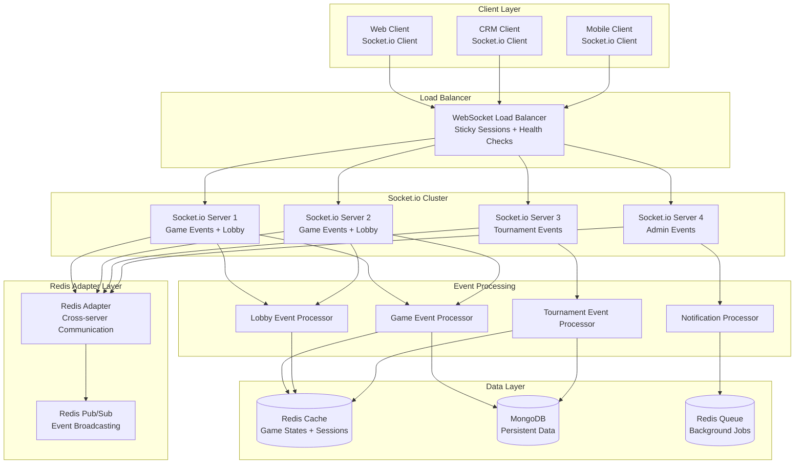

# Real-time Communication Architecture

## Overview

This document outlines the comprehensive real-time communication architecture for the gaming platform using Socket.io, ensuring scalable, reliable, and secure real-time interactions for games, tournaments, and user notifications.

## 1. Socket.io Architecture Overview



## 2. Socket.io Server Configuration

### Server Setup with Clustering
```typescript
import { Server } from 'socket.io';
import { createAdapter } from '@socket.io/redis-adapter';
import { createClient } from 'redis';

class SocketIOServer {
  private io: Server;
  private redisClient: ReturnType<typeof createClient>;
  private redisSubClient: ReturnType<typeof createClient>;

  async initialize(httpServer: any): Promise<void> {
    // Initialize Redis clients for adapter
    this.redisClient = createClient({ url: process.env.REDIS_URL });
    this.redisSubClient = this.redisClient.duplicate();
    
    await Promise.all([
      this.redisClient.connect(),
      this.redisSubClient.connect()
    ]);

    // Initialize Socket.io server
    this.io = new Server(httpServer, {
      cors: {
        origin: process.env.ALLOWED_ORIGINS?.split(',') || ['http://localhost:3000'],
        credentials: true
      },
      
      // Connection settings
      pingTimeout: 60000,
      pingInterval: 25000,
      upgradeTimeout: 10000,
      maxHttpBufferSize: 1e6,
      
      // Transport settings
      transports: ['websocket', 'polling'],
      allowUpgrades: true,
      
      // Compression
      compression: true,
      
      // Cookie settings
      cookie: {
        name: 'gaming-platform-socket',
        httpOnly: true,
        sameSite: 'strict'
      }
    });

    // Setup Redis adapter for clustering
    this.io.adapter(createAdapter(this.redisClient, this.redisSubClient));

    // Setup middleware and event handlers
    this.setupMiddleware();
    this.setupEventHandlers();
  }

  private setupMiddleware(): void {
    // Authentication middleware
    this.io.use(async (socket, next) => {
      try {
        const token = socket.handshake.auth.token || socket.handshake.headers.authorization?.split(' ')[1];
        
        if (!token) {
          throw new Error('No authentication token provided');
        }

        const user = await this.authService.verifyToken(token);
        socket.userId = user.id;
        socket.username = user.username;
        socket.role = user.role;
        
        next();
      } catch (error) {
        next(new Error('Authentication failed'));
      }
    });

    // Rate limiting middleware
    this.io.use(async (socket, next) => {
      const rateLimiter = new RateLimiter({
        windowMs: 1000, // 1 second
        max: 10, // 10 events per second per socket
        keyGenerator: () => socket.userId
      });

      const allowed = await rateLimiter.check();
      if (!allowed) {
        next(new Error('Rate limit exceeded'));
      } else {
        next();
      }
    });

    // Logging middleware
    this.io.use((socket, next) => {
      socket.onAny((eventName, ...args) => {
        this.logger.debug('Socket event received', {
          userId: socket.userId,
          eventName,
          socketId: socket.id,
          timestamp: new Date()
        });
      });
      next();
    });
  }
}
```

### Connection Management
```typescript
class ConnectionManager {
  private connections = new Map<string, SocketConnection>();
  private userSockets = new Map<string, Set<string>>();

  async handleConnection(socket: Socket): Promise<void> {
    const connection: SocketConnection = {
      socketId: socket.id,
      userId: socket.userId,
      username: socket.username,
      role: socket.role,
      connectedAt: new Date(),
      lastActivity: new Date(),
      rooms: new Set(),
      isActive: true
    };

    // Store connection
    this.connections.set(socket.id, connection);
    
    // Track user sockets
    if (!this.userSockets.has(socket.userId)) {
      this.userSockets.set(socket.userId, new Set());
    }
    this.userSockets.get(socket.userId)!.add(socket.id);

    // Join user-specific room
    await socket.join(`user:${socket.userId}`);

    // Update user online status
    await this.updateUserOnlineStatus(socket.userId, true);

    // Send connection confirmation
    socket.emit('connection:confirmed', {
      socketId: socket.id,
      serverTime: new Date(),
      features: this.getAvailableFeatures(socket.role)
    });

    // Setup disconnect handler
    socket.on('disconnect', () => this.handleDisconnection(socket));
  }

  async handleDisconnection(socket: Socket): Promise<void> {
    const connection = this.connections.get(socket.id);
    if (!connection) return;

    // Remove from tracking
    this.connections.delete(socket.id);
    const userSockets = this.userSockets.get(socket.userId);
    if (userSockets) {
      userSockets.delete(socket.id);
      if (userSockets.size === 0) {
        this.userSockets.delete(socket.userId);
        await this.updateUserOnlineStatus(socket.userId, false);
      }
    }

    // Leave all rooms
    for (const room of connection.rooms) {
      socket.leave(room);
    }

    // Log disconnection
    this.logger.info('User disconnected', {
      userId: socket.userId,
      socketId: socket.id,
      duration: Date.now() - connection.connectedAt.getTime()
    });
  }
}
```

## 3. Event System Architecture

### Event Types and Handlers
```typescript
// Event type definitions
interface GameEvents {
  'game:join': (data: { gameId: string }) => void;
  'game:move': (data: { gameId: string; move: GameMove; timeLeft?: number }) => void;
  'game:resign': (data: { gameId: string }) => void;
  'game:offer-draw': (data: { gameId: string }) => void;
  'game:accept-draw': (data: { gameId: string }) => void;
  'game:decline-draw': (data: { gameId: string }) => void;
  'game:offer-revenge': (data: { gameId: string }) => void;
  'game:accept-revenge': (data: { gameId: string }) => void;
  'game:decline-revenge': (data: { gameId: string }) => void;
  'game:spectate': (data: { gameId: string }) => void;
  'game:stop-spectating': (data: { gameId: string }) => void;
}

interface LobbyEvents {
  'lobby:join': (data: { gameType: GameType }) => void;
  'lobby:leave': () => void;
  'lobby:create-room': (data: CreateRoomData) => void;
  'lobby:join-room': (data: { roomId: string; password?: string }) => void;
  'lobby:leave-room': (data: { roomId: string }) => void;
  'lobby:ready': (data: { roomId: string }) => void;
  'lobby:unready': (data: { roomId: string }) => void;
}

interface TournamentEvents {
  'tournament:join': (data: { tournamentId: string }) => void;
  'tournament:leave': (data: { tournamentId: string }) => void;
  'tournament:spectate': (data: { tournamentId: string }) => void;
  'tournament:stop-spectating': (data: { tournamentId: string }) => void;
}

// Event handler implementation
class GameEventHandler {
  constructor(
    private io: Server,
    private gameService: GameService,
    private connectionManager: ConnectionManager
  ) {}

  async handleGameMove(socket: Socket, data: { gameId: string; move: GameMove; timeLeft?: number }): Promise<void> {
    try {
      // Validate user is in the game
      const game = await this.gameService.getGame(data.gameId);
      if (!this.isPlayerInGame(socket.userId, game)) {
        socket.emit('error', { message: 'You are not a player in this game' });
        return;
      }

      // Validate it's the player's turn
      if (!this.isPlayerTurn(socket.userId, game)) {
        socket.emit('error', { message: 'It is not your turn' });
        return;
      }

      // Process the move
      const result = await this.gameService.makeMove(data.gameId, socket.userId, data.move, data.timeLeft);

      // Broadcast move to all participants
      this.io.to(`game:${data.gameId}`).emit('game:move-made', {
        gameId: data.gameId,
        move: data.move,
        player: socket.userId,
        gameState: result.gameState,
        timeLeft: result.timeLeft
      });

      // If game ended, handle end game logic
      if (result.gameEnded) {
        await this.handleGameEnd(data.gameId, result.gameResult);
      }

    } catch (error) {
      socket.emit('error', { message: error.message });
      this.logger.error('Game move error', { error, userId: socket.userId, gameId: data.gameId });
    }
  }

  async handleGameJoin(socket: Socket, data: { gameId: string }): Promise<void> {
    try {
      const game = await this.gameService.getGame(data.gameId);
      
      // Check if user can join (player or spectator)
      const canJoin = this.isPlayerInGame(socket.userId, game) || game.allowSpectators;
      
      if (!canJoin) {
        socket.emit('error', { message: 'Cannot join this game' });
        return;
      }

      // Join game room
      await socket.join(`game:${data.gameId}`);
      this.connectionManager.addToRoom(socket.id, `game:${data.gameId}`);

      // Send current game state
      socket.emit('game:joined', {
        gameId: data.gameId,
        gameState: game.gameState,
        players: game.players,
        spectators: game.spectators,
        isPlayer: this.isPlayerInGame(socket.userId, game)
      });

      // Notify others of spectator join (if spectating)
      if (!this.isPlayerInGame(socket.userId, game)) {
        socket.to(`game:${data.gameId}`).emit('game:spectator-joined', {
          userId: socket.userId,
          username: socket.username
        });
      }

    } catch (error) {
      socket.emit('error', { message: error.message });
    }
  }
}
```

### Event Broadcasting System
```typescript
class EventBroadcaster {
  constructor(private io: Server, private redisClient: RedisClient) {}

  // Broadcast to specific user across all their connections
  async broadcastToUser(userId: string, event: string, data: any): Promise<void> {
    this.io.to(`user:${userId}`).emit(event, data);
  }

  // Broadcast to all users in a game
  async broadcastToGame(gameId: string, event: string, data: any, excludeUserId?: string): Promise<void> {
    const room = this.io.to(`game:${gameId}`);
    if (excludeUserId) {
      room.except(`user:${excludeUserId}`);
    }
    room.emit(event, data);
  }

  // Broadcast to all users in a tournament
  async broadcastToTournament(tournamentId: string, event: string, data: any): Promise<void> {
    this.io.to(`tournament:${tournamentId}`).emit(event, data);
  }

  // Broadcast to all users in lobby for specific game type
  async broadcastToLobby(gameType: GameType, event: string, data: any): Promise<void> {
    this.io.to(`lobby:${gameType}`).emit(event, data);
  }

  // Broadcast to all admin users
  async broadcastToAdmins(event: string, data: any): Promise<void> {
    this.io.to('role:admin').emit(event, data);
  }

  // Global platform broadcast
  async broadcastGlobal(event: string, data: any): Promise<void> {
    this.io.emit(event, data);
  }

  // Delayed broadcast using Redis queue
  async scheduleDelayedBroadcast(delay: number, target: string, event: string, data: any): Promise<void> {
    const job = {
      target,
      event,
      data,
      scheduledFor: Date.now() + delay
    };

    await this.redisClient.zadd('delayed_broadcasts', Date.now() + delay, JSON.stringify(job));
  }
}
```

## 4. Room Management System

### Room Types and Management
```typescript
enum RoomType {
  GAME = 'game',
  LOBBY = 'lobby',
  TOURNAMENT = 'tournament',
  USER = 'user',
  ADMIN = 'admin'
}

class RoomManager {
  private rooms = new Map<string, RoomInfo>();

  async createRoom(roomId: string, type: RoomType, metadata?: any): Promise<void> {
    const room: RoomInfo = {
      id: roomId,
      type,
      createdAt: new Date(),
      participants: new Set(),
      metadata: metadata || {}
    };

    this.rooms.set(roomId, room);
  }

  async joinRoom(socket: Socket, roomId: string): Promise<boolean> {
    try {
      await socket.join(roomId);
      
      const room = this.rooms.get(roomId);
      if (room) {
        room.participants.add(socket.userId);
      }

      this.logger.debug('User joined room', {
        userId: socket.userId,
        roomId,
        roomType: room?.type
      });

      return true;
    } catch (error) {
      this.logger.error('Failed to join room', { error, userId: socket.userId, roomId });
      return false;
    }
  }

  async leaveRoom(socket: Socket, roomId: string): Promise<void> {
    await socket.leave(roomId);
    
    const room = this.rooms.get(roomId);
    if (room) {
      room.participants.delete(socket.userId);
      
      // Clean up empty rooms (except persistent ones)
      if (room.participants.size === 0 && !this.isPersistentRoom(room.type)) {
        this.rooms.delete(roomId);
      }
    }
  }

  getRoomParticipants(roomId: string): string[] {
    const room = this.rooms.get(roomId);
    return room ? Array.from(room.participants) : [];
  }

  private isPersistentRoom(type: RoomType): boolean {
    return [RoomType.LOBBY, RoomType.ADMIN].includes(type);
  }
}
```

## 5. Real-time Game State Synchronization

### Game State Management
```typescript
class GameStateManager {
  private gameStates = new Map<string, GameState>();
  private stateVersions = new Map<string, number>();

  async updateGameState(gameId: string, newState: GameState, userId: string): Promise<void> {
    // Validate state transition
    const currentState = this.gameStates.get(gameId);
    if (currentState && !this.isValidStateTransition(currentState, newState, userId)) {
      throw new Error('Invalid state transition');
    }

    // Update version for conflict resolution
    const currentVersion = this.stateVersions.get(gameId) || 0;
    const newVersion = currentVersion + 1;
    
    // Store state with version
    this.gameStates.set(gameId, { ...newState, version: newVersion });
    this.stateVersions.set(gameId, newVersion);

    // Persist to Redis for clustering
    await this.redisClient.setex(
      `gamestate:${gameId}`,
      3600, // 1 hour TTL
      JSON.stringify({ state: newState, version: newVersion })
    );

    // Broadcast state update
    this.eventBroadcaster.broadcastToGame(gameId, 'game:state-update', {
      gameId,
      gameState: newState,
      version: newVersion,
      updatedBy: userId,
      timestamp: new Date()
    });
  }

  async getGameState(gameId: string): Promise<GameState | null> {
    // Try memory first
    let state = this.gameStates.get(gameId);
    
    if (!state) {
      // Fallback to Redis
      const cached = await this.redisClient.get(`gamestate:${gameId}`);
      if (cached) {
        const parsed = JSON.parse(cached);
        state = parsed.state;
        this.gameStates.set(gameId, state);
        this.stateVersions.set(gameId, parsed.version);
      }
    }

    return state || null;
  }

  private isValidStateTransition(currentState: GameState, newState: GameState, userId: string): boolean {
    // Implement game-specific validation logic
    // Check if the user is allowed to make this state change
    // Validate move legality, turn order, etc.
    return true; // Simplified for example
  }
}
```

### Conflict Resolution
```typescript
class ConflictResolver {
  async resolveStateConflict(gameId: string, conflictingStates: GameState[]): Promise<GameState> {
    // Get authoritative state from database
    const dbState = await this.gameService.getGameFromDB(gameId);
    
    // Compare timestamps and versions
    const sortedStates = conflictingStates.sort((a, b) => {
      if (a.version !== b.version) {
        return b.version - a.version; // Higher version wins
      }
      return new Date(b.lastUpdated).getTime() - new Date(a.lastUpdated).getTime();
    });

    // Use the most recent valid state
    const resolvedState = sortedStates[0];

    // Broadcast resolution to all participants
    this.eventBroadcaster.broadcastToGame(gameId, 'game:conflict-resolved', {
      gameId,
      resolvedState,
      conflictedStates: conflictingStates.length,
      timestamp: new Date()
    });

    return resolvedState;
  }
}
```

## 6. Performance Optimization

### Connection Pooling and Load Balancing
```typescript
class SocketLoadBalancer {
  private servers: SocketServerInfo[] = [];
  private currentIndex = 0;

  addServer(server: SocketServerInfo): void {
    this.servers.push(server);
  }

  getNextServer(): SocketServerInfo {
    // Round-robin with health check
    let attempts = 0;
    while (attempts < this.servers.length) {
      const server = this.servers[this.currentIndex];
      this.currentIndex = (this.currentIndex + 1) % this.servers.length;
      
      if (server.isHealthy && server.connectionCount < server.maxConnections) {
        return server;
      }
      attempts++;
    }
    
    // Fallback to least loaded server
    return this.servers.reduce((least, current) => 
      current.connectionCount < least.connectionCount ? current : least
    );
  }
}
```

### Event Batching and Compression
```typescript
class EventBatcher {
  private batches = new Map<string, EventBatch>();
  private batchInterval = 50; // 50ms batching window

  addEvent(roomId: string, event: SocketEvent): void {
    if (!this.batches.has(roomId)) {
      this.batches.set(roomId, {
        events: [],
        timer: setTimeout(() => this.flushBatch(roomId), this.batchInterval)
      });
    }

    const batch = this.batches.get(roomId)!;
    batch.events.push(event);

    // Flush immediately for critical events
    if (this.isCriticalEvent(event)) {
      this.flushBatch(roomId);
    }
  }

  private flushBatch(roomId: string): void {
    const batch = this.batches.get(roomId);
    if (!batch || batch.events.length === 0) return;

    // Compress and send batch
    const compressedBatch = this.compressEvents(batch.events);
    this.io.to(roomId).emit('batch:events', compressedBatch);

    // Clean up
    clearTimeout(batch.timer);
    this.batches.delete(roomId);
  }

  private compressEvents(events: SocketEvent[]): CompressedEventBatch {
    // Group similar events and compress data
    const grouped = this.groupEventsByType(events);
    return {
      timestamp: Date.now(),
      events: grouped.map(group => ({
        type: group.type,
        count: group.events.length,
        data: this.mergeEventData(group.events)
      }))
    };
  }
}
```

## 7. Error Handling and Resilience

### Connection Recovery
```typescript
class ConnectionRecovery {
  async handleConnectionLoss(socket: Socket): Promise<void> {
    const userId = socket.userId;
    const reconnectWindow = 30000; // 30 seconds

    // Store user state for potential reconnection
    await this.redisClient.setex(
      `reconnect:${userId}`,
      30,
      JSON.stringify({
        rooms: Array.from(socket.rooms),
        lastActivity: new Date(),
        gameStates: await this.getCurrentGameStates(userId)
      })
    );

    // Notify other users of temporary disconnection
    this.eventBroadcaster.broadcastToUser(userId, 'user:temporarily-disconnected', {
      userId,
      reconnectWindow
    });
  }

  async handleReconnection(socket: Socket): Promise<void> {
    const userId = socket.userId;
    const recoveryData = await this.redisClient.get(`reconnect:${userId}`);

    if (recoveryData) {
      const data = JSON.parse(recoveryData);
      
      // Rejoin previous rooms
      for (const room of data.rooms) {
        if (room !== socket.id) { // Skip socket-specific room
          await socket.join(room);
        }
      }

      // Restore game states
      for (const [gameId, state] of Object.entries(data.gameStates)) {
        socket.emit('game:state-restored', { gameId, state });
      }

      // Clean up recovery data
      await this.redisClient.del(`reconnect:${userId}`);

      // Notify successful reconnection
      socket.emit('connection:restored', {
        restoredAt: new Date(),
        recoveredRooms: data.rooms.length
      });
    }
  }
}
```

### Circuit Breaker Pattern
```typescript
class SocketCircuitBreaker {
  private failures = new Map<string, number>();
  private lastFailureTime = new Map<string, number>();
  private readonly failureThreshold = 5;
  private readonly recoveryTimeout = 60000; // 1 minute

  async executeWithCircuitBreaker<T>(
    operation: string,
    fn: () => Promise<T>
  ): Promise<T> {
    if (this.isCircuitOpen(operation)) {
      throw new Error(`Circuit breaker is open for operation: ${operation}`);
    }

    try {
      const result = await fn();
      this.onSuccess(operation);
      return result;
    } catch (error) {
      this.onFailure(operation);
      throw error;
    }
  }

  private isCircuitOpen(operation: string): boolean {
    const failures = this.failures.get(operation) || 0;
    const lastFailure = this.lastFailureTime.get(operation) || 0;
    
    if (failures >= this.failureThreshold) {
      const timeSinceLastFailure = Date.now() - lastFailure;
      return timeSinceLastFailure < this.recoveryTimeout;
    }
    
    return false;
  }

  private onSuccess(operation: string): void {
    this.failures.delete(operation);
    this.lastFailureTime.delete(operation);
  }

  private onFailure(operation: string): void {
    const currentFailures = this.failures.get(operation) || 0;
    this.failures.set(operation, currentFailures + 1);
    this.lastFailureTime.set(operation, Date.now());
  }
}
```

## 8. Monitoring and Analytics

### Real-time Metrics Collection
```typescript
class SocketMetrics {
  private metrics = {
    connections: {
      total: 0,
      byType: new Map<string, number>(),
      byRegion: new Map<string, number>()
    },
    events: {
      total: 0,
      byType: new Map<string, number>(),
      errors: 0
    },
    performance: {
      averageLatency: 0,
      messageQueue: 0,
      memoryUsage: 0
    }
  };

  trackConnection(socket: Socket): void {
    this.metrics.connections.total++;
    
    const userType = socket.role || 'user';
    this.metrics.connections.byType.set(
      userType,
      (this.metrics.connections.byType.get(userType) || 0) + 1
    );

    // Track by region if available
    const region = this.getRegionFromIP(socket.handshake.address);
    if (region) {
      this.metrics.connections.byRegion.set(
        region,
        (this.metrics.connections.byRegion.get(region) || 0) + 1
      );
    }
  }

  trackEvent(eventName: string, success: boolean, latency?: number): void {
    this.metrics.events.total++;
    this.metrics.events.byType.set(
      eventName,
      (this.metrics.events.byType.get(eventName) || 0) + 1
    );

    if (!success) {
      this.metrics.events.errors++;
    }

    if (latency) {
      this.updateAverageLatency(latency);
    }
  }

  getMetricsSnapshot(): SocketMetricsSnapshot {
    return {
      timestamp: new Date(),
      connections: { ...this.metrics.connections },
      events: { ...this.metrics.events },
      performance: { ...this.metrics.performance }
    };
  }
}
```

This comprehensive real-time communication architecture ensures scalable, reliable, and performant real-time interactions across the entire gaming platform.