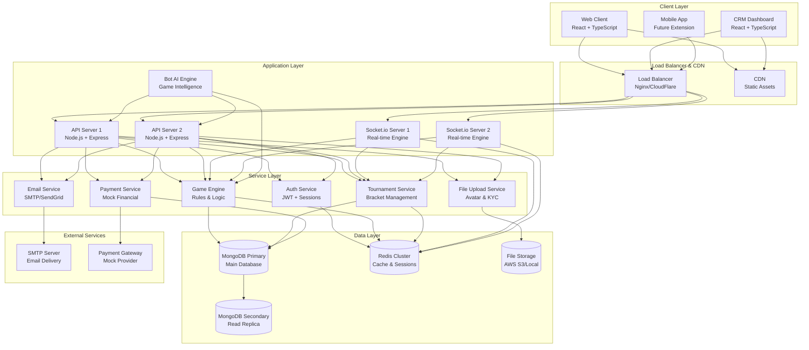
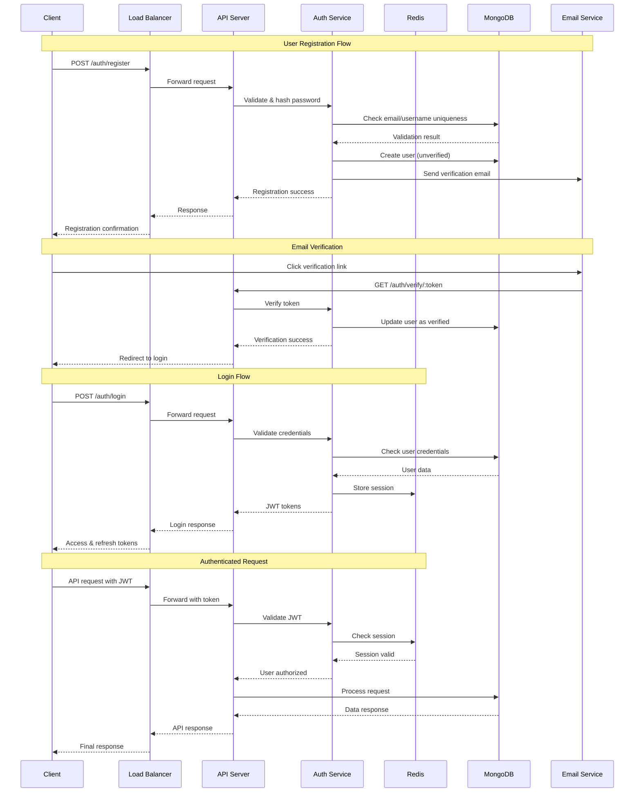
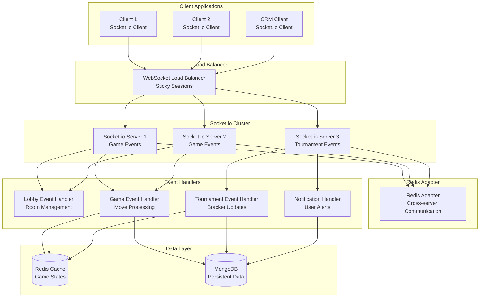
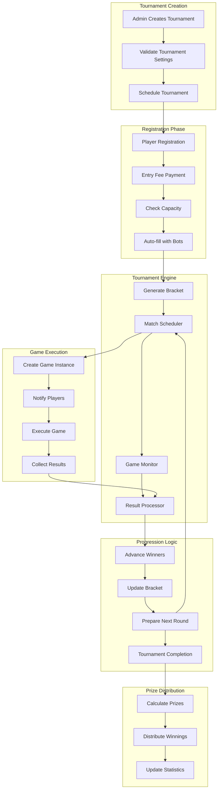
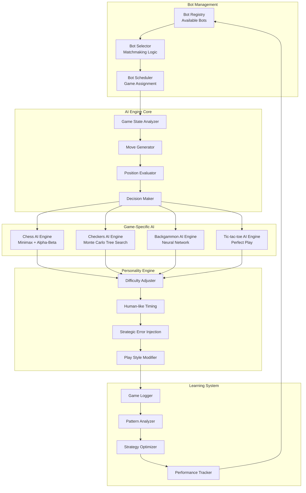
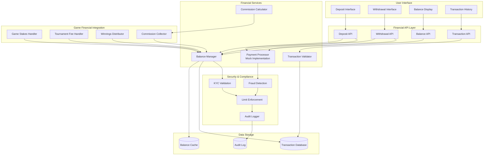
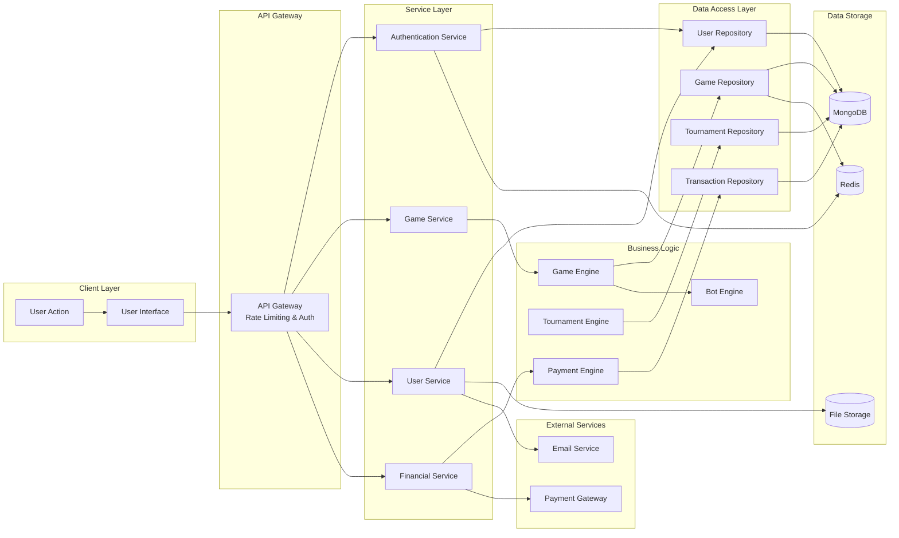
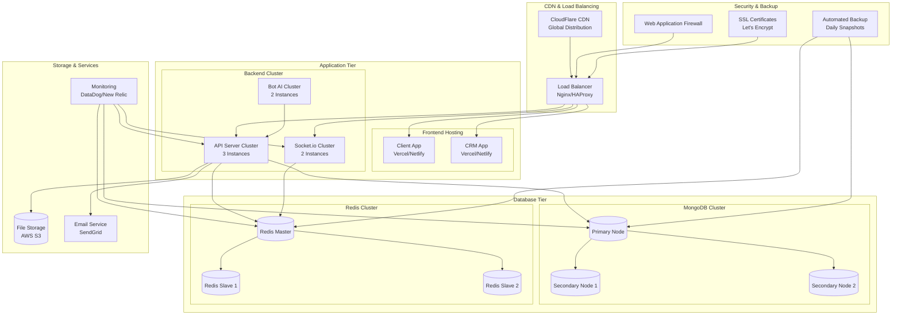
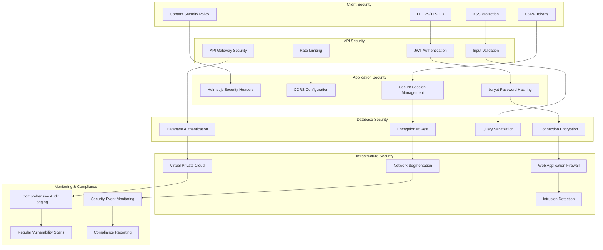

# System Architecture Diagrams

## Overview

This document contains comprehensive system architecture diagrams for the gaming platform, illustrating the relationships between components, data flow, and system interactions.

## 1. High-Level System Architecture



## 2. Authentication & Authorization Flow



## 3. Game Flow Architecture

```mermaid
stateDiagram-v2
    [*] --> Lobby
    
    state Lobby {
        [*] --> BrowsingRooms
        BrowsingRooms --> CreatingRoom : Create Room
        BrowsingRooms --> JoiningRoom : Join Room
        CreatingRoom --> WaitingForPlayer
        JoiningRoom --> WaitingForPlayer
    }
    
    state WaitingForPlayer {
        [*] --> SearchingOpponent
        SearchingOpponent --> FoundHuman : Human Found
        SearchingOpponent --> FoundBot : Timeout/Bot Match
        FoundHuman --> GameReady
        FoundBot --> GameReady
    }
    
    state GameReady {
        [*] --> PlayersConnected
        PlayersConnected --> GameStarted : Both Ready
    }
    
    state GameStarted {
        [*] --> Player1Turn
        Player1Turn --> Player2Turn : Valid Move
        Player2Turn --> Player1Turn : Valid Move
        Player1Turn --> GameEnded : Game Over
        Player2Turn --> GameEnded : Game Over
        Player1Turn --> DrawOffered : Draw Offer
        Player2Turn --> DrawOffered : Draw Offer
        DrawOffered --> Player1Turn : Draw Declined
        DrawOffered --> Player2Turn : Draw Declined
        DrawOffered --> GameEnded : Draw Accepted
    }
    
    state GameEnded {
        [*] --> ProcessingResult
        ProcessingResult --> RevengeOffered : Offer Revenge
        ProcessingResult --> BackToLobby : No Revenge
        RevengeOffered --> GameReady : Revenge Accepted
        RevengeOffered --> BackToLobby : Revenge Declined/Timeout
    }
    
    GameEnded --> Lobby : Return to Lobby
    BackToLobby --> Lobby
```

## 4. Real-time Communication Architecture



## 5. Tournament System Architecture



## 6. Bot AI System Architecture



## 7. Financial System Architecture



## 8. Data Flow Architecture



## 9. Deployment Architecture



## 10. Security Architecture



These comprehensive system architecture diagrams provide a clear visual representation of how all components of the gaming platform interact, ensuring proper understanding for implementation and maintenance.