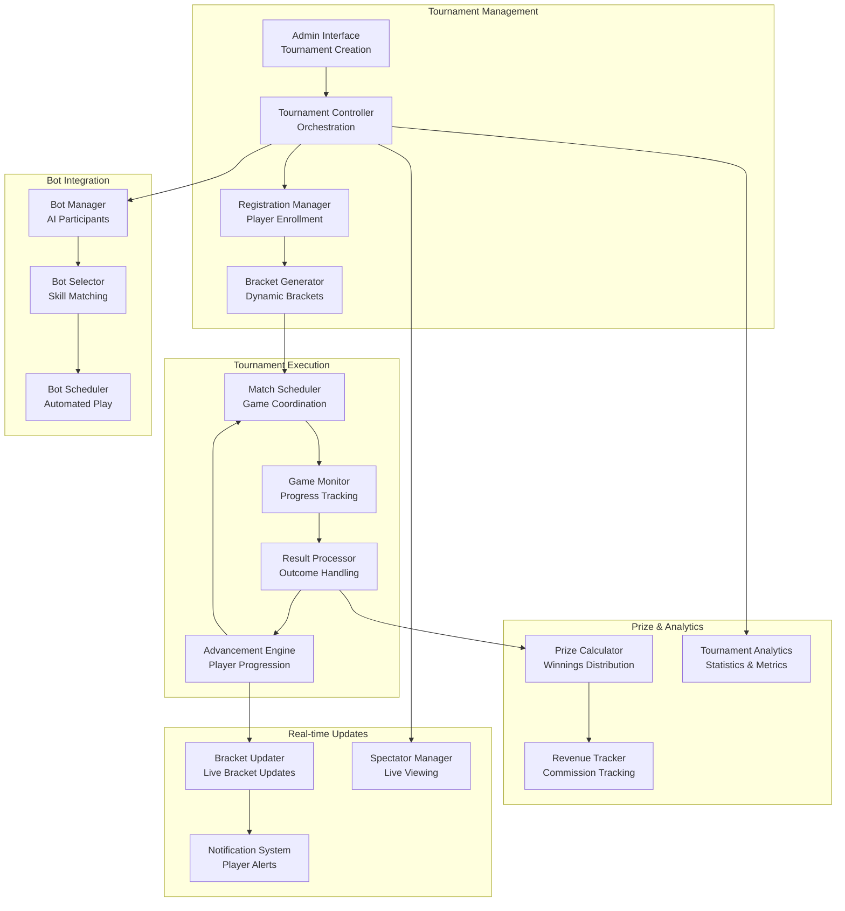

# Tournament System Architecture

## Overview

This document outlines the comprehensive tournament system architecture for the gaming platform, supporting all four game types with dynamic bracket generation, real-time progression, and automated management.

## 1. Tournament System Overview



## 2. Core Tournament Architecture

### Tournament Entity Structure
```typescript
interface Tournament {
  id: string;
  name: string;
  description?: string;
  gameType: 'chess' | 'checkers' | 'backgammon' | 'tictactoe';
  format: TournamentFormat;
  status: TournamentStatus;
  settings: TournamentSettings;
  participants: TournamentParticipant[];
  bracket: TournamentBracket;
  prizePool: PrizePool;
  schedule: TournamentSchedule;
  statistics: TournamentStatistics;
  createdBy: string;
  createdAt: Date;
  updatedAt: Date;
}

enum TournamentFormat {
  SINGLE_ELIMINATION = 'single_elimination',
  DOUBLE_ELIMINATION = 'double_elimination',
  ROUND_ROBIN = 'round_robin',
  SWISS_SYSTEM = 'swiss_system'
}

enum TournamentStatus {
  DRAFT = 'draft',
  REGISTRATION_OPEN = 'registration_open',
  REGISTRATION_CLOSED = 'registration_closed',
  STARTING = 'starting',
  IN_PROGRESS = 'in_progress',
  PAUSED = 'paused',
  COMPLETED = 'completed',
  CANCELLED = 'cancelled'
}

interface TournamentSettings {
  maxPlayers: number;
  minPlayers: number;
  entryFee: number;
  autoFillWithBots: boolean;
  registrationDeadline?: Date;
  startTime?: Date;
  timeControl?: {
    initialTime: number;
    increment: number;
  };
  allowSpectators: boolean;
  isPrivate: boolean;
  password?: string;
}
```

### Tournament Controller
```typescript
class TournamentController {
  constructor(
    private tournamentService: TournamentService,
    private gameService: GameService,
    private botService: BotService,
    private notificationService: NotificationService,
    private socketService: SocketService
  ) {}

  async createTournament(adminId: string, tournamentData: CreateTournamentRequest): Promise<Tournament> {
    // Validate tournament data
    const validation = await this.validateTournamentData(tournamentData);
    if (!validation.isValid) {
      throw new ValidationError(validation.errors);
    }

    // Create tournament
    const tournament = await this.tournamentService.create({
      ...tournamentData,
      createdBy: adminId,
      status: TournamentStatus.DRAFT,
      participants: [],
      bracket: this.initializeBracket(tournamentData.format),
      prizePool: this.calculatePrizePool(tournamentData.entryFee, tournamentData.maxPlayers),
      statistics: this.initializeStatistics()
    });

    // Schedule tournament start if specified
    if (tournament.settings.startTime) {
      await this.scheduleTournamentStart(tournament.id, tournament.settings.startTime);
    }

    // Notify about new tournament
    await this.notificationService.broadcastTournamentCreated(tournament);

    return tournament;
  }

  async registerPlayer(tournamentId: string, playerId: string): Promise<RegistrationResult> {
    const tournament = await this.tournamentService.findById(tournamentId);
    
    if (!tournament) {
      throw new NotFoundError('Tournament not found');
    }

    // Validate registration
    const validation = await this.validateRegistration(tournament, playerId);
    if (!validation.isValid) {
      throw new ValidationError(validation.error);
    }

    // Process entry fee
    await this.processEntryFee(playerId, tournament.settings.entryFee);

    // Add participant
    const participant: TournamentParticipant = {
      userId: playerId,
      username: await this.getUserUsername(playerId),
      isBot: false,
      registeredAt: new Date(),
      status: ParticipantStatus.REGISTERED,
      seed: tournament.participants.length + 1
    };

    tournament.participants.push(participant);
    await this.tournamentService.update(tournamentId, { participants: tournament.participants });

    // Check if tournament is ready to start
    if (this.shouldAutoStart(tournament)) {
      await this.startTournament(tournamentId);
    }

    // Notify participants
    await this.notificationService.notifyTournamentRegistration(tournament, participant);

    return {
      success: true,
      tournament,
      position: tournament.participants.length
    };
  }

  async startTournament(tournamentId: string): Promise<void> {
    const tournament = await this.tournamentService.findById(tournamentId);
    
    if (!tournament || tournament.status !== TournamentStatus.REGISTRATION_CLOSED) {
      throw new InvalidStateError('Tournament cannot be started');
    }

    // Fill remaining slots with bots if enabled
    if (tournament.settings.autoFillWithBots) {
      await this.fillWithBots(tournament);
    }

    // Generate bracket
    const bracket = await this.generateBracket(tournament);
    
    // Update tournament status
    await this.tournamentService.update(tournamentId, {
      status: TournamentStatus.IN_PROGRESS,
      bracket,
      startedAt: new Date()
    });

    // Start first round
    await this.startRound(tournament, 1);

    // Notify all participants
    await this.notificationService.notifyTournamentStarted(tournament);
  }
}
```

## 3. Bracket Generation System

### Bracket Generator
```typescript
class BracketGenerator {
  generateBracket(tournament: Tournament): TournamentBracket {
    switch (tournament.format) {
      case TournamentFormat.SINGLE_ELIMINATION:
        return this.generateSingleEliminationBracket(tournament);
      case TournamentFormat.DOUBLE_ELIMINATION:
        return this.generateDoubleEliminationBracket(tournament);
      case TournamentFormat.ROUND_ROBIN:
        return this.generateRoundRobinBracket(tournament);
      case TournamentFormat.SWISS_SYSTEM:
        return this.generateSwissBracket(tournament);
      default:
        throw new Error(`Unsupported tournament format: ${tournament.format}`);
    }
  }

  private generateSingleEliminationBracket(tournament: Tournament): TournamentBracket {
    const participants = this.shuffleParticipants(tournament.participants);
    const rounds: BracketRound[] = [];
    
    // Calculate number of rounds needed
    const numRounds = Math.ceil(Math.log2(participants.length));
    
    // Generate first round matches
    const firstRoundMatches: BracketMatch[] = [];
    for (let i = 0; i < participants.length; i += 2) {
      const player1 = participants[i];
      const player2 = participants[i + 1] || null; // Bye if odd number
      
      firstRoundMatches.push({
        id: `${tournament.id}_r1_m${Math.floor(i / 2) + 1}`,
        roundNumber: 1,
        matchNumber: Math.floor(i / 2) + 1,
        player1: player1 ? {
          userId: player1.userId,
          username: player1.username,
          isBot: player1.isBot
        } : null,
        player2: player2 ? {
          userId: player2.userId,
          username: player2.username,
          isBot: player2.isBot
        } : null,
        status: player2 ? MatchStatus.PENDING : MatchStatus.BYE,
        winner: player2 ? null : 'player1' // Auto-advance if bye
      });
    }

    rounds.push({
      roundNumber: 1,
      name: 'Round 1',
      matches: firstRoundMatches,
      status: RoundStatus.PENDING
    });

    // Generate subsequent rounds (empty initially)
    for (let round = 2; round <= numRounds; round++) {
      const numMatches = Math.ceil(firstRoundMatches.length / Math.pow(2, round - 1));
      const roundMatches: BracketMatch[] = [];

      for (let match = 1; match <= numMatches; match++) {
        roundMatches.push({
          id: `${tournament.id}_r${round}_m${match}`,
          roundNumber: round,
          matchNumber: match,
          player1: null,
          player2: null,
          status: MatchStatus.WAITING_FOR_PLAYERS
        });
      }

      rounds.push({
        roundNumber: round,
        name: round === numRounds ? 'Final' : `Round ${round}`,
        matches: roundMatches,
        status: RoundStatus.WAITING
      });
    }

    return {
      format: TournamentFormat.SINGLE_ELIMINATION,
      rounds,
      currentRound: 1,
      isComplete: false
    };
  }

  private generateDoubleEliminationBracket(tournament: Tournament): TournamentBracket {
    const participants = this.shuffleParticipants(tournament.participants);
    const rounds: BracketRound[] = [];
    
    // Winner's bracket
    const winnersBracket = this.generateSingleEliminationBracket(tournament);
    
    // Loser's bracket (more complex structure)
    const losersBracket = this.generateLosersBracket(participants.length);
    
    // Combine brackets
    rounds.push(...winnersBracket.rounds.map(round => ({
      ...round,
      bracketType: 'winners'
    })));
    
    rounds.push(...losersBracket.map(round => ({
      ...round,
      bracketType: 'losers'
    })));

    // Grand final
    rounds.push({
      roundNumber: rounds.length + 1,
      name: 'Grand Final',
      bracketType: 'final',
      matches: [{
        id: `${tournament.id}_grand_final`,
        roundNumber: rounds.length + 1,
        matchNumber: 1,
        player1: null, // Winner of winner's bracket
        player2: null, // Winner of loser's bracket
        status: MatchStatus.WAITING_FOR_PLAYERS
      }],
      status: RoundStatus.WAITING
    });

    return {
      format: TournamentFormat.DOUBLE_ELIMINATION,
      rounds,
      currentRound: 1,
      isComplete: false
    };
  }

  private generateRoundRobinBracket(tournament: Tournament): TournamentBracket {
    const participants = tournament.participants;
    const rounds: BracketRound[] = [];
    const numRounds = participants.length - 1;

    for (let round = 1; round <= numRounds; round++) {
      const matches: BracketMatch[] = [];
      const pairings = this.generateRoundRobinPairings(participants, round);

      pairings.forEach((pairing, index) => {
        matches.push({
          id: `${tournament.id}_rr_r${round}_m${index + 1}`,
          roundNumber: round,
          matchNumber: index + 1,
          player1: {
            userId: pairing.player1.userId,
            username: pairing.player1.username,
            isBot: pairing.player1.isBot
          },
          player2: {
            userId: pairing.player2.userId,
            username: pairing.player2.username,
            isBot: pairing.player2.isBot
          },
          status: MatchStatus.PENDING
        });
      });

      rounds.push({
        roundNumber: round,
        name: `Round ${round}`,
        matches,
        status: round === 1 ? RoundStatus.PENDING : RoundStatus.WAITING
      });
    }

    return {
      format: TournamentFormat.ROUND_ROBIN,
      rounds,
      currentRound: 1,
      isComplete: false
    };
  }
}
```

## 4. Match Scheduling and Execution

### Match Scheduler
```typescript
class MatchScheduler {
  constructor(
    private gameService: GameService,
    private botService: BotService,
    private notificationService: NotificationService
  ) {}

  async scheduleMatch(tournament: Tournament, match: BracketMatch): Promise<void> {
    // Validate match can be scheduled
    if (!this.canScheduleMatch(match)) {
      throw new InvalidStateError('Match cannot be scheduled');
    }

    // Create game instance
    const game = await this.gameService.createGame({
      type: tournament.gameType,
      players: [
        {
          userId: match.player1!.userId,
          username: match.player1!.username,
          isBot: match.player1!.isBot
        },
        {
          userId: match.player2!.userId,
          username: match.player2!.username,
          isBot: match.player2!.isBot
        }
      ],
      tournament: {
        tournamentId: tournament.id,
        round: match.roundNumber,
        matchNumber: match.matchNumber
      },
      timeControl: tournament.settings.timeControl,
      stake: 0 // Tournament games have no individual stakes
    });

    // Update match with game ID
    match.gameId = game.id;
    match.status = MatchStatus.IN_PROGRESS;
    match.startedAt = new Date();

    // Notify players
    await this.notificationService.notifyMatchStarted(tournament, match);

    // If bot is involved, schedule bot moves
    if (match.player1!.isBot || match.player2!.isBot) {
      await this.botService.joinGame(game.id);
    }
  }

  async handleMatchResult(tournament: Tournament, match: BracketMatch, result: GameResult): Promise<void> {
    // Update match with result
    match.status = MatchStatus.COMPLETED;
    match.finishedAt = new Date();
    match.result = result;
    match.winner = this.determineMatchWinner(result);

    // Update tournament statistics
    await this.updateTournamentStatistics(tournament, match, result);

    // Process advancement
    await this.processAdvancement(tournament, match);

    // Notify participants
    await this.notificationService.notifyMatchCompleted(tournament, match);

    // Check if round is complete
    if (await this.isRoundComplete(tournament, match.roundNumber)) {
      await this.completeRound(tournament, match.roundNumber);
    }

    // Check if tournament is complete
    if (await this.isTournamentComplete(tournament)) {
      await this.completeTournament(tournament);
    }
  }

  private async processAdvancement(tournament: Tournament, match: BracketMatch): Promise<void> {
    const winner = this.getMatchWinner(match);
    const loser = this.getMatchLoser(match);

    switch (tournament.format) {
      case TournamentFormat.SINGLE_ELIMINATION:
        await this.processSingleEliminationAdvancement(tournament, match, winner);
        break;
      
      case TournamentFormat.DOUBLE_ELIMINATION:
        await this.processDoubleEliminationAdvancement(tournament, match, winner, loser);
        break;
      
      case TournamentFormat.ROUND_ROBIN:
        await this.processRoundRobinAdvancement(tournament, match, winner, loser);
        break;
    }
  }

  private async processSingleEliminationAdvancement(
    tournament: Tournament, 
    match: BracketMatch, 
    winner: MatchPlayer
  ): Promise<void> {
    const nextRound = match.roundNumber + 1;
    const nextMatch = await this.findNextMatch(tournament, match, winner);

    if (nextMatch) {
      // Advance winner to next match
      if (!nextMatch.player1) {
        nextMatch.player1 = winner;
      } else if (!nextMatch.player2) {
        nextMatch.player2 = winner;
        // Both players assigned, match can be scheduled
        await this.scheduleMatch(tournament, nextMatch);
      }
    }
  }

  private async processDoubleEliminationAdvancement(
    tournament: Tournament,
    match: BracketMatch,
    winner: MatchPlayer,
    loser: MatchPlayer
  ): Promise<void> {
    // Winner advancement
    if (match.bracketType === 'winners') {
      // Winner stays in winner's bracket
      const nextWinnersMatch = await this.findNextWinnersMatch(tournament, match);
      if (nextWinnersMatch) {
        this.assignPlayerToMatch(nextWinnersMatch, winner);
      }
      
      // Loser drops to loser's bracket
      const losersMatch = await this.findCorrespondingLosersMatch(tournament, match);
      if (losersMatch) {
        this.assignPlayerToMatch(losersMatch, loser);
      }
    } else if (match.bracketType === 'losers') {
      // Winner advances in loser's bracket
      const nextLosersMatch = await this.findNextLosersMatch(tournament, match);
      if (nextLosersMatch) {
        this.assignPlayerToMatch(nextLosersMatch, winner);
      }
      // Loser is eliminated
    }
  }
}
```

## 5. Bot Integration for Tournaments

### Tournament Bot Manager
```typescript
class TournamentBotManager {
  constructor(
    private botService: BotService,
    private gameService: GameService
  ) {}

  async fillTournamentWithBots(tournament: Tournament): Promise<void> {
    const spotsToFill = tournament.settings.maxPlayers - tournament.participants.length;
    
    if (spotsToFill <= 0) return;

    // Select appropriate bots
    const selectedBots = await this.selectBotsForTournament(tournament, spotsToFill);

    // Add bots as participants
    for (const bot of selectedBots) {
      const botParticipant: TournamentParticipant = {
        userId: bot.id,
        username: bot.username,
        isBot: true,
        registeredAt: new Date(),
        status: ParticipantStatus.REGISTERED,
        seed: tournament.participants.length + 1,
        botDifficulty: bot.difficulty
      };

      tournament.participants.push(botParticipant);
    }

    await this.tournamentService.update(tournament.id, {
      participants: tournament.participants
    });
  }

  private async selectBotsForTournament(tournament: Tournament, count: number): Promise<Bot[]> {
    // Get available bots for the game type
    const availableBots = await this.botService.getBotsForGame(tournament.gameType);
    
    // Filter bots based on tournament requirements
    const suitableBots = availableBots.filter(bot => 
      bot.settings.isActive && 
      bot.gameTypes.includes(tournament.gameType)
    );

    // Select diverse difficulty levels
    const selectedBots: Bot[] = [];
    const difficultyLevels = ['easy', 'medium', 'hard', 'expert'];
    
    for (let i = 0; i < count; i++) {
      const targetDifficulty = difficultyLevels[i % difficultyLevels.length];
      const botsOfDifficulty = suitableBots.filter(bot => bot.difficulty === targetDifficulty);
      
      if (botsOfDifficulty.length > 0) {
        const randomBot = botsOfDifficulty[Math.floor(Math.random() * botsOfDifficulty.length)];
        selectedBots.push(randomBot);
      } else {
        // Fallback to any available bot
        const randomBot = suitableBots[Math.floor(Math.random() * suitableBots.length)];
        selectedBots.push(randomBot);
      }
    }

    return selectedBots;
  }

  async handleBotMatch(tournament: Tournament, match: BracketMatch): Promise<void> {
    const isBotVsBot = match.player1!.isBot && match.player2!.isBot;
    
    if (isBotVsBot) {
      // Simulate bot vs bot match with realistic timing
      await this.simulateBotVsBotMatch(tournament, match);
    } else {
      // One bot, one human - let the game proceed normally
      // Bot will make moves automatically through the game engine
    }
  }

  private async simulateBotVsBotMatch(tournament: Tournament, match: BracketMatch): Promise<void> {
    const game = await this.gameService.getGame(match.gameId!);
    
    // Simulate realistic game duration
    const estimatedDuration = this.estimateGameDuration(tournament.gameType);
    const moveInterval = estimatedDuration /

    // Simulate realistic game duration
    const estimatedDuration = this.estimateGameDuration(tournament.gameType);
    const moveInterval = estimatedDuration / this.estimateMovesPerGame(tournament.gameType);

    // Schedule bot moves with realistic timing
    const botMoveScheduler = setInterval(async () => {
      const currentGame = await this.gameService.getGame(match.gameId!);
      
      if (currentGame.status === 'finished') {
        clearInterval(botMoveScheduler);
        return;
      }

      // Determine which bot should move
      const currentPlayer = currentGame.gameState.currentPlayer;
      const botToMove = currentPlayer === 'player1' ? match.player1! : match.player2!;

      if (botToMove.isBot) {
        await this.botService.makeMove(currentGame.id, botToMove.userId);
      }
    }, moveInterval);
  }

  private estimateGameDuration(gameType: string): number {
    // Return estimated duration in milliseconds
    switch (gameType) {
      case 'chess': return 15 * 60 * 1000; // 15 minutes
      case 'checkers': return 10 * 60 * 1000; // 10 minutes
      case 'backgammon': return 8 * 60 * 1000; // 8 minutes
      case 'tictactoe': return 30 * 1000; // 30 seconds
      default: return 10 * 60 * 1000;
    }
  }

  private estimateMovesPerGame(gameType: string): number {
    switch (gameType) {
      case 'chess': return 40;
      case 'checkers': return 30;
      case 'backgammon': return 50;
      case 'tictactoe': return 6;
      default: return 30;
    }
  }
}
```

## 6. Prize Distribution System

### Prize Calculator
```typescript
class PrizeCalculator {
  calculatePrizePool(entryFee: number, participants: number, commission: number = 0.1): PrizePool {
    const totalCollected = entryFee * participants;
    const platformCommission = totalCollected * commission;
    const prizePool = totalCollected - platformCommission;

    return {
      totalCollected,
      platformCommission,
      prizePool,
      distribution: this.calculatePrizeDistribution(prizePool, participants)
    };
  }

  private calculatePrizeDistribution(prizePool: number, participants: number): PrizeDistribution[] {
    const distribution: PrizeDistribution[] = [];

    if (participants <= 2) {
      // Winner takes all for small tournaments
      distribution.push({
        position: 1,
        percentage: 100,
        amount: prizePool
      });
    } else if (participants <= 8) {
      // Top 2 get prizes
      distribution.push(
        { position: 1, percentage: 70, amount: prizePool * 0.7 },
        { position: 2, percentage: 30, amount: prizePool * 0.3 }
      );
    } else if (participants <= 16) {
      // Top 3 get prizes
      distribution.push(
        { position: 1, percentage: 50, amount: prizePool * 0.5 },
        { position: 2, percentage: 30, amount: prizePool * 0.3 },
        { position: 3, percentage: 20, amount: prizePool * 0.2 }
      );
    } else {
      // Top 4 get prizes for larger tournaments
      distribution.push(
        { position: 1, percentage: 40, amount: prizePool * 0.4 },
        { position: 2, percentage: 25, amount: prizePool * 0.25 },
        { position: 3, percentage: 20, amount: prizePool * 0.2 },
        { position: 4, percentage: 15, amount: prizePool * 0.15 }
      );
    }

    return distribution;
  }

  async distributePrizes(tournament: Tournament): Promise<void> {
    const finalStandings = this.calculateFinalStandings(tournament);
    
    for (const standing of finalStandings) {
      const prizeInfo = tournament.prizePool.distribution.find(
        dist => dist.position === standing.position
      );

      if (prizeInfo && prizeInfo.amount > 0) {
        await this.awardPrize(standing.participant, prizeInfo.amount, tournament);
      }
    }

    // Record prize distribution
    await this.recordPrizeDistribution(tournament, finalStandings);
  }

  private async awardPrize(participant: TournamentParticipant, amount: number, tournament: Tournament): Promise<void> {
    if (participant.isBot) {
      // Bots don't receive prizes - add to platform revenue
      await this.addToPlatformRevenue(amount, `Bot prize from tournament ${tournament.id}`);
      return;
    }

    // Award prize to human player
    await this.financialService.addToBalance(participant.userId, amount, {
      type: 'tournament_win',
      reference: {
        type: 'tournament',
        id: tournament.id,
        description: `Prize from tournament: ${tournament.name}`
      }
    });

    // Send notification
    await this.notificationService.notifyPrizeAwarded(participant.userId, amount, tournament);
  }

  private calculateFinalStandings(tournament: Tournament): TournamentStanding[] {
    const standings: TournamentStanding[] = [];

    switch (tournament.format) {
      case TournamentFormat.SINGLE_ELIMINATION:
      case TournamentFormat.DOUBLE_ELIMINATION:
        return this.calculateEliminationStandings(tournament);
      
      case TournamentFormat.ROUND_ROBIN:
        return this.calculateRoundRobinStandings(tournament);
      
      default:
        throw new Error(`Unsupported tournament format for standings: ${tournament.format}`);
    }
  }

  private calculateEliminationStandings(tournament: Tournament): TournamentStanding[] {
    const standings: TournamentStanding[] = [];
    
    // Winner is the participant who won the final match
    const finalMatch = this.getFinalMatch(tournament);
    if (finalMatch && finalMatch.winner) {
      const winner = finalMatch.winner === 'player1' ? finalMatch.player1! : finalMatch.player2!;
      standings.push({
        position: 1,
        participant: tournament.participants.find(p => p.userId === winner.userId)!,
        wins: this.countWins(tournament, winner.userId),
        losses: this.countLosses(tournament, winner.userId)
      });
    }

    // Calculate other positions based on elimination round
    const eliminatedByRound = this.groupEliminationsByRound(tournament);
    let currentPosition = 2;

    // Process from latest round to earliest
    const rounds = Object.keys(eliminatedByRound).map(Number).sort((a, b) => b - a);
    
    for (const round of rounds) {
      const eliminated = eliminatedByRound[round];
      
      for (const participant of eliminated) {
        standings.push({
          position: currentPosition,
          participant,
          wins: this.countWins(tournament, participant.userId),
          losses: this.countLosses(tournament, participant.userId)
        });
      }
      
      currentPosition += eliminated.length;
    }

    return standings;
  }

  private calculateRoundRobinStandings(tournament: Tournament): TournamentStanding[] {
    const standings: TournamentStanding[] = [];

    for (const participant of tournament.participants) {
      const wins = this.countWins(tournament, participant.userId);
      const losses = this.countLosses(tournament, participant.userId);
      const draws = this.countDraws(tournament, participant.userId);
      
      standings.push({
        position: 0, // Will be calculated after sorting
        participant,
        wins,
        losses,
        draws,
        points: wins * 3 + draws * 1 // 3 points for win, 1 for draw
      });
    }

    // Sort by points, then by head-to-head if tied
    standings.sort((a, b) => {
      if (a.points !== b.points) {
        return b.points! - a.points!;
      }
      // Tiebreaker: head-to-head result
      return this.getHeadToHeadResult(tournament, a.participant.userId, b.participant.userId);
    });

    // Assign positions
    standings.forEach((standing, index) => {
      standing.position = index + 1;
    });

    return standings;
  }
}
```

## 7. Real-time Tournament Updates

### Tournament Event Broadcaster
```typescript
class TournamentEventBroadcaster {
  constructor(
    private socketService: SocketService,
    private notificationService: NotificationService
  ) {}

  async broadcastTournamentUpdate(tournament: Tournament, updateType: TournamentUpdateType, data?: any): Promise<void> {
    const updateEvent = {
      type: updateType,
      tournamentId: tournament.id,
      timestamp: new Date(),
      data
    };

    // Broadcast to all tournament participants
    await this.socketService.broadcastToTournament(tournament.id, 'tournament:update', updateEvent);

    // Broadcast to spectators
    await this.socketService.broadcastToRoom(`tournament:${tournament.id}:spectators`, 'tournament:update', updateEvent);

    // Send push notifications for important updates
    if (this.isImportantUpdate(updateType)) {
      await this.sendPushNotifications(tournament, updateEvent);
    }
  }

  async broadcastBracketUpdate(tournament: Tournament): Promise<void> {
    const bracketData = {
      bracket: tournament.bracket,
      currentRound: tournament.bracket.currentRound,
      completedMatches: this.getCompletedMatches(tournament),
      upcomingMatches: this.getUpcomingMatches(tournament)
    };

    await this.socketService.broadcastToTournament(tournament.id, 'tournament:bracket-update', bracketData);
  }

  async broadcastMatchStart(tournament: Tournament, match: BracketMatch): Promise<void> {
    const matchData = {
      match,
      round: match.roundNumber,
      gameId: match.gameId
    };

    // Notify participants
    await this.notificationService.notifyMatchParticipants(tournament, match, 'match_started');

    // Broadcast to tournament viewers
    await this.socketService.broadcastToTournament(tournament.id, 'tournament:match-started', matchData);
  }

  async broadcastMatchResult(tournament: Tournament, match: BracketMatch): Promise<void> {
    const resultData = {
      match,
      result: match.result,
      winner: match.winner,
      advancement: await this.getAdvancementInfo(tournament, match)
    };

    // Notify participants
    await this.notificationService.notifyMatchParticipants(tournament, match, 'match_completed');

    // Broadcast to tournament viewers
    await this.socketService.broadcastToTournament(tournament.id, 'tournament:match-completed', resultData);

    // Update bracket
    await this.broadcastBracketUpdate(tournament);
  }

  async broadcastRoundCompletion(tournament: Tournament, roundNumber: number): Promise<void> {
    const roundData = {
      completedRound: roundNumber,
      nextRound: roundNumber + 1,
      advancingPlayers: this.getAdvancingPlayers(tournament, roundNumber),
      eliminatedPlayers: this.getEliminatedPlayers(tournament, roundNumber)
    };

    await this.socketService.broadcastToTournament(tournament.id, 'tournament:round-completed', roundData);
  }

  async broadcastTournamentCompletion(tournament: Tournament): Promise<void> {
    const completionData = {
      winner: this.getTournamentWinner(tournament),
      finalStandings: this.calculateFinalStandings(tournament),
      prizeDistribution: tournament.prizePool.distribution,
      statistics: tournament.statistics
    };

    // Notify all participants
    for (const participant of tournament.participants) {
      if (!participant.isBot) {
        await this.notificationService.notifyTournamentCompleted(participant.userId, tournament, completionData);
      }
    }

    // Broadcast to all viewers
    await this.socketService.broadcastToTournament(tournament.id, 'tournament:completed', completionData);
  }

  private isImportantUpdate(updateType: TournamentUpdateType): boolean {
    const importantUpdates = [
      'tournament_started',
      'match_started',
      'round_completed',
      'tournament_completed'
    ];
    return importantUpdates.includes(updateType);
  }
}
```

## 8. Tournament Analytics and Statistics

### Tournament Analytics Engine
```typescript
class TournamentAnalyticsEngine {
  async generateTournamentStatistics(tournament: Tournament): Promise<TournamentStatistics> {
    const statistics: TournamentStatistics = {
      totalParticipants: tournament.participants.length,
      humanParticipants: tournament.participants.filter(p => !p.isBot).length,
      botParticipants: tournament.participants.filter(p => p.isBot).length,
      totalMatches: this.countTotalMatches(tournament),
      completedMatches: this.countCompletedMatches(tournament),
      averageMatchDuration: await this.calculateAverageMatchDuration(tournament),
      totalDuration: this.calculateTournamentDuration(tournament),
      prizePoolTotal: tournament.prizePool.prizePool,
      platformRevenue: tournament.prizePool.platformCommission,
      participantsByCountry: await this.getParticipantsByCountry(tournament),
      gameStatistics: await this.generateGameStatistics(tournament)
    };

    return statistics;
  }

  private async calculateAverageMatchDuration(tournament: Tournament): Promise<number> {
    const completedMatches = this.getCompletedMatches(tournament);
    
    if (completedMatches.length === 0) return 0;

    const totalDuration = completedMatches.reduce((sum, match) => {
      if (match.startedAt && match.finishedAt) {
        return sum + (match.finishedAt.getTime() - match.startedAt.getTime());
      }
      return sum;
    }, 0);

    return totalDuration / completedMatches.length;
  }

  private async generateGameStatistics(tournament: Tournament): Promise<GameStatistics> {
    const matches = this.getAllMatches(tournament);
    const gameStats: GameStatistics = {
      totalMoves: 0,
      averageMovesPerGame: 0,
      shortestGame: null,
      longestGame: null,
      mostCommonOpenings: [],
      winsByColor: { white: 0, black: 0, draws: 0 }
    };

    for (const match of matches) {
      if (match.gameId) {
        const gameData = await this.gameService.getGameStatistics(match.gameId);
        gameStats.totalMoves += gameData.moveCount;
        
        // Track shortest/longest games
        if (!gameStats.shortestGame || gameData.duration < gameStats.shortestGame.duration) {
          gameStats.shortestGame = gameData;
        }
        if (!gameStats.longestGame || gameData.duration > gameStats.longestGame.duration) {
          gameStats.longestGame = gameData;
        }

        // Track wins by color
        if (gameData.result === 'white_wins') gameStats.winsByColor.white++;
        else if (gameData.result === 'black_wins') gameStats.winsByColor.black++;
        else gameStats.winsByColor.draws++;
      }
    }

    gameStats.averageMovesPerGame = matches.length > 0 ? gameStats.totalMoves / matches.length : 0;

    return gameStats;
  }

  async generatePlatformTournamentAnalytics(period: AnalyticsPeriod): Promise<PlatformTournamentAnalytics> {
    const tournaments = await this.getTournamentsInPeriod(period);
    
    return {
      totalTournaments: tournaments.length,
      totalParticipants: tournaments.reduce((sum, t) => sum + t.participants.length, 0),
      totalRevenue: tournaments.reduce((sum, t) => sum + t.prizePool.platformCommission, 0),
      averageParticipants: tournaments.length > 0 ? 
        tournaments.reduce((sum, t) => sum + t.participants.length, 0) / tournaments.length : 0,
      popularGameTypes: this.calculateGameTypePopularity(tournaments),
      tournamentFormats: this.calculateFormatPopularity(tournaments),
      participantRetention: await this.calculateParticipantRetention(tournaments),
      revenueByGameType: this.calculateRevenueByGameType(tournaments)
    };
  }

  private calculateGameTypePopularity(tournaments: Tournament[]): GameTypePopularity[] {
    const gameTypeCounts = tournaments.reduce((counts, tournament) => {
      counts[tournament.gameType] = (counts[tournament.gameType] || 0) + 1;
      return counts;
    }, {} as Record<string, number>);

    return Object.entries(gameTypeCounts)
      .map(([gameType, count]) => ({
        gameType,
        count,
        percentage: (count / tournaments.length) * 100
      }))
      .sort((a, b) => b.count - a.count);
  }
}
```

## 9. Tournament Spectator System

### Spectator Manager
```typescript
class TournamentSpectatorManager {
  private spectators: Map<string, Set<string>> = new Map(); // tournamentId -> Set of userIds

  async addSpectator(tournamentId: string, userId: string): Promise<void> {
    const tournament = await this.tournamentService.findById(tournamentId);
    
    if (!tournament) {
      throw new NotFoundError('Tournament not found');
    }

    if (!tournament.settings.allowSpectators) {
      throw new ForbiddenError('Spectators not allowed for this tournament');
    }

    // Add to spectator list
    if (!this.spectators.has(tournamentId)) {
      this.spectators.set(tournamentId, new Set());
    }
    
    this.spectators.get(tournamentId)!.add(userId);

    // Join spectator room
    await this.socketService.joinRoom(userId, `tournament:${tournamentId}:spectators`);

    // Send current tournament state
    await this.sendTournamentState(tournamentId, userId);

    // Notify other spectators
    await this.socketService.broadcastToRoom(
      `tournament:${tournamentId}:spectators`,
      'spectator:joined',
      { userId, spectatorCount: this.spectators.get(tournamentId)!.size }
    );
  }

  async removeSpectator(tournamentId: string, userId: string): Promise<void> {
    const spectatorSet = this.spectators.get(tournamentId);
    
    if (spectatorSet) {
      spectatorSet.delete(userId);
      
      if (spectatorSet.size === 0) {
        this.spectators.delete(tournamentId);
      }
    }

    // Leave spectator room
    await this.socketService.leaveRoom(userId, `tournament:${tournamentId}:spectators`);

    // Notify remaining spectators
    if (spectatorSet && spectatorSet.size > 0) {
      await this.socketService.broadcastToRoom(
        `tournament:${tournamentId}:spectators`,
        'spectator:left',
        { userId, spectatorCount: spectatorSet.size }
      );
    }
  }

  async getSpectatorCount(tournamentId: string): Promise<number> {
    return this.spectators.get(tournamentId)?.size || 0;
  }

  private async sendTournamentState(tournamentId: string, userId: string): Promise<void> {
    const tournament = await this.tournamentService.findById(tournamentId);
    
    if (!tournament) return;

    const spectatorData = {
      tournament: {
        id: tournament.id,
        name: tournament.name,
        gameType: tournament.gameType,
        status: tournament.status,
        participants: tournament.participants.map(p => ({
          username: p.username,
          isBot: p.isBot,
          status: p.status
        }))
      },
      bracket: tournament.bracket,
      currentMatches: this.getCurrentMatches(tournament),
      spectatorCount: await this.getSpectatorCount(tournamentId)
    };

    await this.socketService.sendToUser(userId, 'tournament:spectator-state', spectatorData);
  }

  async broadcastToSpectators(tournamentId: string, event: string, data: any): Promise<void> {
    await this.socketService.broadcastToRoom(`tournament:${tournamentId}:spectators`, event, data);
  }
}
```

This comprehensive tournament system architecture provides a robust, scalable foundation for managing tournaments across all game types with real-time updates, bot integration, and comprehensive analytics.